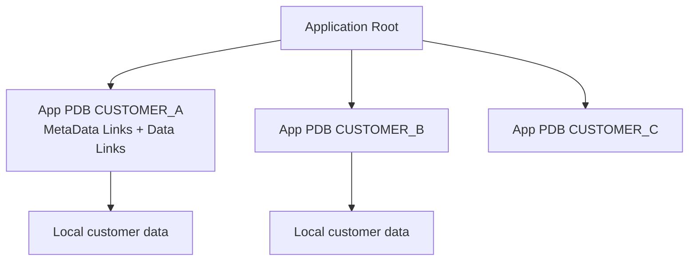

# Application PDBs

## Overview

An **application PDB** is a PDB that belongs to an [application container](application-containers.md) — it inherits shared code, schema, and data from an **application root** PDB. Application PDBs are the "tenant instances" in a multi-tenant SaaS scenario. Regular (non-application) PDBs are independent.

## Architecture



## Internal Working

### Creation

```sql
ALTER SESSION SET CONTAINER = sales_app_root;

CREATE PLUGGABLE DATABASE customer_a
  ADMIN USER pdbadmin IDENTIFIED BY pwd
  FILE_NAME_CONVERT = ('+DATA/prod/pdbseed', '+DATA/prod/customer_a');

ALTER PLUGGABLE DATABASE customer_a OPEN;

-- Sync the application definitions
ALTER SESSION SET CONTAINER = customer_a;
ALTER PLUGGABLE DATABASE APPLICATION sales_app SYNC;
```

### Links

Under the hood, application objects come in three link types:

- **Metadata Link** — Only definition present in application PDB; DML executes locally.
- **Data Link** — Data physically in application root; all app PDBs read the same data.
- **Extended Data Link** — Root data plus local per-PDB rows.

### Local Objects

Application PDBs can create local schemas, tables, indexes just like regular PDBs — they exist only in that PDB and are not shared.

```sql
ALTER SESSION SET CONTAINER = customer_a;
CREATE USER local_owner IDENTIFIED BY pwd;
CREATE TABLE local_owner.customer_specific_config (...);
```

### Sync

After an application root's `END UPGRADE` or `END PATCH`, application PDBs are marked "needs sync":

```sql
SELECT app_name, status FROM dba_app_pdb_status;

-- Sync the specific PDB
ALTER SESSION SET CONTAINER = customer_a;
ALTER PLUGGABLE DATABASE APPLICATION sales_app SYNC;

-- Sync all PDBs at once (from app root)
ALTER SESSION SET CONTAINER = sales_app_root;
ALTER PLUGGABLE DATABASE ALL APPLICATION sales_app SYNC;
```

## Components

Same as [Application Containers](application-containers.md).

## Important Views

| View                  | Purpose                |
| --------------------- | ---------------------- |
| `DBA_APP_PDB_STATUS`  | Per-PDB sync status    |
| `DBA_APPLICATIONS`    | Local + inherited apps |
| `DBA_OBJECTS.SHARING` | Object sharing mode    |

## Diagnostic Queries

```sql
-- App PDBs and sync status
SELECT p.pdb_name, s.app_name, s.app_version, s.patch_number, s.status
FROM   cdb_pdbs p LEFT JOIN dba_app_pdb_status s ON s.pdb_name = p.pdb_name
WHERE  p.application_root <> ' '   -- app PDBs
ORDER  BY p.pdb_name;

-- Shared objects in app PDB
ALTER SESSION SET CONTAINER = customer_a;
SELECT object_name, object_type, sharing
FROM   dba_objects
WHERE  sharing IN ('METADATA LINK','DATA LINK','EXTENDED DATA LINK')
FETCH FIRST 20 ROWS ONLY;
```

## Common Operations

### Sync a lagging PDB

```sql
ALTER SESSION SET CONTAINER = customer_a;
ALTER PLUGGABLE DATABASE APPLICATION sales_app SYNC;
```

### Convert regular PDB to application PDB

You cannot directly. Create a new app PDB and migrate data.

### Detach an application PDB

```sql
ALTER PLUGGABLE DATABASE APPLICATION sales_app DETACH FROM APPLICATION_ROOT;
```

Rare — detached PDB loses ability to sync.

## Common Issues

- **Sync fails** — Underlying DDL error. Check `DBA_APP_ERRORS`.
- **Partial sync** — Some object couldn't be created (space, permissions). Fix and retry.
- **Application PDB behind** — Multiple upgrades queued; run SYNC to catch up.

## Best Practices

1. Automate `SYNC` after every app root upgrade.
2. Monitor `DBA_APP_PDB_STATUS` — flag any `NEEDS UPGRADE` or `FAILED`.
3. Reserve local schemas for per-tenant customization; keep shared logic in app root.
4. Test upgrades on a canary app PDB before syncing all.
5. Alert on failed syncs.

## Interview Questions

1. **Q:** Application PDB vs regular PDB?
   **A:** App PDB inherits definitions/data from an application root PDB (via metadata/data links). Regular PDB is independent.

2. **Q:** What's a Data Link?
   **A:** Object where the data lives in the app root; app PDBs see the same rows.

3. **Q:** After an app upgrade, how do you propagate?
   **A:** `ALTER PLUGGABLE DATABASE ALL APPLICATION <app> SYNC;` from the app root.

4. **Q:** Can an app PDB have local tables?
   **A:** Yes — regular non-shared objects can be created locally.

5. **Q:** Where does DML go on a Metadata Link?
   **A:** To the local PDB — only the definition is shared.

## References

- Oracle Database Multitenant Administrator's Guide 19c
- MOS Doc ID 2091823.1 — Application Containers
