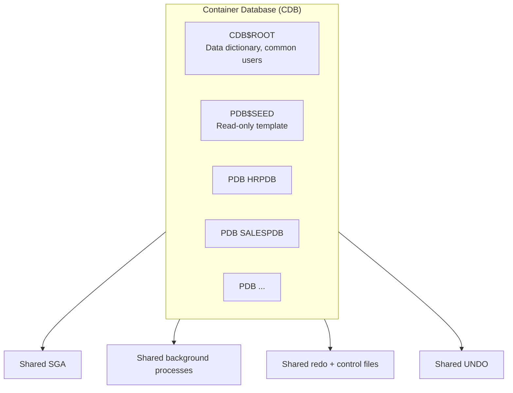

# CDB — Container Database

## Overview

A **CDB** (Container Database) is a single Oracle database that can host multiple **pluggable databases (PDBs)**. All PDBs in a CDB share one instance's SGA, background processes, redo, undo, and control files. From a resource-utilization standpoint, one CDB with 20 PDBs is dramatically more efficient than 20 separate databases.

Every 19c database created via DBCA is a CDB by default (non-CDB is deprecated in 21c). A CDB always contains:

- **`CDB$ROOT`** — system container.
- **`PDB$SEED`** — read-only template for new PDBs.
- Zero or more **user PDBs**.

## Architecture



## Internal Working

### Containers

Each PDB (plus CDB$ROOT and PDB$SEED) is a **container** with a unique `CON_ID`:

- `CON_ID = 0` — cross-container view.
- `CON_ID = 1` — CDB$ROOT.
- `CON_ID = 2` — PDB$SEED.
- `CON_ID >= 3` — user PDBs.

### Shared Resources

Shared across all PDBs:

- SGA (buffer cache, shared pool, log buffer, etc.).
- Background processes (PMON, LGWR, DBWn, ARCn, CKPT).
- Control files.
- Online redo logs.
- UNDO tablespace (12.2+ can have per-PDB UNDO with local undo).
- TEMP (or per-PDB TEMP).

### Per-PDB Resources

Each PDB has:

- Its own dictionary (subset of SYSTEM/SYSAUX tablespaces).
- Its own users, roles, tablespaces.
- Its own default TEMP (12.2+ optional).
- Its own service (auto-registered by LREG).

### Session Container Switching

A single session can switch containers:

```sql
ALTER SESSION SET CONTAINER = HRPDB;
-- Now queries execute against HRPDB
ALTER SESSION SET CONTAINER = CDB$ROOT;
```

Only common users (see [Common Users](common-users.md)) can switch.

### Views

- `V$` views — cross-container by default from CDB$ROOT.
- `CDB_*` views — CDB-wide dictionary view (row per container).
- `DBA_*` — behave as in non-CDB but scoped to current container.
- `PDB_*` — CDB-wide summary of PDBs.

## Components

| Component                | Purpose                                           |
| ------------------------ | ------------------------------------------------- |
| `CDB$ROOT`               | System container, common metadata                 |
| `PDB$SEED`               | Template for new PDBs                             |
| User PDBs                | Application-owned databases                       |
| Application root (12.2+) | Special PDB acting as parent for application PDBs |

## Important Parameters

| Parameter                   | Purpose                                                          |
| --------------------------- | ---------------------------------------------------------------- |
| `enable_pluggable_database` | TRUE for CDB (set at CREATE DATABASE)                            |
| `max_pdbs`                  | Max user PDBs (default 4096; 19c EE 3 free, up to 4096 licensed) |
| `db_files`                  | Total datafile count across CDB                                  |
| `pdb_lockdown`              | Lockdown profile for PDB restrictions                            |
| `common_user_prefix`        | Default `C##`                                                    |

## Important Views

| View                 | Purpose                   |
| -------------------- | ------------------------- |
| `V$CONTAINERS`       | All containers            |
| `V$PDBS`             | PDB state                 |
| `CDB_PDBS`           | Dictionary view of PDBs   |
| `DBA_PDB_HISTORY`    | PDB open/close history    |
| `V$CON_SYSSTAT`      | Per-container stats       |
| `V$CON_SYSTEM_EVENT` | Per-container wait events |

## Diagnostic Queries

```sql
-- Container overview
SELECT con_id, name, open_mode, restricted, dbid, con_uid
FROM   v$containers
ORDER  BY con_id;

-- PDB state
SELECT con_id, name, open_mode, restricted, total_size/1024/1024/1024 AS gb
FROM   v$pdbs;

-- Container of current session
SELECT SYS_CONTEXT('userenv','con_name') AS container,
       SYS_CONTEXT('userenv','con_id') AS con_id
FROM   dual;

-- CDB-wide user list
SELECT con_id, username, common, oracle_maintained
FROM   cdb_users
ORDER  BY con_id, username;

-- Aggregate SGA by container (sizing view)
SELECT con_id, con_name, ROUND(SUM(bytes)/1024/1024, 1) AS shared_pool_mb
FROM   v$sgastat
WHERE  pool = 'shared pool'
GROUP  BY con_id, con_name
ORDER  BY 3 DESC;
```

## Common Operations

### Create a CDB

```bash
dbca -silent -createDatabase \
     -templateName General_Purpose.dbc \
     -gdbName orcl -sid orcl \
     -createAsContainerDatabase true \
     -numberOfPDBs 1 -pdbName hrpdb \
     -sysPassword pwd -systemPassword pwd -pdbAdminPassword pwd
```

### Confirm CDB mode

```sql
SELECT cdb FROM v$database;   -- YES = CDB
```

### List PDBs

```sql
SHOW PDBS
```

### Switch container in session

```sql
ALTER SESSION SET CONTAINER = HRPDB;
ALTER SESSION SET CONTAINER = CDB$ROOT;
```

## Common Issues

- **Non-CDB deprecated** — Migrate to CDB by 21c.
- **`ORA-65011: PDB does not exist`** — Wrong PDB name or PDB not open.
- **`ORA-65020: shared undo tablespace UNDOTBS1 required`** — CDB uses shared UNDO by default (12.1); enable local undo in 12.2+.
- **PDB stays MOUNTED after CDB restart** — No `SAVE STATE`. Fix: `ALTER PLUGGABLE DATABASE hrpdb SAVE STATE;`.

## Best Practices

1. **Always CDB** in new deployments.
2. **Local UNDO** enabled (12.2+): `ALTER DATABASE LOCAL UNDO ON;` — allows per-PDB flashback and PITR.
3. Use **Resource Manager** to isolate PDB performance.
4. **PDB save state** so PDBs auto-open after CDB restart.
5. **Application containers** for SaaS-style deployments with shared code.
6. Monitor per-PDB SGA usage — hot PDB can starve siblings.
7. Standardize PDB naming: environment + application (`HR_DEV`, `HR_UAT`, `HR_PROD`).
8. RMAN handles CDB and PDBs — full CDB backup + PDB-level restore.

## Interview Questions

1. **Q:** What is a CDB?
   **A:** A single database instance hosting multiple pluggable databases (PDBs) that share SGA, redo, and control files.

2. **Q:** How many PDBs can a CDB have?
   **A:** Up to 4096. In 19c EE, first 3 are free; beyond that requires Multitenant Option.

3. **Q:** What is `CDB$ROOT`?
   **A:** The system container — holds common users, common roles, common metadata.

4. **Q:** What is `PDB$SEED`?
   **A:** Read-only template used to create new PDBs.

5. **Q:** Can a session query across containers?
   **A:** `V$` and `CDB_*` views span containers. Data queries stay in the current container unless explicitly using `CONTAINERS()`.

6. **Q:** How to switch containers?
   **A:** `ALTER SESSION SET CONTAINER = <name>;` — requires common user privilege.

7. **Q:** Non-CDB vs CDB — what's the future?
   **A:** Non-CDB is desupported in 21c+. Migrate to CDB.

## References

- Oracle Database Multitenant Administrator's Guide 19c
- Oracle Database Concepts 19c — Multitenant Architecture
- MOS Doc ID 1935365.1 — Multitenant FAQ
