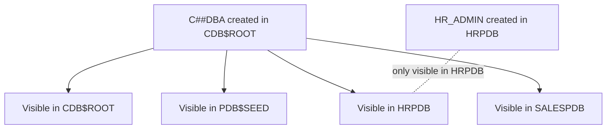

# Common Users

## Overview

A **common user** exists across all containers in a CDB: `CDB$ROOT`, `PDB$SEED`, and every PDB. Common users' names must begin with `C##` (except Oracle-supplied users like SYS, SYSTEM). They are created in `CDB$ROOT` and automatically propagate to every PDB.

Contrast with [Local Users](local-users.md), which exist only within one PDB.

## Architecture



## Internal Working

### Naming Convention

- Common users: must start with `C##` (default; changeable via `common_user_prefix`).
- Local users: any valid name **except** starting with `C##`.

### Creation

```sql
-- Must be in CDB$ROOT
ALTER SESSION SET CONTAINER = CDB$ROOT;

CREATE USER c##dba IDENTIFIED BY pwd CONTAINER = ALL;
GRANT CREATE SESSION, DBA TO c##dba CONTAINER = ALL;
```

`CONTAINER = ALL` propagates the user (and grants) to all existing and future PDBs.

### CONTAINER = ALL vs CONTAINER = CURRENT

- **`ALL`** — common user visible in all containers.
- **`CURRENT`** — grant applies only in the current container.

Example: create common user but grant CREATE SESSION only in one PDB:

```sql
-- Create common user (default CONTAINER = ALL for CREATE USER)
CREATE USER c##monitor IDENTIFIED BY pwd;

-- Grant CREATE SESSION in HRPDB only
ALTER SESSION SET CONTAINER = HRPDB;
GRANT CREATE SESSION TO c##monitor CONTAINER = CURRENT;
```

Result: c##monitor exists in all PDBs but can only log in to HRPDB.

### Switching Containers

Only common users can switch containers within a session:

```sql
CONNECT c##dba/pwd@CDB
ALTER SESSION SET CONTAINER = HRPDB;
ALTER SESSION SET CONTAINER = SALESPDB;
```

### Oracle-Maintained Common Users

`SYS`, `SYSTEM`, `AUDSYS`, `SYSBACKUP`, `SYSKM`, `SYSDG`, `LBACSYS`, etc. — pre-existing common users. Do not modify.

### Privileges

- Common privileges (granted CONTAINER=ALL) apply everywhere.
- Local privileges (CONTAINER=CURRENT, granted in a PDB) apply only there.
- Object privileges are always local — a common user's grants on a table in PDB1 don't propagate to PDB2.

## Components

| Component        | Purpose                      |
| ---------------- | ---------------------------- |
| Common user      | Exists across all containers |
| `C##` prefix     | Naming convention            |
| CONTAINER clause | ALL or CURRENT               |

## Important Parameters

| Parameter            | Purpose                                              |
| -------------------- | ---------------------------------------------------- |
| `common_user_prefix` | Default `C##`; change if you want a different prefix |

## Important Views

| View                          | Purpose                     |
| ----------------------------- | --------------------------- |
| `CDB_USERS.COMMON`            | 'YES' for common users      |
| `CDB_USERS.ORACLE_MAINTAINED` | 'Y' for Oracle-supplied     |
| `V$PDBS`                      | PDB list to see propagation |

## Diagnostic Queries

```sql
-- All common users
SELECT username, common, oracle_maintained
FROM   cdb_users
WHERE  common = 'YES'
ORDER  BY oracle_maintained, username;

-- Where can a common user log in?
SELECT p.name AS pdb, u.username, u.account_status
FROM   cdb_users u JOIN v$containers p ON p.con_id = u.con_id
WHERE  u.username = 'C##DBA'
ORDER  BY p.name;

-- Common grants
SELECT grantee, privilege, common, con_id
FROM   cdb_sys_privs
WHERE  common = 'YES'
   AND grantee LIKE 'C##%';
```

## Common Operations

### Create common user

```sql
ALTER SESSION SET CONTAINER = CDB$ROOT;
CREATE USER c##monitor IDENTIFIED BY pwd CONTAINER = ALL
  DEFAULT TABLESPACE users
  TEMPORARY TABLESPACE temp;

GRANT CREATE SESSION TO c##monitor CONTAINER = ALL;
GRANT SELECT ANY DICTIONARY TO c##monitor CONTAINER = ALL;
GRANT SELECT ANY TABLE TO c##monitor CONTAINER = ALL;
```

### Change common user prefix (rare)

```sql
ALTER SYSTEM SET common_user_prefix = '' SCOPE = SPFILE;
-- Restart
-- Now you can create common users without prefix (not recommended)
```

Requires `_ORACLE_SCRIPT=TRUE` or `common_user_prefix=''`.

### Drop common user

```sql
DROP USER c##monitor CASCADE;
-- Removes from all containers
```

## Common Issues

- **`ORA-65094: invalid local user or role name`** — Trying to create a local user with `C##` prefix.
- **`ORA-65095: invalid common user or role name`** — Trying to create a common user without `C##` prefix.
- **`ORA-65066: The specified changes must apply to all containers`** — Modifying a common user in a PDB context requires `CONTAINER = ALL`.
- **Common user cannot login to new PDB** — CREATE PDB from PDB$SEED includes common users automatically; grants may need re-issue with `CONTAINER = ALL`.

## Best Practices

1. **Minimize common users.** Use them for DBAs and monitoring accounts only.
2. Application users → **local users** in their PDB.
3. Prefix all common users clearly (e.g., `C##DBA_MONITOR`).
4. Do not lower `common_user_prefix` — Oracle-supplied namespace conflicts.
5. Grant `CONTAINER = ALL` only when truly needed globally.
6. Audit common user activity centrally in CDB$ROOT.
7. Do not use SYS/SYSTEM for applications.

## Interview Questions

1. **Q:** What is a common user?
   **A:** A user that exists across CDB$ROOT and all PDBs.

2. **Q:** How do you name common users?
   **A:** Prefix `C##` (default). Configurable via `common_user_prefix`.

3. **Q:** `CONTAINER = ALL` vs `CURRENT`?
   **A:** ALL: user or grant applies in every container. CURRENT: only the current container.

4. **Q:** Can a local user switch containers?
   **A:** No — only common users can.

5. **Q:** What are Oracle-maintained common users?
   **A:** SYS, SYSTEM, AUDSYS, and other pre-supplied users installed by Oracle scripts.

6. **Q:** When should you use common users?
   **A:** For centralized DBAs and monitoring — never for application accounts.

## References

- Oracle Database Multitenant Administrator's Guide 19c — Common Users
- Oracle Database Security Guide 19c
- MOS Doc ID 1935365.1 — Multitenant FAQ
