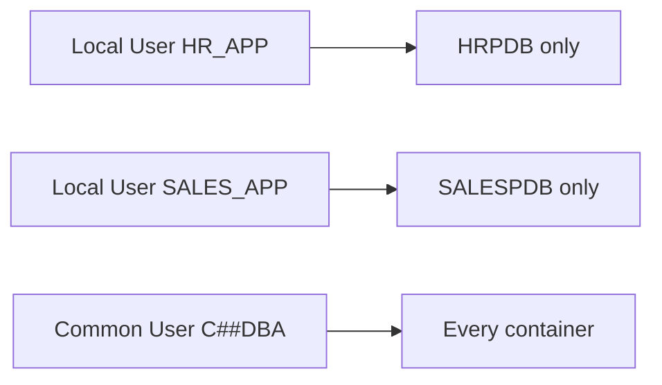

# Local Users

## Overview

A **local user** exists in exactly one PDB. It cannot log in to any other container. Local users are the default for applications: application `HR` has its schema owner `HR_APP` in `HRPDB`; that user is unknown outside of `HRPDB`.

## Architecture



## Internal Working

### Creation

Connect to the PDB (or switch container), then create:

```sql
ALTER SESSION SET CONTAINER = HRPDB;
CREATE USER hr_app IDENTIFIED BY pwd
  DEFAULT TABLESPACE users
  TEMPORARY TABLESPACE temp;

GRANT CREATE SESSION, RESOURCE TO hr_app;
```

No `CONTAINER = ALL` — local users cannot be common.

### Naming

Cannot start with `C##` (that prefix is reserved for common users).

### Privileges

Local users receive only local grants:

```sql
GRANT CREATE TABLE TO hr_app;   -- CONTAINER = CURRENT by default
```

Can be granted local roles and common roles (with local `GRANT`).

### Isolation

- Local user in HRPDB cannot see or query SALESPDB.
- Cross-PDB queries need common users or `CONTAINERS()` function (limited use).

## Components

Same as [Common Users](common-users.md).

## Important Parameters

None specific.

## Important Views

| View                         | Purpose                                       |
| ---------------------------- | --------------------------------------------- |
| `DBA_USERS` (in PDB context) | Local users of current PDB                    |
| `CDB_USERS`                  | CDB-wide user list; `COMMON = 'NO'` for local |

## Diagnostic Queries

```sql
-- Local users in current PDB
SELECT username, account_status, default_tablespace, temporary_tablespace
FROM   dba_users
WHERE  common = 'NO'
   AND oracle_maintained = 'N'
ORDER  BY username;

-- CDB-wide view: which PDBs have which local users
SELECT p.name AS pdb, u.username, u.account_status
FROM   cdb_users u JOIN v$containers p ON p.con_id = u.con_id
WHERE  u.common = 'NO' AND u.oracle_maintained = 'N'
ORDER  BY p.name, u.username;
```

## Common Operations

### Create local user

```sql
ALTER SESSION SET CONTAINER = HRPDB;

CREATE USER hr_app IDENTIFIED BY pwd
  DEFAULT TABLESPACE users
  TEMPORARY TABLESPACE temp
  QUOTA UNLIMITED ON users;

GRANT CREATE SESSION, RESOURCE TO hr_app;
```

### Grant common role locally

```sql
-- Common role must exist (created in CDB$ROOT with CONTAINER = ALL)
GRANT c##dba TO hr_app;   -- CONTAINER = CURRENT default
```

### Drop local user

```sql
DROP USER hr_app CASCADE;   -- CASCADE drops owned objects
```

## Common Issues

- **`ORA-65094`** — Attempted to name local user with `C##`.
- **`ORA-01031: insufficient privileges`** — Local user missing local grant.
- **User exists in dictionary but can't connect** — Account status LOCKED or EXPIRED; check `DBA_USERS.ACCOUNT_STATUS`.

## Best Practices

1. **All application accounts are local.** Every PDB has its own set.
2. **Schema-only accounts** for schema owners:
   ```sql
   CREATE USER hr_schema NO AUTHENTICATION;
   GRANT CREATE SESSION TO hr_schema;   -- proxy in
   ```
3. **Profile** each app user with password policy.
4. **Quotas** on tablespaces — prevent runaway growth.
5. Version-control user + grant scripts per PDB.
6. Regular audit: `DBA_USERS.ACCOUNT_STATUS`, `DBA_USERS.LAST_LOGIN`.

## Interview Questions

1. **Q:** Local vs common user?
   **A:** Local exists in one PDB. Common exists across all containers.

2. **Q:** Can a local user be named `C##FOO`?
   **A:** No — that prefix is reserved for common users.

3. **Q:** In which container are local users created?
   **A:** In the specific PDB where they should live.

4. **Q:** Can a common user access local user's objects?
   **A:** Only via granted privileges or role, and only if switched into that container.

5. **Q:** Best practice for app schema owners?
   **A:** Local users, schema-only where possible.

## References

- Oracle Database Multitenant Administrator's Guide 19c
- Oracle Database Security Guide 19c
