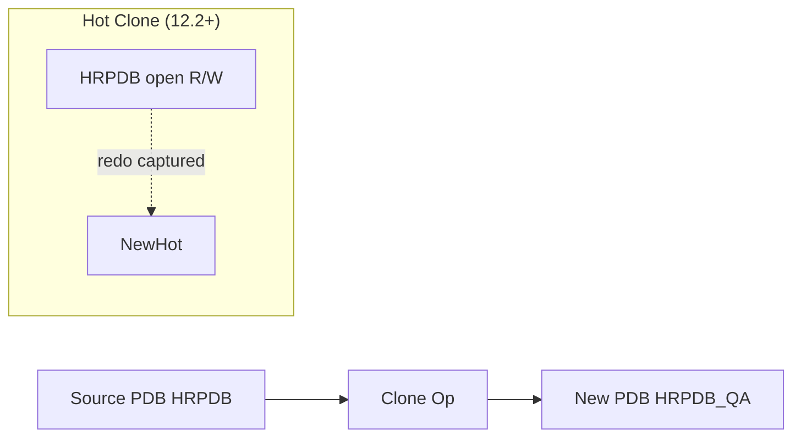

# PDB Clone

## Overview

**PDB cloning** creates a full copy of a source PDB — same schema, same data — as a new PDB. Cloning is used for:

- Creating dev/QA copies from production.
- Rapid provisioning of app tenants from a template.
- Point-in-time snapshots for testing patches.

Oracle supports **hot cloning** (source PDB is open READ WRITE), **cold cloning** (source READ ONLY), and **remote cloning** (source in another CDB via DB link).

## Architecture



## Internal Working

### Hot Clone (12.2+)

Source stays open for reads and writes. Oracle:

1. Snapshots current SCN.
2. Copies datafiles to new location.
3. Captures redo generated during copy.
4. Applies redo to make new PDB consistent to snapshot SCN.

Only supported in **Local UNDO** mode:

```sql
ALTER DATABASE LOCAL UNDO ON;
-- Requires restart in 12.2; supported cleanly in 19c
```

### Cold Clone

Source PDB in READ ONLY mode during copy. Simpler; slower for the source (no writes).

### Local Clone (Same CDB)

```sql
-- Hot clone
CREATE PLUGGABLE DATABASE hrpdb_qa FROM hrpdb
  FILE_NAME_CONVERT = ('+DATA/prod/hrpdb', '+DATA/prod/hrpdb_qa');

ALTER PLUGGABLE DATABASE hrpdb_qa OPEN;
```

Source stays open.

### Remote Clone

Source PDB is in a different CDB. Use a database link from target to source:

```sql
-- On target CDB
CREATE DATABASE LINK srccdb CONNECT TO c##dba IDENTIFIED BY pwd USING 'SRCCDB';

CREATE PLUGGABLE DATABASE hrpdb_target FROM hrpdb@srccdb
  FILE_NAME_CONVERT = ('+DATA/src/hrpdb', '+DATA/tgt/hrpdb_target');

ALTER PLUGGABLE DATABASE hrpdb_target OPEN;
```

Requires network path between CDBs and matching Oracle version.

### Snapshot Clone (see also)

See [PDB Snapshot Clone](pdb-snapshot-clone.md) for copy-on-write clones on ACFS or ZFS.

## Components

| Component         | Purpose                 |
| ----------------- | ----------------------- |
| Source PDB        | Copy source             |
| FILE_NAME_CONVERT | Datafile rename mapping |
| DB link (remote)  | Network path            |
| Local UNDO        | Required for hot clone  |

## Important Parameters

| Parameter               | Purpose                                        |
| ----------------------- | ---------------------------------------------- |
| `db_create_file_dest`   | Default new location (OMF)                     |
| `pdb_file_name_convert` | Fallback name convert if none specified in DDL |

## Important Views

| View              | Purpose                     |
| ----------------- | --------------------------- |
| `V$PDBS`          | New PDB visible after clone |
| `CDB_PDB_HISTORY` | Clone history               |

## Diagnostic Queries

```sql
-- Confirm local UNDO enabled
SELECT property_value FROM database_properties
WHERE  property_name = 'LOCAL_UNDO_ENABLED';

-- Verify new PDB
SELECT con_id, name, open_mode, total_size/1024/1024/1024 AS gb
FROM   v$pdbs
WHERE  name = 'HRPDB_QA';

-- Clone history
SELECT db_name, pdb_name, operation, op_timestamp, cloned_from_pdb_name
FROM   cdb_pdb_history
ORDER  BY op_timestamp DESC;
```

## Common Operations

### Hot local clone

```sql
CREATE PLUGGABLE DATABASE hrpdb_qa FROM hrpdb
  FILE_NAME_CONVERT = ('+DATA/prod/hrpdb', '+DATA/prod/hrpdb_qa')
  STORAGE (MAXSIZE UNLIMITED);

ALTER PLUGGABLE DATABASE hrpdb_qa OPEN;
ALTER PLUGGABLE DATABASE hrpdb_qa SAVE STATE;
```

### Remote hot clone

```sql
CREATE PLUGGABLE DATABASE hrpdb_dr FROM hrpdb@srccdb
  FILE_NAME_CONVERT = ('+DATA/src/hrpdb', '+DATA/tgt/hrpdb_dr')
  STANDBYS = NONE;

ALTER PLUGGABLE DATABASE hrpdb_dr OPEN;
```

### Cold local clone

```sql
-- Put source read-only
ALTER PLUGGABLE DATABASE hrpdb CLOSE;
ALTER PLUGGABLE DATABASE hrpdb OPEN READ ONLY;

CREATE PLUGGABLE DATABASE hrpdb_qa FROM hrpdb
  FILE_NAME_CONVERT = ('+DATA/prod/hrpdb', '+DATA/prod/hrpdb_qa');

ALTER PLUGGABLE DATABASE hrpdb OPEN READ WRITE;
ALTER PLUGGABLE DATABASE hrpdb_qa OPEN;
```

### Sanitize clone (mask sensitive data)

After clone open, mask columns:

```sql
ALTER SESSION SET CONTAINER = hrpdb_qa;
UPDATE hr.employees SET ssn = 'XXX-XX-XXXX', salary = 0;
COMMIT;
```

## Common Issues

- **`ORA-65066: The specified changes must apply to all containers`** — Command run in wrong container.
- **`ORA-65107` — Local UNDO required for hot clone** — Enable local UNDO.
- **`ORA-01031` on DB link** — DB link user needs `CREATE PLUGGABLE DATABASE` privilege in source CDB$ROOT.
- **Datafile name conflict** — Specify correct FILE_NAME_CONVERT.
- **Source in shared UNDO mode** — Hot clone requires local UNDO.

## Troubleshooting

1. Ensure `LOCAL_UNDO_ENABLED = TRUE` for hot clone.
2. Check DB link works: `SELECT sysdate FROM dual@srccdb;`.
3. Alert log in target CDB captures clone progress.

## Best Practices

1. **Enable local UNDO** at CDB creation.
2. Prefer **hot clone** — no source downtime.
3. Use **remote clone** for cross-environment provisioning (prod → QA).
4. Automate cloning + data masking in a single script for QA environments.
5. Use FILE_NAME_CONVERT to avoid path collisions.
6. Set `STORAGE (MAXSIZE)` on clone to prevent runaway growth.
7. `SAVE STATE` after opening clone.
8. Refresh clones periodically or use [Refreshable PDB](refreshable-pdb.md) for periodic sync.

## Interview Questions

1. **Q:** What is PDB cloning?
   **A:** Creating a new PDB as a full copy of an existing PDB.

2. **Q:** Hot vs cold clone?
   **A:** Hot clone: source open R/W (12.2+, requires local UNDO). Cold: source READ ONLY.

3. **Q:** Local vs remote clone?
   **A:** Local: same CDB. Remote: source PDB in another CDB via DB link.

4. **Q:** Required for hot clone?
   **A:** Local UNDO enabled at CDB level.

5. **Q:** How do you specify new file locations?
   **A:** `FILE_NAME_CONVERT` clause.

6. **Q:** How do you avoid open the clone after cloning?
   **A:** Clone is created MOUNTED; explicitly `ALTER PLUGGABLE DATABASE ... OPEN`.

## References

- Oracle Database Multitenant Administrator's Guide 19c — Cloning PDBs
- MOS Doc ID 2015998.1 — Hot Cloning
- MOS Doc ID 1935365.1 — Multitenant FAQ
