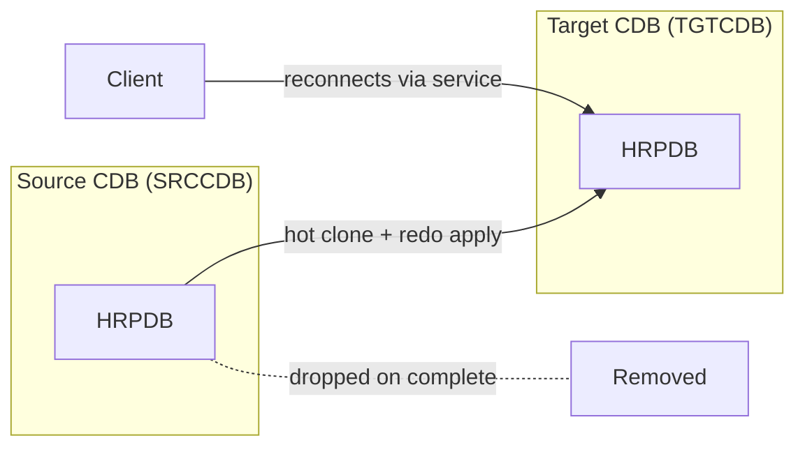

# PDB Relocate

## Overview

**PDB Relocate** (12.2+) moves a PDB from one CDB to another with minimal downtime — near-zero for applications using services. Uses the same underlying mechanism as remote hot clone but implicitly drops the source PDB after successful move.

Ideal for:

- Consolidating PDBs from multiple CDBs.
- Balancing PDBs across CDBs for resource distribution.
- Moving PDBs between servers with different Oracle Home versions.

## Architecture



## Internal Working

### Steps (Behind the Scenes)

1. Target CDB requests hot clone of source PDB via DB link.
2. Datafiles copied to target.
3. Ongoing redo shipped via link.
4. When target catches up, source PDB closes and target opens.
5. Source PDB is dropped automatically.
6. Service registration flips: clients reconnect and land at target.

### Prerequisites

- **Local UNDO** on both CDBs.
- Both CDBs in ARCHIVELOG.
- DB link from target to source.
- Compatible or upgraded Oracle Home on target (same or newer version).

### Syntax

```sql
-- On target CDB
CREATE DATABASE LINK srccdb CONNECT TO c##dba IDENTIFIED BY pwd USING 'SRCCDB';

CREATE PLUGGABLE DATABASE hrpdb FROM hrpdb@srccdb
  RELOCATE
  AVAILABILITY MAX
  FILE_NAME_CONVERT = ('/src/hrpdb', '/tgt/hrpdb');

ALTER PLUGGABLE DATABASE hrpdb OPEN;
```

`AVAILABILITY MAX` = source stays available until nearly the last moment. `AVAILABILITY NORMAL` = simpler but source is offline earlier.

### Service Failover

Clients connect via a service name. When source PDB drops and target opens the same service, next connect lands at target. Existing sessions on source get errors — best used with Application Continuity or connection retry.

## Components

Same as [PDB Clone](pdb-clone.md).

## Important Parameters

None specific.

## Important Views

| View              | Purpose            |
| ----------------- | ------------------ |
| `V$PDBS`          | Before/after       |
| `CDB_PDB_HISTORY` | RELOCATE operation |

## Diagnostic Queries

```sql
-- On target, after relocate
SELECT con_id, name, open_mode FROM v$pdbs WHERE name = 'HRPDB';

-- History on target
SELECT operation, op_timestamp, cloned_from_pdb_name
FROM   cdb_pdb_history
WHERE  pdb_name = 'HRPDB' AND operation LIKE '%RELOCATE%'
ORDER  BY op_timestamp DESC;
```

## Common Operations

### Relocate with MAX availability

```sql
CREATE PLUGGABLE DATABASE hrpdb FROM hrpdb@srccdb
  RELOCATE
  AVAILABILITY MAX
  FILE_NAME_CONVERT = ('/src/hrpdb', '/tgt/hrpdb');

ALTER PLUGGABLE DATABASE hrpdb OPEN;
```

### Rollback (if relocate fails)

If the operation fails, source is intact. Simply drop the partial target:

```sql
DROP PLUGGABLE DATABASE hrpdb INCLUDING DATAFILES;
```

Then investigate and retry.

## Common Issues

- **DB link privileges** — Source-side account needs `CREATE PLUGGABLE DATABASE` and `SYSOPER` privileges.
- **Version mismatch** — Target must be same or higher Oracle version. Cross-major-version needs upgrade path.
- **Local UNDO required** — Both CDBs.
- **Large PDB, slow copy** — Bandwidth × PDB size. Budget accordingly.
- **Client reconnect timing** — In-flight transactions on source will abort; use TAF / Application Continuity.

## Best Practices

1. Use for **consolidation and rebalancing**.
2. Ensure clients use **service names + connection retry** (or App Continuity) to survive the reconnect.
3. Schedule during low-activity window despite MAX availability.
4. Take RMAN backup on source before starting.
5. Use out-of-place upgrade pattern: relocate PDB from older Oracle Home CDB to newer Oracle Home CDB.
6. Monitor network throughput during relocate.
7. Test the rollback procedure in a lower environment.

## Interview Questions

1. **Q:** What is PDB Relocate?
   **A:** A near-online move of a PDB from one CDB to another; source is dropped after target opens.

2. **Q:** Prerequisites?
   **A:** Local UNDO on both, ARCHIVELOG, DB link, compatible Oracle versions.

3. **Q:** `AVAILABILITY MAX` vs `NORMAL`?
   **A:** MAX: source available until nearly the switchover. NORMAL: source closes earlier — simpler flow.

4. **Q:** Client impact?
   **A:** In-flight transactions abort at switchover; new connects go to target via service registration.

5. **Q:** Use case?
   **A:** Consolidation, load rebalancing, cross-version upgrades.

## References

- Oracle Database Multitenant Administrator's Guide 19c — Relocate PDB
- MOS Doc ID 2015998.1 — Hot Cloning and Relocate
- MOS Doc ID 2091823.1 — PDB Relocate Best Practices
