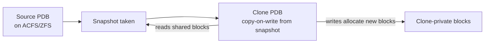

# PDB Snapshot Clone

## Overview

**Snapshot cloning** creates a copy-on-write clone of a PDB — near-instant, minimal storage. Requires storage that supports snapshots: **Oracle ACFS**, **ZFS Storage Appliance**, **Oracle ZFSSA**, or **Oracle Direct NFS with snapshot-capable storage**. On generic ASM without ACFS, use regular PDB clone.

Snapshot clones use **Sparse (thin) files**: the clone shares blocks with the source until modified, then copy-on-write allocates a private block.

## Architecture



## Internal Working

### Prerequisites

- Source PDB on a **snapshot-capable filesystem**: ACFS, ZFSSA, ZFS SD, or DNFS with snapshot support.
- **Local UNDO** enabled.

### Syntax

```sql
CREATE PLUGGABLE DATABASE hrpdb_qa FROM hrpdb
  SNAPSHOT COPY
  FILE_NAME_CONVERT = ('+ACFS/prod/hrpdb', '+ACFS/prod/hrpdb_qa');

ALTER PLUGGABLE DATABASE hrpdb_qa OPEN;
```

Oracle asks the underlying filesystem for a snapshot rather than performing a full block copy.

### Storage Behavior

- Initial clone size: ~0 (metadata + delta only).
- As clone diverges (writes), size grows.
- Reads of unchanged blocks share source's physical blocks.

### Dropping the Source

You cannot drop the source PDB while snapshot clones depend on it. Drop clones first.

### Combining with Refreshable

Snapshot cloning doesn't preserve refresh capability — for periodic refresh, use [Refreshable PDB](refreshable-pdb.md) instead.

## Components

| Component           | Purpose                             |
| ------------------- | ----------------------------------- |
| Underlying snapshot | Filesystem-level shared blocks      |
| Sparse datafiles    | Clone's private + shared references |
| PDB metadata        | Clone's own dictionary              |

## Important Parameters

| Parameter               | Purpose                                     |
| ----------------------- | ------------------------------------------- |
| `clonedb`               | (undocumented) enables generic sparse clone |
| `pdb_file_name_convert` | Convert map                                 |

## Important Views

| View                       | Purpose                    |
| -------------------------- | -------------------------- |
| `V$PDBS`                   | Clone listed like any PDB  |
| `V$DATAFILE.CREATION_TIME` | Newer than source datafile |

## Diagnostic Queries

```sql
-- Verify clone exists
SELECT con_id, name, open_mode, total_size/1024/1024/1024 AS gb
FROM   v$pdbs
WHERE  name IN ('HRPDB','HRPDB_QA');

-- OS-level to see sparse allocation (Linux ACFS)
-- du -sh /acfs/prod/hrpdb_qa
```

## Common Operations

### Snapshot clone on ACFS

```sql
CREATE PLUGGABLE DATABASE hrpdb_qa FROM hrpdb
  SNAPSHOT COPY
  FILE_NAME_CONVERT = ('/acfs/prod/hrpdb', '/acfs/prod/hrpdb_qa');

ALTER PLUGGABLE DATABASE hrpdb_qa OPEN;
```

### Drop snapshot clone

```sql
ALTER PLUGGABLE DATABASE hrpdb_qa CLOSE;
DROP PLUGGABLE DATABASE hrpdb_qa INCLUDING DATAFILES;
```

Storage returns to sparse-only footprint.

## Common Issues

- **`ORA-65169: unable to create a snapshot clone`** — Underlying storage doesn't support snapshots.
- **`ORA-65170: could not create sparse datafile`** — Filesystem doesn't support sparse or ran out of space.
- **Cannot drop source** — Clones depend on it. List clones via `V$PDBS.SNAPSHOT_MODE = 'MANUAL'` (approximately) and drop them first.

## Troubleshooting

1. Confirm filesystem supports snapshots. `df -T` and platform docs.
2. Ensure sufficient space for divergence — clones can grow.
3. Local UNDO required.

## Best Practices

1. Use snapshot clone for **short-lived dev / QA / test PDBs** — near-zero storage cost.
2. Do not depend on snapshot clones for long-lived environments — they accumulate divergence.
3. Refresh often by dropping and recreating from a fresh snapshot.
4. Track total snapshot chain to avoid runaway divergence.
5. Combine with data masking scripts for safe QA copies.

## Interview Questions

1. **Q:** What is a snapshot clone?
   **A:** A copy-on-write PDB clone that initially shares storage blocks with the source; only diverging blocks consume new space.

2. **Q:** Storage requirement?
   **A:** Snapshot-capable filesystem — ACFS, ZFSSA, ZFS SD.

3. **Q:** Advantage over regular clone?
   **A:** Near-instant, near-zero initial storage.

4. **Q:** Can you drop the source PDB while clones exist?
   **A:** No — clones depend on shared blocks.

5. **Q:** When to use vs regular clone?
   **A:** Snapshot: short-lived, disposable environments. Regular: long-lived environments where you want an independent copy.

## References

- Oracle Database Multitenant Administrator's Guide 19c — Snapshot Copy
- MOS Doc ID 1597027.1 — Snapshot Copy on ACFS
- MOS Doc ID 2058070.1 — Snapshot Clone on ZFSSA
