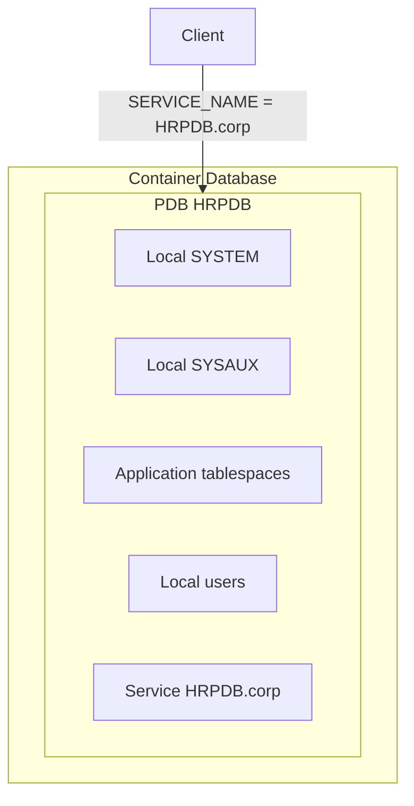

# PDB — Pluggable Database

## Overview

A **PDB** (Pluggable Database) is a self-contained set of schemas, tablespaces, users, and data that runs inside a **container database (CDB)**. From the application's perspective, a PDB behaves like a standalone database. From the DBA's perspective, PDBs share infrastructure with siblings and can be plugged, unplugged, cloned, relocated, and refreshed as units.

## Architecture



## Internal Working

### PDB Contents

Each PDB has:

- **Local SYSTEM tablespace** — dictionary for this PDB.
- **Local SYSAUX** — AWR-per-PDB (12.2+), etc.
- **Local UNDO (12.2+ if enabled at CDB level)**.
- **Local TEMP** (optional; can share CDB TEMP).
- **Application tablespaces**.
- **Local users**.
- **Service name** — same as PDB name (auto-registered).

### PDB States

| State        | Meaning                             |
| ------------ | ----------------------------------- |
| `MOUNTED`    | Files known but dictionary not open |
| `READ ONLY`  | Dictionary loaded, no DML/DDL       |
| `READ WRITE` | Normal operation                    |
| `MIGRATE`    | Upgrade in progress                 |
| `RESTRICTED` | Only privileged users can connect   |

### Open / Close

```sql
ALTER PLUGGABLE DATABASE hrpdb OPEN;
ALTER PLUGGABLE DATABASE hrpdb OPEN READ ONLY;
ALTER PLUGGABLE DATABASE hrpdb CLOSE;
ALTER PLUGGABLE DATABASE hrpdb CLOSE IMMEDIATE;
ALTER PLUGGABLE DATABASE ALL OPEN;
```

### Save State

Persist PDB open mode across CDB restarts:

```sql
ALTER PLUGGABLE DATABASE hrpdb SAVE STATE;
-- Or reverse
ALTER PLUGGABLE DATABASE hrpdb DISCARD STATE;
```

Without `SAVE STATE`, PDBs default to `MOUNTED` after CDB restart.

### Connect to a PDB

Use its service name:

```
HRPDB =
  (DESCRIPTION =
    (ADDRESS = (PROTOCOL = TCP)(HOST = dbhost)(PORT = 1521))
    (CONNECT_DATA = (SERVICE_NAME = HRPDB.corp.example.com)))
```

```bash
sqlplus hr/pwd@HRPDB
```

Alternatively, connect to CDB$ROOT and switch:

```sql
ALTER SESSION SET CONTAINER = HRPDB;
```

## Components

Same as [CDB](cdb.md).

## Important Parameters

Some parameters are settable per-PDB (see `V$SYSTEM_PARAMETER` with `ISPDB_MODIFIABLE = 'TRUE'`):

- `open_cursors`
- `sga_target` (upper bound; PDB competes for SGA within CDB)
- `pga_aggregate_target`
- Optimizer parameters
- Diagnostic parameters

Set at PDB level:

```sql
ALTER SESSION SET CONTAINER = HRPDB;
ALTER SYSTEM SET open_cursors = 500 SCOPE=BOTH;
```

## Important Views

| View                | Purpose                        |
| ------------------- | ------------------------------ |
| `V$PDBS`            | Per-PDB state                  |
| `CDB_PDBS`          | CDB-wide PDB list              |
| `V$PDB_INCARNATION` | Flashback incarnations         |
| `DBA_PDB_HISTORY`   | Open/close/plug/unplug history |
| `V$SERVICES`        | Auto-registered PDB services   |

## Diagnostic Queries

```sql
-- PDB state
SELECT con_id, name, open_mode, restricted, total_size/1024/1024/1024 AS gb
FROM   v$pdbs;

-- Size and space
SELECT pdb_name, ROUND(SUM(bytes)/1024/1024/1024, 2) AS gb
FROM   cdb_data_files
GROUP  BY pdb_name
ORDER  BY 2 DESC;

-- Save state
SELECT pdb_name, con_id, saved_state
FROM   cdb_pdb_saved_states;

-- Users per PDB
SELECT con_id, username, account_status
FROM   cdb_users
WHERE  common = 'NO'
ORDER  BY con_id, username;
```

## Common Operations

### Create a PDB

```sql
CREATE PLUGGABLE DATABASE hrpdb
  ADMIN USER pdbadmin IDENTIFIED BY pwd
  ROLES = (PDB_DBA)
  FILE_NAME_CONVERT = ('+DATA/prod/pdbseed', '+DATA/prod/hrpdb')
  STORAGE (MAXSIZE 100G);

ALTER PLUGGABLE DATABASE hrpdb OPEN;
ALTER PLUGGABLE DATABASE hrpdb SAVE STATE;
```

### Drop a PDB

```sql
ALTER PLUGGABLE DATABASE hrpdb CLOSE IMMEDIATE;
DROP PLUGGABLE DATABASE hrpdb INCLUDING DATAFILES;
```

!!! danger "Irreversible"
Removes datafiles from disk. Ensure backup exists.

### Rename PDB

```sql
ALTER PLUGGABLE DATABASE hrpdb CLOSE;
ALTER PLUGGABLE DATABASE hrpdb OPEN RESTRICTED;
ALTER PLUGGABLE DATABASE hrpdb RENAME GLOBAL_NAME TO hrpdb_new;
ALTER PLUGGABLE DATABASE CLOSE;
ALTER PLUGGABLE DATABASE OPEN;
```

## Common Issues

- **PDB not open after restart** — `SAVE STATE` missing.
- **Service not registered** — LREG hasn't run; `ALTER SYSTEM REGISTER`.
- **Storage limit hit** — `STORAGE (MAXSIZE X)` reached; enlarge or unset.
- **`ORA-65107: Error encountered while accessing shared UNDO`** — CDB in shared undo mode; consider local undo.

## Best Practices

1. **`ALTER DATABASE LOCAL UNDO ON;`** — enables per-PDB flashback + PITR.
2. `SAVE STATE` on every PDB.
3. Use RMAN for PDB-level backup/restore.
4. Set `STORAGE (MAXSIZE)` to prevent one PDB filling the CDB.
5. **PDB lockdown profiles** — restrict what a PDB user can do (`ALTER SYSTEM`, `ALTER SESSION SET CONTAINER`, etc.).
6. Standardize service naming; use per-PDB services for connect load balance.
7. Use **Resource Manager plans** at CDB and PDB levels for QoS.

## Interview Questions

1. **Q:** What is a PDB?
   **A:** A pluggable database — self-contained set of schemas, users, and tablespaces inside a CDB.

2. **Q:** How do you connect to a PDB?
   **A:** Use the PDB's service name (default = PDB name) in the connect string.

3. **Q:** `SAVE STATE`?
   **A:** Persists PDB open mode across CDB restart. Without it, PDB stays MOUNTED.

4. **Q:** Local vs shared UNDO?
   **A:** Local UNDO (12.2+, must be explicitly enabled) gives each PDB its own UNDO tablespace, enabling per-PDB flashback and PITR.

5. **Q:** How do you drop a PDB?
   **A:** `ALTER PLUGGABLE DATABASE ... CLOSE; DROP PLUGGABLE DATABASE ... INCLUDING DATAFILES;`.

6. **Q:** Which PDB modes are visible in `V$PDBS`?
   **A:** MOUNTED, READ ONLY, READ WRITE, MIGRATE, RESTRICTED.

7. **Q:** Can a session switch between PDBs?
   **A:** Yes if common user: `ALTER SESSION SET CONTAINER = <pdb>;`.

## References

- Oracle Database Multitenant Administrator's Guide 19c
- MOS Doc ID 1935365.1 — Multitenant FAQ
- MOS Doc ID 2313531.1 — Local UNDO
