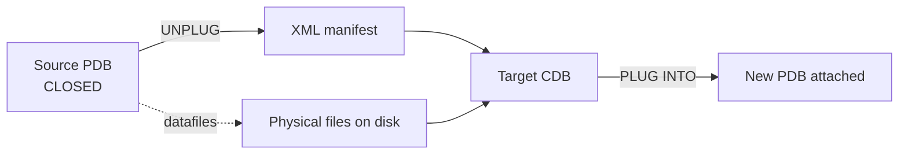

# Unplug / Plug

## Overview

**Unplug and plug** is the original PDB portability mechanism. **Unplug** captures a PDB's metadata into an XML file and detaches the datafiles from the source CDB. **Plug** takes that XML plus the datafiles and attaches them to a target CDB. Downtime = shutdown source PDB → move files → plug in target.

Use cases:

- Move a PDB between CDBs of different versions (upgrade path).
- Physically ship datafiles between servers (via file copy or storage array).
- Archive a PDB long-term as XML + datafiles for compliance.

For online moves, prefer [PDB Relocate](pdb-relocate.md). Unplug/plug is best for cross-version and offline moves.

## Architecture



## Internal Working

### Unplug

```sql
-- On source CDB
ALTER PLUGGABLE DATABASE hrpdb CLOSE;
ALTER PLUGGABLE DATABASE hrpdb UNPLUG INTO '/backup/hrpdb.xml';

-- Datafiles remain in place; PDB no longer registered
DROP PLUGGABLE DATABASE hrpdb KEEP DATAFILES;
```

XML contains:

- Tablespace and datafile listing
- Version and character set
- Feature usage
- Encryption metadata

### Plug (Same Version)

```sql
-- On target CDB
CREATE PLUGGABLE DATABASE hrpdb USING '/backup/hrpdb.xml'
  NOCOPY TEMPFILE REUSE;
-- NOCOPY: use existing files in place
-- COPY: Oracle copies to db_create_file_dest

ALTER PLUGGABLE DATABASE hrpdb OPEN;
```

For file relocation:

```sql
CREATE PLUGGABLE DATABASE hrpdb USING '/backup/hrpdb.xml'
  COPY
  FILE_NAME_CONVERT = ('/old/path', '/new/path');
```

### Plug (Cross-Version Upgrade)

If target CDB is a newer version:

```sql
CREATE PLUGGABLE DATABASE hrpdb USING '/backup/hrpdb.xml'
  COPY
  FILE_NAME_CONVERT = ('/old', '/new')
  STANDBYS = NONE;

-- PDB opens in upgrade mode
ALTER PLUGGABLE DATABASE hrpdb OPEN UPGRADE;

-- Upgrade
$ORACLE_HOME/rdbms/admin/catupgrd.sql   -- or datapatch approach

-- Recompile
@?/rdbms/admin/utlrp.sql
ALTER PLUGGABLE DATABASE hrpdb OPEN;
```

### Compatibility Check

Before plug, check compatibility:

```sql
SET SERVEROUTPUT ON
DECLARE
  compat BOOLEAN;
BEGIN
  compat := DBMS_PDB.CHECK_PLUG_COMPATIBILITY(pdb_descr_file => '/backup/hrpdb.xml');
  DBMS_OUTPUT.PUT_LINE(CASE WHEN compat THEN 'Compatible' ELSE 'Incompatible' END);
END;
/

-- Issues detail
SELECT type, message, action FROM pdb_plug_in_violations
WHERE  name = 'HRPDB';
```

## Components

| Component              | Purpose              |
| ---------------------- | -------------------- |
| XML manifest           | Metadata for the PDB |
| Datafiles              | Physical data        |
| Tempfiles              | Recreated on plug    |
| PDB_PLUG_IN_VIOLATIONS | Pre-plug diagnostic  |

## Important Parameters

None specific.

## Important Views

| View                     | Purpose              |
| ------------------------ | -------------------- |
| `PDB_PLUG_IN_VIOLATIONS` | Compatibility issues |
| `CDB_PDB_HISTORY`        | UNPLUG / PLUG events |

## Diagnostic Queries

```sql
-- Compatibility violations after checking
SELECT name, cause, type, message
FROM   pdb_plug_in_violations
WHERE  name = 'HRPDB';

-- History
SELECT db_name, pdb_name, operation, op_timestamp, description
FROM   cdb_pdb_history
WHERE  operation IN ('UNPLUG','PLUG','CREATE')
ORDER  BY op_timestamp DESC;
```

## Common Operations

### Full unplug/plug workflow (same version)

```sql
-- Source CDB
ALTER PLUGGABLE DATABASE hrpdb CLOSE IMMEDIATE;
ALTER PLUGGABLE DATABASE hrpdb UNPLUG INTO '/nfs/backup/hrpdb.xml';
DROP PLUGGABLE DATABASE hrpdb KEEP DATAFILES;

-- Copy or mount datafiles to target host if needed

-- Target CDB
BEGIN
  IF NOT dbms_pdb.check_plug_compatibility('/nfs/backup/hrpdb.xml') THEN
    RAISE_APPLICATION_ERROR(-20000, 'Incompatible');
  END IF;
END;
/

CREATE PLUGGABLE DATABASE hrpdb USING '/nfs/backup/hrpdb.xml'
  NOCOPY TEMPFILE REUSE;

ALTER PLUGGABLE DATABASE hrpdb OPEN;
ALTER PLUGGABLE DATABASE hrpdb SAVE STATE;
```

### As archival / cold backup

Unplug + tar the XML + datafiles as an archive:

```bash
tar czf hrpdb_archive_$(date +%F).tar.gz /backup/hrpdb.xml /oradata/hrpdb/*.dbf
```

Later, plug back in when needed.

## Common Issues

- **`ORA-65342: cannot plug in the PDB` — version mismatch** — Target version < source. Cannot downgrade via plug.
- **Character set mismatch** — Cross-CDB plug requires compatible character sets.
- **Missing datafiles** — Datafiles not present at expected paths. Fix and retry.
- **Compatibility violations** — Address each in `PDB_PLUG_IN_VIOLATIONS` before plugging.
- **`ORA-65086` — PDB does not exist** — Unplug already dropped it; verify XML path.

## Best Practices

1. Prefer **PDB Relocate** for online moves.
2. Unplug/Plug is ideal for **cross-version upgrades** and **archival**.
3. Always run `DBMS_PDB.CHECK_PLUG_COMPATIBILITY` first.
4. Keep XML in a backed-up location.
5. `KEEP DATAFILES` on unplug — don't accidentally remove them.
6. Datapatch after cross-version plug.
7. Test in staging: unplug from source clone → plug into staging target.
8. Document character set and version match.

## Interview Questions

1. **Q:** What is unplug/plug?
   **A:** Detach a PDB from source CDB (capturing metadata to XML) and attach it to a target CDB.

2. **Q:** Files needed?
   **A:** XML manifest + datafiles.

3. **Q:** Can you plug a lower-version PDB into a higher-version CDB?
   **A:** Yes — must open UPGRADE mode and run catupgrd or use Autoupgrade.

4. **Q:** What does `NOCOPY` vs `COPY` do?
   **A:** NOCOPY uses files in place; COPY copies files to target CDB's file dest.

5. **Q:** How do you check compatibility?
   **A:** `DBMS_PDB.CHECK_PLUG_COMPATIBILITY` and `PDB_PLUG_IN_VIOLATIONS`.

6. **Q:** Downtime for unplug/plug?
   **A:** From close-source to open-target: depends on datafile copy time.

## References

- Oracle Database Multitenant Administrator's Guide 19c — Unplug and Plug
- MOS Doc ID 2264476.1 — Unplug/Plug Cross-Version
- MOS Doc ID 1935365.1 — Multitenant FAQ
