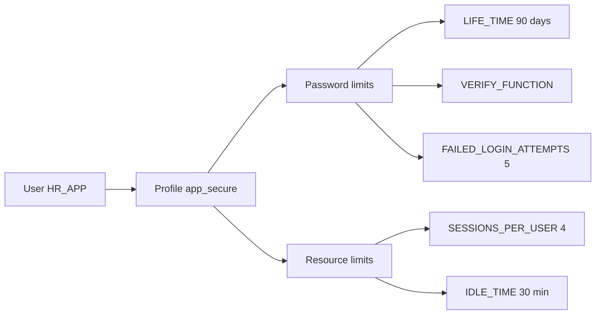

# Profiles

## Overview

A **profile** is a named policy governing password behavior and resource consumption for users. Every user is assigned a profile (default: `DEFAULT`). Profiles enforce password complexity, expiration, lockout after failed logins, and per-session resource caps (CPU seconds, idle time, sessions per user).

Profiles enable regulatory compliance (SOX, PCI-DSS, HIPAA) — enforce "password expires every 90 days" and "lock account after 5 failed logins" centrally.

## Architecture



## Internal Working

### Creation

```sql
CREATE PROFILE app_secure LIMIT
  -- Password
  FAILED_LOGIN_ATTEMPTS 5
  PASSWORD_LOCK_TIME 1
  PASSWORD_LIFE_TIME 90
  PASSWORD_GRACE_TIME 7
  PASSWORD_REUSE_TIME 365
  PASSWORD_REUSE_MAX 12
  PASSWORD_VERIFY_FUNCTION ora12c_verify_function
  INACTIVE_ACCOUNT_TIME 90

  -- Resource
  SESSIONS_PER_USER 10
  CPU_PER_SESSION UNLIMITED
  CPU_PER_CALL 60000        -- 10 min in centiseconds
  IDLE_TIME 30              -- minutes
  CONNECT_TIME UNLIMITED
  LOGICAL_READS_PER_SESSION DEFAULT
  PRIVATE_SGA UNLIMITED;
```

### Assign

```sql
ALTER USER hr_app PROFILE app_secure;
```

### Password Limits

| Limit                      | Purpose                               |
| -------------------------- | ------------------------------------- |
| `FAILED_LOGIN_ATTEMPTS`    | Attempts before lock                  |
| `PASSWORD_LOCK_TIME`       | Days locked after failure limit       |
| `PASSWORD_LIFE_TIME`       | Days before expiry                    |
| `PASSWORD_GRACE_TIME`      | Days after expiry to change           |
| `PASSWORD_REUSE_TIME`      | Days before password can repeat       |
| `PASSWORD_REUSE_MAX`       | Password changes before reuse allowed |
| `PASSWORD_VERIFY_FUNCTION` | Complexity check                      |
| `INACTIVE_ACCOUNT_TIME`    | Auto-lock after N idle days (12.2+)   |

### Resource Limits

| Limit                       | Purpose                                   |
| --------------------------- | ----------------------------------------- |
| `SESSIONS_PER_USER`         | Concurrent sessions                       |
| `CPU_PER_SESSION`           | Cumulative CPU per session (centiseconds) |
| `CPU_PER_CALL`              | CPU per SQL call                          |
| `IDLE_TIME`                 | Minutes before disconnect                 |
| `CONNECT_TIME`              | Minutes total session                     |
| `LOGICAL_READS_PER_SESSION` | Buffer gets                               |
| `LOGICAL_READS_PER_CALL`    | Per call                                  |
| `COMPOSITE_LIMIT`           | Weighted combination                      |
| `PRIVATE_SGA`               | Shared server memory                      |

`RESOURCE_LIMIT = TRUE` (default in 19c) is required for resource limits to take effect.

### Password Verify Function

Oracle ships `utlpwdmg.sql` with example verify functions:

- `verify_function` (legacy)
- `verify_function_11G`
- `ora12c_verify_function` (recommended)
- `ora12c_strong_verify_function`

Located at `$ORACLE_HOME/rdbms/admin/utlpwdmg.sql`.

Custom function:

```sql
CREATE OR REPLACE FUNCTION my_pwd_verify(
  username VARCHAR2, password VARCHAR2, old_password VARCHAR2)
RETURN BOOLEAN AS
BEGIN
  IF LENGTH(password) < 12 THEN
    RAISE_APPLICATION_ERROR(-20001, 'Password must be at least 12 chars');
  END IF;
  IF NOT REGEXP_LIKE(password, '[[:upper:]]') THEN
    RAISE_APPLICATION_ERROR(-20002, 'Must contain uppercase');
  END IF;
  IF NOT REGEXP_LIKE(password, '[[:digit:]]') THEN
    RAISE_APPLICATION_ERROR(-20003, 'Must contain digit');
  END IF;
  IF NOT REGEXP_LIKE(password, '[[:punct:]]') THEN
    RAISE_APPLICATION_ERROR(-20004, 'Must contain punctuation');
  END IF;
  RETURN TRUE;
END;
/

CREATE PROFILE app_secure LIMIT
  PASSWORD_VERIFY_FUNCTION my_pwd_verify
  ...;
```

## Components

| Component       | Purpose                   |
| --------------- | ------------------------- |
| Profile         | Policy container          |
| Password limits | Password rules            |
| Resource limits | Session constraints       |
| Verify function | Password complexity check |

## Important Parameters

| Parameter                          | Purpose                                    |
| ---------------------------------- | ------------------------------------------ |
| `resource_limit`                   | TRUE (default 19c) enables resource limits |
| `sec_return_server_release_banner` | Hides version info                         |

## Important Views

| View                | Purpose                   |
| ------------------- | ------------------------- |
| `DBA_PROFILES`      | Profile definitions       |
| `DBA_USERS.PROFILE` | Assigned profile          |
| `V$SESSION`         | Current sessions per user |

## Diagnostic Queries

```sql
-- All profiles
SELECT DISTINCT profile FROM dba_profiles ORDER BY profile;

-- Profile detail
SELECT resource_name, limit, resource_type
FROM   dba_profiles
WHERE  profile = 'APP_SECURE'
ORDER  BY resource_type, resource_name;

-- Users per profile
SELECT profile, COUNT(*) FROM dba_users
GROUP  BY profile ORDER BY 2 DESC;

-- Users about to expire
SELECT username, account_status, expiry_date
FROM   dba_users
WHERE  expiry_date IS NOT NULL
   AND expiry_date < SYSDATE + 30
ORDER  BY expiry_date;
```

## Common Operations

### Alter profile

```sql
ALTER PROFILE app_secure LIMIT
  PASSWORD_LIFE_TIME 60
  FAILED_LOGIN_ATTEMPTS 3;
```

### Drop profile

```sql
DROP PROFILE app_secure CASCADE;   -- reassigns users to DEFAULT
```

### Enable resource limits

```sql
ALTER SYSTEM SET resource_limit = TRUE SCOPE=BOTH;
```

## Common Issues

- **`ORA-28000: account is locked`** — Failed logins exceeded. `ALTER USER x ACCOUNT UNLOCK;`.
- **`ORA-28001: password has expired`** — Beyond `PASSWORD_LIFE_TIME` + `GRACE`. Reset with `ALTER USER x IDENTIFIED BY new`.
- **`ORA-28002: password will expire in N days`** — Warning during grace period.
- **`ORA-28003: password verification failed`** — Verify function rejected.
- **`ORA-02391: exceeded simultaneous SESSIONS_PER_USER limit`** — Reduce concurrent sessions or raise limit.
- **`ORA-02393: exceeded call limit on CPU usage`** — CPU_PER_CALL hit.

## Best Practices

1. Set `PASSWORD_LIFE_TIME` — comply with your policy (30/60/90 days).
2. **`FAILED_LOGIN_ATTEMPTS = 5`** minimum.
3. **`INACTIVE_ACCOUNT_TIME = 90`** — auto-lock stale accounts.
4. Use `ora12c_verify_function` or stronger.
5. Set `IDLE_TIME` to force disconnect of forgotten sessions.
6. Never assign `DEFAULT` profile to application accounts — always a custom profile.
7. For service accounts / batch users, custom profile with `PASSWORD_LIFE_TIME UNLIMITED` if password rotation is impractical (accept the risk).
8. Test verify function in dev before deploying.
9. Alert on expiring passwords 14 days in advance.

## Interview Questions

1. **Q:** What is a profile?
   **A:** A named policy for password behavior and resource limits assigned to users.

2. **Q:** Password vs resource limits?
   **A:** Password: expiration, complexity, lockout. Resource: sessions, CPU, memory, idle time.

3. **Q:** What parameter must be TRUE for resource limits?
   **A:** `resource_limit = TRUE` (default in 19c).

4. **Q:** What is `PASSWORD_VERIFY_FUNCTION`?
   **A:** A PL/SQL function that validates password complexity when set/changed.

5. **Q:** How to lock idle sessions?
   **A:** Set `IDLE_TIME` in profile (minutes).

6. **Q:** What is `INACTIVE_ACCOUNT_TIME`?
   **A:** 12.2+ — auto-lock accounts inactive for N days.

7. **Q:** Can you drop DEFAULT profile?
   **A:** No.

## References

- Oracle Database Security Guide 19c — Password Management Policy
- Oracle Database Reference 19c — Profile
- MOS Doc ID 401207.1 — Password Verify Function
