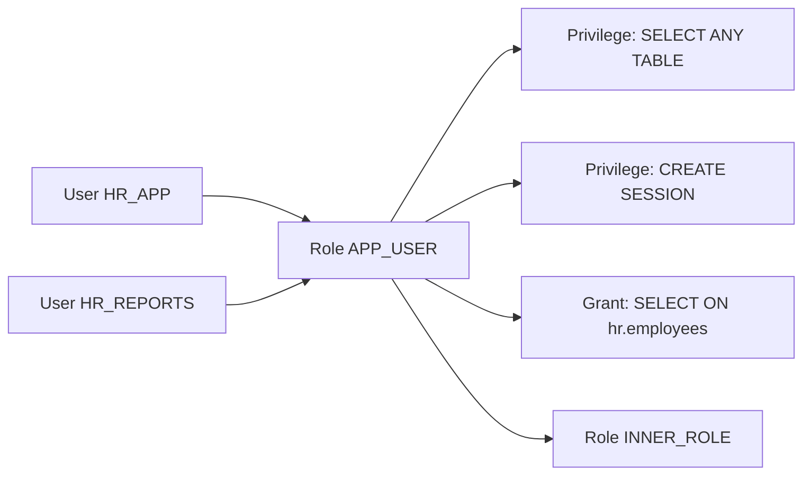

# Roles

## Overview

A **role** is a named bundle of privileges. Instead of granting individual privileges to many users, DBAs grant them once to a role and then grant the role to users. Roles simplify authorization management and enable dynamic privilege enable/disable per session.

Oracle ships **predefined roles** (`DBA`, `RESOURCE`, `CONNECT`, etc.); DBAs create **application roles** for their apps.

## Architecture



## Internal Working

### Creation

```sql
CREATE ROLE app_user;
GRANT CREATE SESSION TO app_user;
GRANT SELECT ON hr.employees TO app_user;
GRANT INSERT, UPDATE ON hr.orders TO app_user;

-- Grant role to user
GRANT app_user TO hr_reports;
```

### Types

| Type                        | Description                                                                        |
| --------------------------- | ---------------------------------------------------------------------------------- |
| **Non-secure**              | Default; enabled at session start                                                  |
| **Password-protected**      | `CREATE ROLE r IDENTIFIED BY pwd` — user must issue `SET ROLE r IDENTIFIED BY pwd` |
| **External**                | Verified via OS                                                                    |
| **Global**                  | LDAP-authenticated                                                                 |
| **Secure application role** | Enabled by a PL/SQL procedure — 12c+ preferred                                     |

### Nested Roles

Roles can be granted to other roles (up to 5 levels of nesting recommended).

```sql
CREATE ROLE app_admin;
GRANT app_user TO app_admin;
```

Users granted `app_admin` inherit `app_user`.

### Enabling / Disabling

```sql
-- All roles enabled at login unless DEFAULT ROLE alters
ALTER USER hr_reports DEFAULT ROLE ALL EXCEPT app_admin;
ALTER USER hr_reports DEFAULT ROLE NONE;

-- Enable in session
SET ROLE app_user;
SET ROLE app_user IDENTIFIED BY pwd;
SET ROLE NONE;
SET ROLE ALL;
```

### Predefined Roles

| Role                | Purpose                         | Notes                                 |
| ------------------- | ------------------------------- | ------------------------------------- |
| `CONNECT`           | Legacy; now just CREATE SESSION | Simplified in 10g+                    |
| `RESOURCE`          | Various privileges              | Includes UNLIMITED TABLESPACE — avoid |
| `DBA`               | Full DBA rights                 | Do not grant to app users             |
| `SYSDBA`            | Highest privilege               | For instance management               |
| `SYSOPER`           | Startup/shutdown/backup         | Cannot access data                    |
| `SYSBACKUP`         | RMAN backup                     | Separation of duty                    |
| `SYSDG`             | Data Guard operations           |                                       |
| `SYSKM`             | TDE key management              |                                       |
| `SYSRAC`            | RAC management                  |                                       |
| `IMP_FULL_DATABASE` | For Data Pump imports           |                                       |
| `EXP_FULL_DATABASE` | For Data Pump exports           |                                       |
| `AUDIT_ADMIN`       | Manage Unified Audit            |                                       |
| `PDB_DBA`           | PDB admin                       |                                       |

### Secure Application Roles

Since 12c, prefer secure application roles — enabled by a package that validates context:

```sql
CREATE ROLE secure_app_role IDENTIFIED USING app_pkg.enable_role;

CREATE OR REPLACE PACKAGE app_pkg AS
  PROCEDURE enable_role;
END;
/

CREATE OR REPLACE PACKAGE BODY app_pkg AS
  PROCEDURE enable_role IS
  BEGIN
    IF SYS_CONTEXT('userenv','ip_address') LIKE '10.0.%' THEN
      DBMS_SESSION.SET_ROLE('secure_app_role');
    ELSE
      RAISE_APPLICATION_ERROR(-20001, 'Not allowed');
    END IF;
  END;
END;
/
```

Guarantees role can't be enabled outside the trusted path.

## Components

| Component     | Purpose                     |
| ------------- | --------------------------- |
| Role          | Named privilege bundle      |
| Grant         | Privilege → role assignment |
| Grant         | Role → user assignment      |
| Default roles | Enabled at login            |
| SET ROLE      | Session-level enable        |

## Important Parameters

| Parameter           | Purpose                                |
| ------------------- | -------------------------------------- |
| `max_enabled_roles` | Historical; ignored in modern versions |
| `os_roles`          | Enable OS-authenticated roles          |

## Important Views

| View              | Purpose                          |
| ----------------- | -------------------------------- |
| `DBA_ROLES`       | All roles                        |
| `DBA_ROLE_PRIVS`  | Who has which role               |
| `ROLE_ROLE_PRIVS` | Role-in-role                     |
| `ROLE_SYS_PRIVS`  | System privs per role            |
| `ROLE_TAB_PRIVS`  | Object privs per role            |
| `SESSION_ROLES`   | Roles enabled in current session |

## Diagnostic Queries

```sql
-- All non-Oracle roles
SELECT role, authentication_type, common, oracle_maintained
FROM   dba_roles
WHERE  oracle_maintained = 'N';

-- Who has which role
SELECT grantee, granted_role, admin_option, default_role
FROM   dba_role_privs
WHERE  granted_role = 'APP_USER'
ORDER  BY grantee;

-- Privileges granted to a role
SELECT privilege FROM role_sys_privs WHERE role = 'APP_USER'
UNION ALL
SELECT owner || '.' || table_name || ' ' || privilege
FROM   role_tab_privs WHERE role = 'APP_USER';

-- Effective privileges of a user (roles + direct)
SELECT privilege, 'DIRECT' AS source FROM dba_sys_privs WHERE grantee = 'HR_APP'
UNION ALL
SELECT privilege, granted_role FROM role_sys_privs
WHERE  role IN (SELECT granted_role FROM dba_role_privs WHERE grantee = 'HR_APP');

-- Currently enabled roles in this session
SELECT role FROM session_roles;
```

## Common Operations

### Grant/revoke role

```sql
GRANT app_user TO hr_reports;
REVOKE app_user FROM hr_reports;
```

### Set default roles

```sql
ALTER USER hr_reports DEFAULT ROLE ALL EXCEPT app_admin;
```

### Drop role

```sql
DROP ROLE app_user;   -- cascades revoke to all grantees
```

## Common Issues

- **Grants via role not visible in stored procedures** — Roles are disabled inside definer-rights PL/SQL. Grant directly to the user or make procedure `AUTHID CURRENT_USER`.
- **User missing privilege after login** — Role not in default roles.
- **`ORA-01031`** — Missing grant or role not enabled.
- **Circular role grant** — Oracle rejects with error.

## Best Practices

1. **Never grant `DBA` to app users.** Grant specific privileges via role.
2. **Application role per app.** Not per user.
3. **Secure application roles** for sensitive operations.
4. Do not use `RESOURCE` — it includes `UNLIMITED TABLESPACE`.
5. Explicitly `GRANT CREATE SESSION` — don't rely on `CONNECT`.
6. Regularly audit `DBA_ROLE_PRIVS` — orphaned privileges accumulate.
7. Password-protect powerful roles.
8. Use `DBA_TAB_PRIVS` review to spot over-grants.
9. Roles disabled in definer-rights PL/SQL — grant directly if needed.

## Interview Questions

1. **Q:** What is a role?
   **A:** A named bundle of privileges. Simplifies user administration.

2. **Q:** Are roles enabled in PL/SQL?
   **A:** In definer-rights procedures, NO. In invoker-rights (`AUTHID CURRENT_USER`), YES.

3. **Q:** Difference between direct grant and role grant?
   **A:** Direct grants apply everywhere including definer-rights PL/SQL. Role grants are disabled in definer-rights PL/SQL.

4. **Q:** What is a secure application role?
   **A:** Role enabled only by a specific PL/SQL package — enforces context checks (IP, module, etc.).

5. **Q:** Why avoid `RESOURCE`?
   **A:** Includes `UNLIMITED TABLESPACE` — user can consume all storage.

6. **Q:** How do you drop a role?
   **A:** `DROP ROLE r;` — revokes from all grantees automatically.

7. **Q:** How do you view enabled roles?
   **A:** `SELECT role FROM session_roles;`.

## References

- Oracle Database Security Guide 19c — Configuring User Authorization
- Oracle Database Concepts 19c — Privileges and Roles
- MOS Doc ID 2264476.1 — Secure Application Roles
