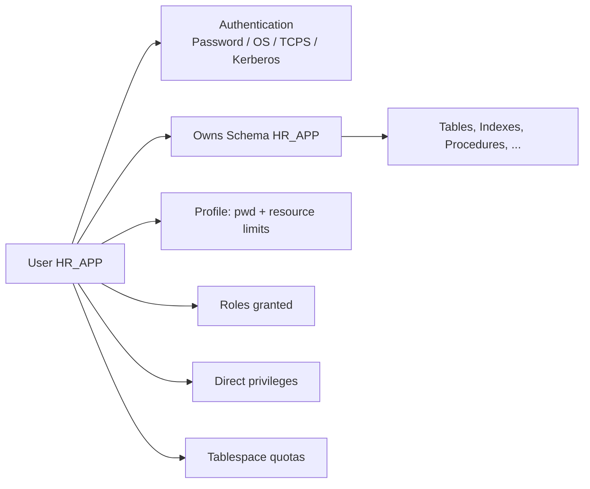

# Users

## Overview

An Oracle **user** is a database account — the identity Oracle uses to authenticate and authorize database operations. Every user owns a **schema** (a namespace of tables, indexes, procedures, etc.); the terms `user` and `schema` are often used interchangeably. In multitenant, users are either **local** (per-PDB) or **common** (across all containers). See [Multitenant Common Users](../08-multitenant/common-users.md).

## Architecture



## Internal Working

### Creation

```sql
CREATE USER hr_app IDENTIFIED BY "StrongPwd!"
  DEFAULT TABLESPACE users
  TEMPORARY TABLESPACE temp
  QUOTA UNLIMITED ON users
  QUOTA 0 ON system
  PROFILE app_profile
  ACCOUNT UNLOCK
  PASSWORD EXPIRE;

GRANT CREATE SESSION TO hr_app;
GRANT CREATE TABLE, CREATE VIEW, CREATE PROCEDURE TO hr_app;
```

### Authentication Types

| Type                     | Config                                 | Notes                                  |
| ------------------------ | -------------------------------------- | -------------------------------------- |
| Password                 | `IDENTIFIED BY <pwd>`                  | Standard; hashed in `SYS.USER$`        |
| External (OS)            | `IDENTIFIED EXTERNALLY`                | User in OS `dba` group / prefix `OPS$` |
| Global (LDAP/Kerberos)   | `IDENTIFIED GLOBALLY AS '...'`         | Enterprise User Security               |
| No Authentication (18c+) | `NO AUTHENTICATION`                    | Schema-only account — no password      |
| Proxy                    | `ALTER USER a GRANT CONNECT THROUGH b` | User b connects as a                   |

### Schema-Only Accounts

Since 18c, schema owners can have no password:

```sql
CREATE USER hr_schema NO AUTHENTICATION;
GRANT CREATE SESSION TO hr_schema;   -- optional; often not needed
GRANT CREATE TABLE, ... TO hr_schema;

-- Cannot log in directly. Proxy authentication:
ALTER USER hr_schema GRANT CONNECT THROUGH hr_app;
```

Best practice — reduces attack surface.

### Password Hashes

Oracle stores password hashes in `SYS.USER$`. Multiple hash versions supported: `10G` (case-insensitive, MD5), `11G` (SHA-1), `12C` (SHA-2 512). Controlled by `SQLNET.ALLOWED_LOGON_VERSION_SERVER`.

Modern default: 12C only.

### Quotas

Users need explicit quotas to allocate space in tablespaces (except with `UNLIMITED TABLESPACE` privilege, which is dangerous).

```sql
ALTER USER hr_app QUOTA 10G ON users;
ALTER USER hr_app QUOTA UNLIMITED ON users;
ALTER USER hr_app QUOTA 0 ON system;   -- prevent any allocation
```

### Account Status

`DBA_USERS.ACCOUNT_STATUS`:

| Status           | Meaning                                     |
| ---------------- | ------------------------------------------- |
| OPEN             | Usable                                      |
| LOCKED           | Locked (manual or profile)                  |
| EXPIRED          | Password expired; must change on next login |
| EXPIRED & LOCKED | Both                                        |
| LOCKED(TIMED)    | Auto-locked by profile after failed logins  |

```sql
ALTER USER hr_app ACCOUNT LOCK;
ALTER USER hr_app ACCOUNT UNLOCK;
ALTER USER hr_app PASSWORD EXPIRE;
ALTER USER hr_app IDENTIFIED BY new_pwd;
```

### Proxy Authentication

Allows one user to connect as another without knowing the target's password:

```sql
ALTER USER hr_schema GRANT CONNECT THROUGH hr_app;

-- Connect
sqlplus hr_app[hr_schema]/pwd@HRPDB
```

Ideal for schema-only accounts. Auditable.

## Components

| Component  | Purpose                              |
| ---------- | ------------------------------------ |
| User       | Identity                             |
| Schema     | Object namespace (same name as user) |
| Profile    | Password + resource policy           |
| Quotas     | Tablespace space limits              |
| Roles      | Privilege bundles                    |
| Privileges | Fine-grained rights                  |

## Important Parameters

| Parameter                             | Purpose                                               |
| ------------------------------------- | ----------------------------------------------------- |
| `sec_case_sensitive_logon`            | Deprecated (was TRUE default in 11g); now always TRUE |
| `sqlnet.allowed_logon_version_server` | Min password hash version accepted                    |
| `resource_limit`                      | Enable profile resource limits (TRUE default in 19c)  |

## Important Views

| View             | Purpose                        |
| ---------------- | ------------------------------ |
| `DBA_USERS`      | User attributes                |
| `DBA_TS_QUOTAS`  | Quotas per user per tablespace |
| `DBA_ROLE_PRIVS` | Role grants                    |
| `DBA_SYS_PRIVS`  | System privilege grants        |
| `DBA_TAB_PRIVS`  | Object privilege grants        |
| `DBA_PROXIES`    | Proxy authentication config    |
| `V$SESSION`      | Currently logged in            |

## Diagnostic Queries

```sql
-- User list
SELECT username, account_status, default_tablespace,
       created, last_login, profile
FROM   dba_users
WHERE  oracle_maintained = 'N'
ORDER  BY username;

-- Any expired or locked?
SELECT username, account_status, expiry_date
FROM   dba_users
WHERE  account_status <> 'OPEN' AND oracle_maintained = 'N';

-- Quotas
SELECT username, tablespace_name, bytes/1024/1024 AS used_mb,
       max_bytes/1024/1024 AS max_mb
FROM   dba_ts_quotas
ORDER  BY username;

-- Privileges of a user
SELECT privilege FROM dba_sys_privs WHERE grantee = 'HR_APP'
UNION ALL
SELECT 'ROLE: ' || granted_role FROM dba_role_privs WHERE grantee = 'HR_APP';

-- Proxy relationships
SELECT proxy, client, authentication FROM dba_proxies;
```

## Common Operations

### Create user with best practices

```sql
CREATE USER hr_app IDENTIFIED BY "&Strong_Pwd"
  DEFAULT TABLESPACE users
  TEMPORARY TABLESPACE temp
  QUOTA UNLIMITED ON users
  PROFILE app_secure
  PASSWORD EXPIRE;

GRANT CREATE SESSION TO hr_app;
GRANT CREATE TABLE, CREATE PROCEDURE, CREATE SEQUENCE,
      CREATE VIEW, CREATE TRIGGER TO hr_app;
```

### Reset password

```sql
ALTER USER hr_app IDENTIFIED BY "&NewPwd";
```

### Rename user (18c+ has ALTER USER RENAME, else recreate)

Traditional workflow: export, drop, recreate under new name, import.

### Drop user

```sql
DROP USER hr_app CASCADE;   -- CASCADE drops owned objects
```

!!! danger
`CASCADE` removes all objects owned by the user. Ensure backup.

## Common Issues

- **`ORA-01017: invalid username/password`** — Wrong password or user missing.
- **`ORA-28001: password has expired`** — Reset with `ALTER USER ... IDENTIFIED BY`.
- **`ORA-28000: account is locked`** — Check profile; `ALTER USER ... ACCOUNT UNLOCK`.
- **`ORA-01031: insufficient privileges`** — Missing grant.
- **`ORA-01950: no privileges on tablespace`** — No quota.
- **`ORA-28107: user is locked`** — Locked by profile too many failed logins.

## Troubleshooting

1. `SELECT username, account_status, expiry_date FROM dba_users WHERE username = 'X';`
2. `SELECT profile FROM dba_users WHERE username = 'X';` — check profile.
3. `SELECT resource_name, limit FROM dba_profiles WHERE profile = '<name>';` — check limits.
4. Audit failed logins: `SELECT * FROM dba_audit_session WHERE returncode <> 0 ORDER BY timestamp DESC;`.

## Best Practices

1. **One schema per application** — clean isolation.
2. **Schema-only accounts** for application owners.
3. **Named DBA accounts** — never share SYS. Use SYSDBA-privileged personal accounts.
4. **Strong passwords** enforced by profile.
5. **`PASSWORD EXPIRE`** on new accounts — forces change.
6. **Explicit quotas** — never grant `UNLIMITED TABLESPACE`.
7. **Least privilege** — no `DBA` role unless truly needed.
8. **Regular audit** of `DBA_USERS.LAST_LOGIN` — remove stale accounts.
9. **Profile-based lockout** to slow brute force.
10. Do not use case-insensitive 10g hashes on new accounts.

## Interview Questions

1. **Q:** What is a user in Oracle?
   **A:** A database account. Owns a schema (namespace of objects).

2. **Q:** Schema-only account?
   **A:** 18c+ user with no password (`NO AUTHENTICATION`); only accessed via proxy — reduces attack surface.

3. **Q:** How do you drop a user with objects?
   **A:** `DROP USER x CASCADE;`.

4. **Q:** Difference between user and schema?
   **A:** Historically same thing — 1:1 mapping. Every user has a schema.

5. **Q:** What is proxy authentication?
   **A:** User A connects "as" User B without knowing B's password. Config: `ALTER USER B GRANT CONNECT THROUGH A;`.

6. **Q:** How to force a password change?
   **A:** `ALTER USER x PASSWORD EXPIRE;` — user must reset at next login.

7. **Q:** Account locked — how to unlock?
   **A:** `ALTER USER x ACCOUNT UNLOCK;`.

## References

- Oracle Database Security Guide 19c — User Authentication
- Oracle Database Concepts 19c — Users and Roles
- MOS Doc ID 401207.1 — Password Policy
- MOS Doc ID 2249633.1 — Schema-Only Accounts
