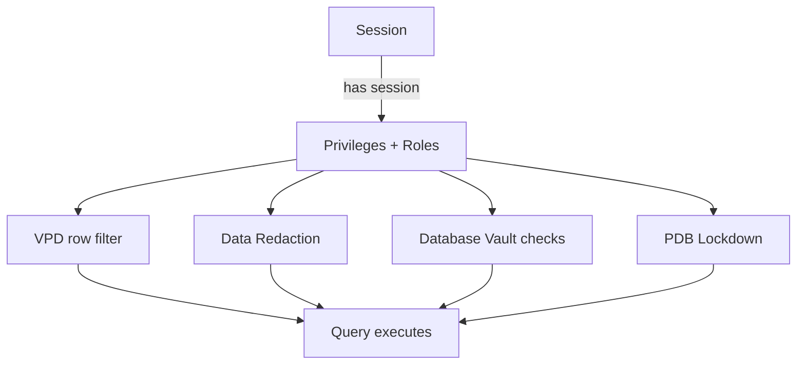

# Authorization

## Overview

**Authorization** answers "what can this authenticated user do?" Oracle's authorization model layers system privileges, object privileges, roles, VPD row filters, Database Vault realms, and lockdown profiles. This page covers the base layer — system + object privileges + roles. See [VPD](vpd.md), [Database Vault](database-vault.md), and [Data Redaction](data-redaction.md) for finer-grained controls.

## Layers of Authorization



## System Privileges

Granted at the database (or PDB) level. Examples:

- `CREATE SESSION` — mandatory to log in.
- `CREATE TABLE`, `CREATE VIEW`, `CREATE PROCEDURE`, etc.
- `SELECT ANY TABLE`, `INSERT ANY TABLE`, `UPDATE ANY TABLE` — dangerous, avoid.
- `ALTER SYSTEM`, `ALTER DATABASE` — DBA-level.
- `UNLIMITED TABLESPACE` — dangerous; use quotas instead.
- `DBA`, `SYSDBA` — kitchen sink.

```sql
GRANT CREATE SESSION, CREATE TABLE, CREATE VIEW TO hr_app;
REVOKE UNLIMITED TABLESPACE FROM hr_app;
```

## Object Privileges

Granted on specific objects:

- `SELECT`, `INSERT`, `UPDATE`, `DELETE`
- `EXECUTE` (procedures/functions/packages)
- `REFERENCES` (foreign key)
- `INDEX`, `ALTER`
- `READ` (17c+ — read without lock; use for materialized view refresh)

```sql
GRANT SELECT ON hr.employees TO hr_reports;
GRANT SELECT, INSERT, UPDATE, DELETE ON hr.orders TO hr_app;
GRANT EXECUTE ON hr.pkg_orders TO hr_app;
```

`WITH GRANT OPTION` allows the grantee to re-grant:

```sql
GRANT SELECT ON hr.employees TO hr_app WITH GRANT OPTION;
```

`WITH ADMIN OPTION` for system privs and roles.

## Roles

See [Roles](../09-user-management/roles.md). Roles bundle privileges. **Roles are disabled inside definer-rights PL/SQL** — direct grants required if PL/SQL depends on them.

## Least Privilege

Instead of `SELECT ANY TABLE`, grant `SELECT ON <specific table>`. Instead of `DBA`, grant needed system privileges via a custom role.

## PDB Lockdown Profiles

Multitenant-specific — restrict what a PDB can do:

```sql
CREATE LOCKDOWN PROFILE pdb_secure;
ALTER LOCKDOWN PROFILE pdb_secure DISABLE STATEMENT = ('ALTER SYSTEM');
ALTER LOCKDOWN PROFILE pdb_secure DISABLE OPTION = ('DATABASE QUEUING');
ALTER LOCKDOWN PROFILE pdb_secure DISABLE FEATURE = ('COMMON_USER_LOGON_EVENTS');

-- Apply to a PDB
ALTER SESSION SET CONTAINER = HRPDB;
ALTER SYSTEM SET pdb_lockdown = 'PDB_SECURE' SCOPE=BOTH;
```

## Important Views

| View                    | Purpose                            |
| ----------------------- | ---------------------------------- |
| `DBA_SYS_PRIVS`         | System privileges granted directly |
| `DBA_ROLE_PRIVS`        | Role grants                        |
| `DBA_TAB_PRIVS`         | Object privileges                  |
| `ROLE_SYS_PRIVS`        | Privs via role                     |
| `ROLE_TAB_PRIVS`        | Object privs via role              |
| `SESSION_PRIVS`         | Current session enabled privileges |
| `SESSION_ROLES`         | Current session enabled roles      |
| `DBA_LOCKDOWN_PROFILES` | PDB restrictions                   |

## Diagnostic Queries

```sql
-- What can user do (direct)
SELECT privilege FROM dba_sys_privs WHERE grantee = 'HR_APP';

-- What can user do (via roles)
SELECT r.granted_role, rsp.privilege
FROM   dba_role_privs r LEFT JOIN role_sys_privs rsp ON rsp.role = r.granted_role
WHERE  r.grantee = 'HR_APP';

-- Object privileges
SELECT owner, table_name, privilege, grantable
FROM   dba_tab_privs WHERE grantee = 'HR_APP';

-- Currently enabled in session
SELECT * FROM session_privs;
SELECT * FROM session_roles;

-- Users with dangerous system privileges
SELECT grantee, privilege FROM dba_sys_privs
WHERE  privilege IN ('SELECT ANY TABLE','UPDATE ANY TABLE',
                     'DELETE ANY TABLE','UNLIMITED TABLESPACE',
                     'DROP ANY TABLE','GRANT ANY PRIVILEGE',
                     'GRANT ANY ROLE','BECOME USER')
ORDER  BY privilege, grantee;
```

## Common Operations

### Grant minimum-privilege set

```sql
-- Application user
GRANT CREATE SESSION TO hr_app;
GRANT CREATE TABLE, CREATE VIEW, CREATE SEQUENCE, CREATE PROCEDURE TO hr_app;

-- Reader user
CREATE USER hr_reader IDENTIFIED BY pwd;
GRANT CREATE SESSION TO hr_reader;
GRANT SELECT ON hr.employees TO hr_reader;
GRANT SELECT ON hr.departments TO hr_reader;
```

### Revoke

```sql
REVOKE SELECT ON hr.employees FROM hr_reader;
REVOKE app_user FROM hr_reader;
```

### Grant with role

```sql
CREATE ROLE hr_read_only;
GRANT SELECT ON hr.employees TO hr_read_only;
GRANT SELECT ON hr.departments TO hr_read_only;
GRANT hr_read_only TO hr_reader;
```

## Common Issues

- **`ORA-01031`** — Missing privilege. Compare `SESSION_PRIVS` to what the operation needs.
- **PL/SQL fails but user can SELECT** — Definer-rights: roles disabled inside PL/SQL. Grant directly.
- **Cannot revoke system privilege** — Revoked but cascading grant remains. Investigate `GRANT_OPTION`.
- **`ORA-01924: role not granted or does not exist`** — Trying to enable an ungranted role.

## Best Practices

1. **Least privilege everywhere.** Grant specific, not `ANY`.
2. **Application role per app.** Grants via role, apply to schema owner.
3. Do not grant `RESOURCE` — it includes `UNLIMITED TABLESPACE`.
4. Avoid `SELECT ANY TABLE`, `UPDATE ANY TABLE`.
5. Use `READ` privilege (12c+) instead of `SELECT` for reporting — prevents `SELECT FOR UPDATE` locks.
6. Regularly audit `DBA_SYS_PRIVS`, `DBA_TAB_PRIVS`.
7. PDB Lockdown Profiles to restrict PDB users from touching CDB.
8. Use secure application roles for sensitive operations.
9. Direct grants for PL/SQL dependencies.
10. Do not grant system privileges via `PUBLIC`.

## Interview Questions

1. **Q:** System vs object privilege?
   **A:** System: DB-wide capability (CREATE SESSION, ALTER SYSTEM). Object: on a specific object (SELECT ON HR.EMPLOYEES).

2. **Q:** Why avoid `SELECT ANY TABLE`?
   **A:** Grants access to every table across schemas — huge blast radius.

3. **Q:** How do you grant `SELECT` on a materialized view without a lock?
   **A:** `GRANT READ` — 12c+ read-only privilege.

4. **Q:** Roles in definer-rights PL/SQL?
   **A:** Disabled. Need direct grants.

5. **Q:** PDB Lockdown Profile?
   **A:** Multitenant feature restricting which statements/features PDB users can invoke.

6. **Q:** `WITH GRANT OPTION`?
   **A:** Grantee can re-grant the object privilege to others.

7. **Q:** `WITH ADMIN OPTION`?
   **A:** Grantee can re-grant system privileges or roles to others.

## References

- Oracle Database Security Guide 19c — Configuring User Authorization
- Oracle Database Multitenant Guide 19c — PDB Lockdown Profiles
- MOS Doc ID 231732.1 — Managing Privileges
