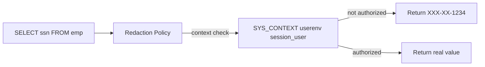

# Data Redaction

## Overview

**Data Redaction** masks sensitive column values in query results based on session context — SSN → `XXX-XX-1234`, credit card → `XXXX-XXXX-XXXX-1234`. The underlying data is unchanged; redaction happens **at SELECT time**. Applications don't need code changes.

Different from encryption (which protects data at rest) and VPD (which filters rows). Redaction is column-level presentation masking.

Requires **Advanced Security Option** license.

## Types

| Type        | Effect                                               |
| ----------- | ---------------------------------------------------- |
| **FULL**    | Entire value replaced (NULL, zero, empty string)     |
| **PARTIAL** | Portion masked, keeping some visible (`XXX-XX-1234`) |
| **RANDOM**  | Random value each query — statistically valid        |
| **REGEXP**  | Regex-based substitution                             |
| **NONE**    | Placeholder — no masking (used for testing)          |

## Architecture



## Configuration

### Full redaction

```sql
BEGIN
  DBMS_REDACT.ADD_POLICY(
    object_schema => 'HR',
    object_name => 'EMPLOYEES',
    column_name => 'SSN',
    policy_name => 'HR_SSN_FULL',
    function_type => DBMS_REDACT.FULL,
    expression => 'SYS_CONTEXT(''USERENV'',''SESSION_USER'') <> ''HR_ADMIN''');
END;
/
```

Now everyone except `HR_ADMIN` sees `NULL` for `SSN`.

### Partial — keep last 4

```sql
BEGIN
  DBMS_REDACT.ADD_POLICY(
    object_schema => 'HR',
    object_name => 'CUSTOMERS',
    column_name => 'CARD_NUMBER',
    policy_name => 'CARD_MASK',
    function_type => DBMS_REDACT.PARTIAL,
    function_parameters => 'VVVVVVVVVVVVVVVV,VVVV-VVVV-VVVV-VVVV,*,1,12',
    expression => 'SYS_CONTEXT(''USERENV'',''SESSION_USER'') NOT IN (''CS_ADMIN'')');
END;
/
```

Params for `PARTIAL`: `input_format, output_format, mask_char, mask_from, mask_to`.

Result: `1234-5678-9012-3456` → `****-****-****-3456`.

### Random

```sql
BEGIN
  DBMS_REDACT.ADD_POLICY(
    object_schema => 'HR',
    object_name => 'EMPLOYEES',
    column_name => 'SALARY',
    policy_name => 'SAL_RANDOM',
    function_type => DBMS_REDACT.RANDOM,
    expression => 'SYS_CONTEXT(''USERENV'',''SESSION_USER'') NOT IN (''HR_ADMIN'')');
END;
/
```

Each query returns a random NUMBER — useful for dev/test data volumes.

### Regexp

```sql
BEGIN
  DBMS_REDACT.ADD_POLICY(
    object_schema => 'HR', object_name => 'CUSTOMERS',
    column_name => 'EMAIL', policy_name => 'EMAIL_MASK',
    function_type => DBMS_REDACT.REGEXP,
    regexp_pattern => '[a-zA-Z0-9._%+-]+@',
    regexp_replace_string => 'redacted@',
    regexp_position => DBMS_REDACT.RE_BEGINNING,
    regexp_occurrence => DBMS_REDACT.RE_FIRST,
    regexp_match_parameter => 'i',
    expression => 'SYS_CONTEXT(''USERENV'',''SESSION_USER'') <> ''CS_ADMIN''');
END;
/
```

Result: `john.doe@example.com` → `redacted@example.com`.

## Multi-column, Multi-policy

Each policy is one column. Multiple policies can protect different columns of the same table. Only one policy per `(table, column)`.

## Exemption

Users with `EXEMPT REDACTION POLICY` see raw values. Grant sparingly.

## Diagnostic Queries

```sql
-- All policies
SELECT object_owner, object_name, column_name, policy_name,
       function_type, enable, policy_expression
FROM   redaction_policies;

-- Test as authorized user vs unauthorized
```

## Common Operations

### Enable / disable

```sql
BEGIN
  DBMS_REDACT.DISABLE_POLICY(
    object_schema => 'HR', object_name => 'EMPLOYEES',
    policy_name => 'HR_SSN_FULL');
END;
/

BEGIN
  DBMS_REDACT.ENABLE_POLICY(
    object_schema => 'HR', object_name => 'EMPLOYEES',
    policy_name => 'HR_SSN_FULL');
END;
/
```

### Modify

```sql
BEGIN
  DBMS_REDACT.ALTER_POLICY(
    object_schema => 'HR', object_name => 'EMPLOYEES',
    policy_name => 'HR_SSN_FULL',
    action => DBMS_REDACT.MODIFY_EXPRESSION,
    expression => 'SYS_CONTEXT(''USERENV'',''SESSION_USER'') NOT IN (''HR_ADMIN'',''AUDIT_USER'')');
END;
/
```

### Drop

```sql
BEGIN
  DBMS_REDACT.DROP_POLICY(
    object_schema => 'HR', object_name => 'EMPLOYEES',
    policy_name => 'HR_SSN_FULL');
END;
/
```

## Common Issues

- **DML with redacted column** — INSERT/UPDATE using redacted expression writes NULL. Applications reading and writing back can silently corrupt data. Design apps carefully.
- **Data type change on partial** — `PARTIAL` masks require exact format specification.
- **`SYS_EXPORT_TABLE` exports show raw data** — Redaction is presentation only; export sees underlying data. Use Data Pump `EXCLUDE=STATISTICS` and separate export policies.
- **Client-side caching** — Some clients cache pre-redacted values.

## Best Practices

1. **Redaction is not encryption.** Data at rest is unchanged. Combine with TDE.
2. **Never rely on redaction alone.** Insider with `SYSDBA` sees raw data.
3. Do not let apps read-then-write redacted values.
4. Set redaction on production **and QA** if QA has real data (avoid altogether — mask via export instead).
5. Use `SYS_CONTEXT` for policy expressions — not username directly.
6. Audit `EXEMPT REDACTION POLICY` grants.
7. Test policy performance — REGEXP is CPU-intensive on large scans.
8. Consider **Data Masking Pack** (subset for cloning/export) for non-production.

## Interview Questions

1. **Q:** What is Data Redaction?
   **A:** On-the-fly masking of column values at SELECT time based on session context.

2. **Q:** Redaction types?
   **A:** FULL, PARTIAL, RANDOM, REGEXP, NONE.

3. **Q:** Does it change data at rest?
   **A:** No — presentation-only.

4. **Q:** Bypass?
   **A:** SYS and users with `EXEMPT REDACTION POLICY` see raw data.

5. **Q:** Difference from VPD?
   **A:** VPD filters rows. Redaction masks column values.

6. **Q:** Difference from TDE?
   **A:** TDE encrypts at rest. Redaction masks at query time.

## References

- Oracle Database Advanced Security Guide 19c — Data Redaction
- MOS Doc ID 1589861.1 — Data Redaction Overview
- MOS Doc ID 1937031.1 — Data Redaction Best Practices
