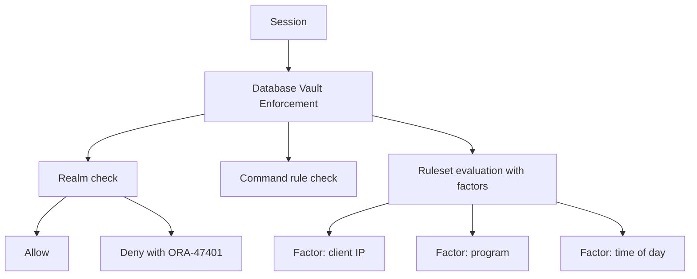

# Database Vault

## Overview

**Oracle Database Vault** enforces separation of duties: even users with `DBA` or `SYSDBA` privileges cannot access application data without authorization. It's built for regulatory compliance (SOX, PCI-DSS, HIPAA) — the DBA administers the database; the security officer authorizes data access via **realms**, **command rules**, **rulesets**, and **factors**.

Requires **Database Vault** option, licensed separately.

## Building Blocks

- **Realm** — collection of objects (schemas, tables) with authorized-users list.
- **Command Rule** — restricts SQL commands based on rulesets.
- **Ruleset** — set of PL/SQL rules evaluated to TRUE/FALSE.
- **Factor** — session attribute (client IP, program, day, etc.).
- **Secure Application Role** — enabled only when rules pass.

## Architecture



## Installation

Database Vault is present in 12c+ EE but disabled by default. Enable during CDB creation, or after with `DBCA -configureDatabase -dbNumber n -enableVaultAndOls`, or manually:

```sql
-- Register accounts
BEGIN
  DBMS_MACADM.CONFIGURE_DV(
    dvowner_uname => 'DV_OWNER',
    dvacctmgr_uname => 'DV_ACCT_MGR');
END;
/
```

Then:

```sql
EXEC DBMS_MACADM.ENABLE_DV;

-- Restart database
```

Once enabled, `SYS` and `SYSTEM` cannot freely operate on application objects — they need explicit realm authorization.

## Realm

```sql
BEGIN
  DBMS_MACADM.CREATE_REALM(
    realm_name => 'HR Realm',
    description => 'HR schema objects',
    enabled => DBMS_MACUTL.G_YES,
    audit_options => DBMS_MACUTL.G_REALM_AUDIT_FAIL,
    realm_type => 1);   -- 1 = mandatory
END;
/

-- Add objects to realm
BEGIN
  DBMS_MACADM.ADD_OBJECT_TO_REALM(
    realm_name => 'HR Realm',
    object_owner => 'HR',
    object_name => '%',
    object_type => 'TABLE');
END;
/

-- Authorize users
BEGIN
  DBMS_MACADM.ADD_AUTH_TO_REALM(
    realm_name => 'HR Realm',
    grantee => 'HR_APP',
    auth_options => DBMS_MACUTL.G_REALM_AUTH_OWNER);
END;
/
```

Now only `HR_APP` (and realm owner) can SELECT / DML on HR tables — not even DBA.

## Command Rule

Restrict statements:

```sql
BEGIN
  DBMS_MACADM.CREATE_COMMAND_RULE(
    command => 'ALTER SYSTEM',
    rule_set_name => 'Trusted Hours Only',
    object_owner => '%',
    object_name => '%',
    enabled => DBMS_MACUTL.G_YES);
END;
/
```

Combined with rulesets (see below).

## Ruleset + Factor

```sql
-- Factor: client IP address
BEGIN
  DBMS_MACADM.CREATE_FACTOR(
    factor_name => 'Client_IP',
    factor_type_name => 'IPAddress',
    description => 'Client IP',
    rule_set_name => NULL,
    get_expr => 'UPPER(SYS_CONTEXT(''USERENV'',''IP_ADDRESS''))',
    validate_expr => NULL,
    identify_by => DBMS_MACUTL.G_IDENTIFY_BY_METHOD,
    labeled_by => DBMS_MACUTL.G_LABELED_BY_SELF,
    eval_options => DBMS_MACUTL.G_EVAL_ON_SESSION,
    audit_options => DBMS_MACUTL.G_AUDIT_ALWAYS,
    fail_options => DBMS_MACUTL.G_FAIL_SILENTLY);
END;
/

-- Ruleset
BEGIN
  DBMS_MACADM.CREATE_RULE_SET(
    rule_set_name => 'DBA Access Rules',
    description => 'Only trusted IPs',
    enabled => DBMS_MACUTL.G_YES,
    eval_options => DBMS_MACUTL.G_RULESET_EVAL_ALL,
    audit_options => DBMS_MACUTL.G_AUDIT_ALWAYS,
    fail_options => DBMS_MACUTL.G_FAIL_SILENTLY);
END;
/

-- Add a rule
BEGIN
  DBMS_MACADM.CREATE_RULE(
    rule_name => 'Corp Subnet',
    rule_expr => 'DVSYS.DV_SYSEVENT_UC(''CLIENT_IP'') LIKE ''10.0.%''');
END;
/

BEGIN
  DBMS_MACADM.ADD_RULE_TO_RULE_SET(
    rule_set_name => 'DBA Access Rules',
    rule_name => 'Corp Subnet');
END;
/
```

## Diagnostic Queries

```sql
-- Realms
SELECT name, description, enabled, audit_options FROM dba_dv_realm;

-- Realm objects
SELECT object_owner, object_name, object_type
FROM   dba_dv_realm_object;

-- Realm authorizations
SELECT realm, grantee, auth_options FROM dba_dv_realm_auth;

-- Command rules
SELECT command, object_owner, object_name, rule_set, enabled
FROM   dba_dv_command_rule;

-- Rulesets and their rules
SELECT rule_set, rule_name FROM dba_dv_rule_set_rule;
```

## Common Issues

- **`ORA-47401: Realm violation`** — User (even DBA) not authorized. Add to realm or use realm owner.
- **`ORA-47502: DV component internal error`** — Enable Database Vault properly with `DBMS_MACADM.ENABLE_DV`.
- **DBA cannot patch** — Datapatch may fail against realms. Grant temporary bypass:
  ```sql
  EXEC DBMS_MACADM.ADD_OWNER_TO_REALM('HR Realm', 'C##DBA_PATCH');
  ```
- **Recovery of Vault-protected DB** — Requires DV_OWNER credentials.

## Best Practices

1. **Separation of duties.** DBA account ≠ DV_OWNER ≠ DV_ACCT_MGR.
2. Enable Vault at CDB creation if needed — retrofit is more complex.
3. Start with a **pilot realm** — get comfortable before wrapping all schemas.
4. **Combine with Unified Auditing** — capture realm violations.
5. Use **factors** (IP, program, time) to enforce trusted paths.
6. Realm audit options set to `G_REALM_AUDIT_FAIL_AND_SUCCESS` for high-risk schemas.
7. Test patching / upgrades with Vault enabled — some maintenance requires temporary DV bypass.
8. Document authorization changes — reviewed by security officer.
9. Regular review of `DBA_DV_REALM_AUTH` — stale grants revoked.

## Interview Questions

1. **Q:** What is Database Vault?
   **A:** Option that enforces separation of duty — DBA cannot access application data without authorization via realms and rulesets.

2. **Q:** Realm?
   **A:** Collection of objects with a list of authorized users.

3. **Q:** Command rule?
   **A:** Restriction on a SQL command based on ruleset evaluation.

4. **Q:** Factor?
   **A:** Session attribute (IP, program, time) used in rules.

5. **Q:** Can SYS bypass?
   **A:** By default DV controls SYS too; some maintenance requires `DV_OWNER` grants.

6. **Q:** License?
   **A:** Database Vault option, licensed separately.

## References

- Oracle Database Vault Administrator's Guide 19c
- MOS Doc ID 2097855.1 — Database Vault Overview
- MOS Doc ID 2298666.1 — Vault + Patching
