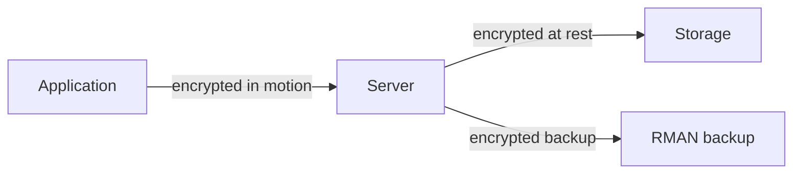

# Encryption

## Overview

Oracle encrypts in three places: **at rest** (TDE), **in motion** (Network Encryption, TCPS), and **in backup** (RMAN encryption). This page gives a summary; drill into [TDE](tde.md), [Network Encryption](network-encryption.md), and RMAN encryption for detail.

## Layers



| Layer              | Feature             | License                                 |
| ------------------ | ------------------- | --------------------------------------- |
| At rest            | TDE                 | Advanced Security                       |
| In motion (native) | SQL\*Net encryption | Free with EE                            |
| In motion (SSL)    | TCPS                | Free with EE                            |
| Backup             | RMAN encryption     | Advanced Security (algorithm-dependent) |

## Algorithm Choice

Oracle supports (as of 19c):

- **AES128 / AES192 / AES256** — recommended.
- **3DES168** — legacy; avoid.
- **DES / RC4** — deprecated; do not use.

## Configuration Highlights

- **TDE**: see [TDE](tde.md). Requires wallet.
- **Native network encryption**: `sqlnet.ora`:
  ```
  SQLNET.ENCRYPTION_SERVER = REQUIRED
  SQLNET.ENCRYPTION_TYPES_SERVER = (AES256)
  SQLNET.CRYPTO_CHECKSUM_SERVER = REQUIRED
  SQLNET.CRYPTO_CHECKSUM_TYPES_SERVER = (SHA512)
  ```
- **TCPS**: uses wallet with server cert.
- **RMAN encrypted backup**:
  ```sql
  CONFIGURE ENCRYPTION FOR DATABASE ON;
  CONFIGURE ENCRYPTION ALGORITHM 'AES256';
  ```

## Diagnostic Queries

```sql
-- Encrypted tablespaces
SELECT * FROM v$encrypted_tablespaces;

-- Encrypted columns
SELECT owner, table_name, column_name, encryption_alg
FROM   dba_encrypted_columns;

-- Wallet state
SELECT * FROM v$encryption_wallet;

-- Network encryption in use for session
SELECT sys_context('userenv','network_protocol') FROM dual;
```

## Best Practices

1. **AES256 everywhere.** No exceptions.
2. Enable at-rest TDE at CDB creation.
3. Enable native network encryption on all connections.
4. Prefer TCPS for external-facing databases.
5. Encrypt RMAN backups; store keys separately from backups.
6. Rotate master keys annually.
7. Test recovery scenarios with encryption.
8. Store wallets on separate storage from datafiles.

## References

- Oracle Database Advanced Security Guide 19c
- Oracle Database Security Guide 19c
- NIST SP 800-131A — Cryptographic Algorithm Transitions
