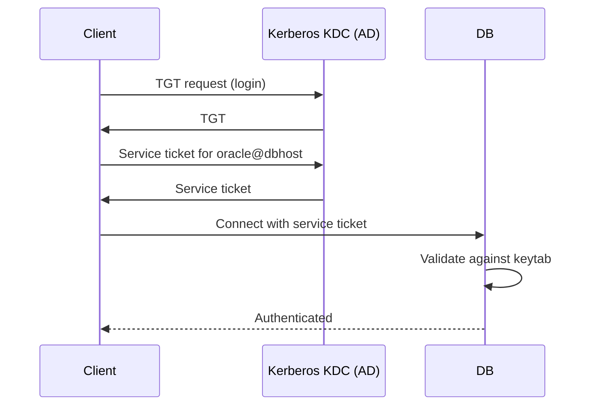

# Kerberos

## Overview

**Kerberos** enables SSO between Oracle Database and Active Directory (or MIT/Heimdal KDCs). Users authenticate to their workstation once; the Kerberos ticket flows to the database — no per-user password stored in Oracle.

## Architecture



## Prerequisites

- KDC (AD DS or MIT/Heimdal).
- Service principal in KDC: `oracle/dbhost.corp.example.com@CORP.EXAMPLE.COM`.
- Keytab file exported to database host.
- Clock sync between client, DB host, and KDC (chrony/NTP).

## Configuration

### 1. Create service principal in AD/KDC

Windows AD:

```
setspn -A oracle/dbhost.corp.example.com CORP\oracle_svc
```

Or MIT:

```bash
kadmin -q "addprinc -randkey oracle/dbhost.corp.example.com@CORP.EXAMPLE.COM"
```

### 2. Export keytab

Windows AD (using ktpass):

```
ktpass -princ oracle/dbhost.corp.example.com@CORP.EXAMPLE.COM \
       -mapuser CORP\oracle_svc \
       -pass ServicePwd \
       -crypto AES256-SHA1 \
       -out oracle.keytab
```

MIT:

```bash
kadmin -q "ktadd -k /etc/krb5.keytab oracle/dbhost.corp.example.com"
```

Copy `oracle.keytab` to DB host, permissions `oracle:oinstall 0400`.

### 3. Configure Oracle

`sqlnet.ora`:

```
SQLNET.AUTHENTICATION_SERVICES = (KERBEROS5, BEQ)
SQLNET.KERBEROS5_CONF = /etc/krb5.conf
SQLNET.KERBEROS5_KEYTAB = /u01/app/oracle/wallet/kerb/oracle.keytab
SQLNET.KERBEROS5_CC_NAME = /tmp/krb5cc_oracle
SQLNET.KERBEROS5_CONF_MIT = TRUE   -- for MIT-style config
SQLNET.FALLBACK_AUTHENTICATION = FALSE   -- reject password if Kerberos fails
SQLNET.KERBEROS5_REALMS = /etc/krb5.realms
```

### 4. Create Kerberos-authenticated users

```sql
ALTER SYSTEM SET os_authent_prefix = '' SCOPE=SPFILE;
-- Restart

CREATE USER hr_app IDENTIFIED EXTERNALLY AS 'hr_app@CORP.EXAMPLE.COM';
GRANT CREATE SESSION TO hr_app;
```

The `IDENTIFIED EXTERNALLY AS` value is the Kerberos principal.

### 5. Client-side

Client host must have Kerberos configured (`/etc/krb5.conf`) and a valid TGT (`kinit user@REALM`).

Client `sqlnet.ora`:

```
SQLNET.AUTHENTICATION_SERVICES = (KERBEROS5)
SQLNET.KERBEROS5_CC_NAME = /tmp/krb5cc_$UID
```

Connect:

```bash
kinit hr_app@CORP.EXAMPLE.COM
sqlplus /@PROD
```

## Diagnostic Queries

```sql
-- Confirm Kerberos-authenticated session
SELECT sys_context('userenv','authentication_type') FROM dual;
-- Returns 'KERBEROS'

-- Kerberos principal used
SELECT sys_context('userenv','external_name') FROM dual;
```

## Common Issues

- **`ORA-28030: Server encountered problems accessing LDAP directory service`** — Not Kerberos itself; check LDAP if EUS is involved.
- **`ORA-12631: username retrieval failed`** — Client can't get TGT; check `kinit`.
- **`ORA-01017: invalid username/password; logon denied`** — Principal mismatch. Check `IDENTIFIED EXTERNALLY AS` value matches the client's principal.
- **Clock skew** — Kerberos rejects tickets with > 5 min skew. Sync clocks with NTP.
- **`SQLNET.FALLBACK_AUTHENTICATION = TRUE`** allowing password fallback — set to FALSE to enforce Kerberos.

## Best Practices

1. Use AES-256 encryption in keytab (`-crypto AES256-SHA1`).
2. `SQLNET.FALLBACK_AUTHENTICATION = FALSE` in production.
3. Rotate service principal password annually.
4. Sync clocks with chrony/NTP.
5. Restrict keytab permissions (`0400 oracle:oinstall`).
6. Use Kerberos for admin sessions — reduces password sprawl.
7. Combine with Enterprise User Security for centralized authorization.
8. Monitor `sqlnet.log` and audit trail for failed Kerberos negotiations.

## Interview Questions

1. **Q:** How does Oracle use Kerberos?
   **A:** Client obtains a TGT from KDC, gets a service ticket for the Oracle service principal, presents it to the database, which validates against its keytab.

2. **Q:** What is the keytab for?
   **A:** Contains the service principal's key so Oracle can decrypt/validate incoming Kerberos tickets.

3. **Q:** How do you tie a database user to a Kerberos principal?
   **A:** `CREATE USER hr_app IDENTIFIED EXTERNALLY AS 'hr_app@REALM';`.

4. **Q:** Why is time sync critical?
   **A:** Kerberos rejects tickets with clock skew > 5 minutes.

5. **Q:** How do you prevent password fallback?
   **A:** `SQLNET.FALLBACK_AUTHENTICATION = FALSE`.

## References

- Oracle Database Enterprise User Security Administrator's Guide 19c
- MOS Doc ID 452411.1 — Kerberos Configuration
- MOS Doc ID 1926511.1 — Kerberos with AD
- MIT Kerberos documentation
