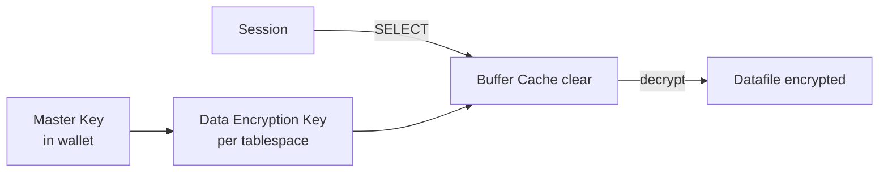

# TDE — Transparent Data Encryption

## Overview

**Transparent Data Encryption (TDE)** encrypts data at rest — datafiles, tempfiles, redo logs, undo, backups. Applications are unchanged; encryption/decryption happens automatically as blocks flow between storage and buffer cache. Two flavors:

- **TDE Column Encryption** — encrypt specific columns.
- **TDE Tablespace Encryption** — encrypt entire tablespaces (preferred; more efficient).

Requires **Advanced Security Option** license (included in some editions/cloud).

## Architecture



## Internal Working

### Two-Tier Key Hierarchy

- **Master Key** — held in the wallet or HSM. Rotatable without decrypting data.
- **Data Encryption Key (DEK)** — per tablespace (or column). Encrypted with master key and stored in the datafile header. Not rotatable without offline rebuild.

Rotating the master key is fast — just re-encrypts the DEK, not the data. Best practice: rotate annually.

### Wallet Setup

19c prefers **`WALLET_ROOT`** parameter to `sqlnet.ora` entries:

```sql
ALTER SYSTEM SET wallet_root = '/u01/app/oracle/wallet' SCOPE=SPFILE;
-- Restart
ALTER SYSTEM SET tde_configuration = 'KEYSTORE_CONFIGURATION=FILE' SCOPE=BOTH;
```

Create keystore:

```sql
ADMINISTER KEY MANAGEMENT CREATE KEYSTORE '/u01/app/oracle/wallet/tde'
  IDENTIFIED BY "StrongWalletPwd";

ADMINISTER KEY MANAGEMENT SET KEYSTORE OPEN
  IDENTIFIED BY "StrongWalletPwd";

ADMINISTER KEY MANAGEMENT SET KEY
  IDENTIFIED BY "StrongWalletPwd"
  WITH BACKUP;
```

### Auto-Login Wallet

Password prompt at every DB restart is a problem. Auto-login wallet allows unattended startup:

```sql
ADMINISTER KEY MANAGEMENT CREATE AUTO_LOGIN KEYSTORE
  FROM KEYSTORE '/u01/app/oracle/wallet/tde'
  IDENTIFIED BY "StrongWalletPwd";
```

Or `local auto-login` — tied to specific host:

```sql
ADMINISTER KEY MANAGEMENT CREATE LOCAL AUTO_LOGIN KEYSTORE
  FROM KEYSTORE '/u01/app/oracle/wallet/tde'
  IDENTIFIED BY "StrongWalletPwd";
```

Local auto-login files (`cwallet.sso`) work only on the machine they were created on — safer.

## Tablespace Encryption

### Create new encrypted tablespace

```sql
CREATE TABLESPACE app_secure
  DATAFILE '+DATA' SIZE 10G AUTOEXTEND ON MAXSIZE 100G
  ENCRYPTION USING 'AES256' ENCRYPT;
```

### Encrypt existing tablespace (12.2+ online)

```sql
ALTER TABLESPACE app_data ENCRYPTION ONLINE USING 'AES256' ENCRYPT;
```

Runs online, no application downtime. Recommended for migrating unencrypted tablespaces.

### Decrypt (rare)

```sql
ALTER TABLESPACE app_data ENCRYPTION ONLINE DECRYPT;
```

## Column Encryption

```sql
CREATE TABLE customers (
  id NUMBER,
  ssn VARCHAR2(20) ENCRYPT USING 'AES256' NO SALT,
  card_number VARCHAR2(20) ENCRYPT
);

-- Add to existing table
ALTER TABLE customers MODIFY (ssn ENCRYPT USING 'AES256' NO SALT);
```

`NO SALT` required if the column is indexed (allows deterministic encryption but is less secure).

Note: for entire tables with sensitive data, tablespace encryption is more efficient than many column-level encryptions.

## Master Key Rotation

```sql
ADMINISTER KEY MANAGEMENT SET KEY
  IDENTIFIED BY "StrongWalletPwd"
  WITH BACKUP USING 'RU_ROTATION_2026Q1';

-- Check active key
SELECT masterkey_id, activation_time, key_use, tag
FROM   v$encryption_keys
ORDER  BY activation_time DESC;
```

Data is unaffected — DEK is re-wrapped in the new master key.

## Redo, Undo, Temp

- **Redo**: encrypted for encrypted tablespaces automatically.
- **Undo**: encrypted if source block was in encrypted tablespace.
- **Temp**: encrypted (12.2+) if any encrypted tablespace exists.

## RMAN and TDE

RMAN handles encrypted tablespaces transparently. For encrypted RMAN backups:

```sql
CONFIGURE ENCRYPTION FOR DATABASE ON;
CONFIGURE ENCRYPTION ALGORITHM 'AES256';
```

Requires the wallet open at restore time.

## Diagnostic Queries

```sql
-- Keystore status
SELECT * FROM v$encryption_wallet;

-- Master keys history
SELECT masterkey_id, activation_time, tag
FROM   v$encryption_keys
ORDER  BY activation_time;

-- Encrypted tablespaces
SELECT tablespace_name, encryptionalg, encryptedts
FROM   v$encrypted_tablespaces
JOIN   dba_tablespaces USING (tablespace_name);

-- Encrypted columns
SELECT owner, table_name, column_name, encryption_alg, salt
FROM   dba_encrypted_columns;
```

## Common Operations

### Open wallet after restart (if no auto-login)

```sql
ADMINISTER KEY MANAGEMENT SET KEYSTORE OPEN
  IDENTIFIED BY "StrongWalletPwd";
```

### Close wallet

```sql
ADMINISTER KEY MANAGEMENT SET KEYSTORE CLOSE
  IDENTIFIED BY "StrongWalletPwd";
```

### Backup wallet

Take OS backup of the entire `wallet_root` directory. **Losing the wallet loses all encrypted data** — restore is impossible without it.

## Common Issues

- **`ORA-28365: wallet is not open`** — Open with `SET KEYSTORE OPEN` or use auto-login.
- **`ORA-46658` — keystore in autologin mode cannot be modified** — Use password-based operations for key changes.
- **`ORA-28362` — master key not found** — Wallet mismatch. Restore original wallet.
- **Data Guard standby cannot open encrypted files** — Standby needs its own wallet with the same master key. Use `KEYSTORE_CONFIGURATION=OKV|HSM` for shared or copy wallet from primary.

## Best Practices

1. **Enable TDE at CDB creation.** Encrypt everything up front.
2. Use **tablespace encryption**, not column, for whole-table sensitive data.
3. Store wallet at `WALLET_ROOT`, never in `sqlnet.ora`.
4. Use **local auto-login** wallet for unattended startup.
5. **Backup the wallet** every time you rotate the master key.
6. Rotate master key **annually**.
7. Use **HSM** (via PKCS#11) or **Oracle Key Vault (OKV)** for regulated environments.
8. Test standby wallet setup — DG failures around key management are common.
9. Monitor `V$ENCRYPTION_WALLET.STATUS` — alert if not `OPEN`.
10. Never store wallet on shared NFS without proper permissions.

## Interview Questions

1. **Q:** What is TDE?
   **A:** Transparent Data Encryption — encrypts data at rest with automatic decrypt on read. Applications unchanged.

2. **Q:** Column vs tablespace encryption?
   **A:** Column: per-column, slower, more overhead. Tablespace: whole tablespace, faster, preferred.

3. **Q:** Two-tier key hierarchy?
   **A:** Master key in wallet/HSM protects Data Encryption Keys in datafile headers.

4. **Q:** What is `WALLET_ROOT`?
   **A:** 19c+ parameter specifying wallet location; replaces `sqlnet.ora` entries.

5. **Q:** Auto-login vs local auto-login?
   **A:** Auto-login: usable from any host. Local: tied to the host that created it — safer.

6. **Q:** How do you rotate the master key?
   **A:** `ADMINISTER KEY MANAGEMENT SET KEY IDENTIFIED BY ... WITH BACKUP;`. Data is not re-encrypted; only DEK is re-wrapped.

7. **Q:** What license does TDE require?
   **A:** Advanced Security Option (bundled with EE Cloud services).

## References

- Oracle Database Advanced Security Guide 19c
- Oracle Database Security Guide 19c
- MOS Doc ID 2253045.1 — TDE Master Key
- MOS Doc ID 2314601.1 — WALLET_ROOT in 19c
