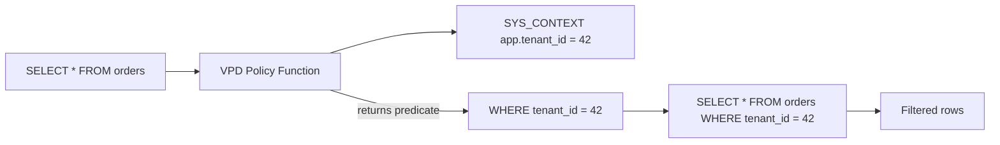

# VPD — Virtual Private Database

## Overview

**Virtual Private Database (VPD)** — also called **Fine-Grained Access Control (FGAC)** — attaches an invisible `WHERE` clause to every query on a specific table or view, based on session context. Different users see different subsets of the same table without changing application SQL.

Classic use case: multi-tenant SaaS where every row has a `tenant_id`, and each tenant sees only their own rows via a policy that appends `WHERE tenant_id = SYS_CONTEXT('app_ctx','tenant_id')`.

Requires **Advanced Security Option** license.

## Architecture



## Internal Working

### 1. Application Context

```sql
CREATE OR REPLACE CONTEXT app_ctx USING app_ctx_pkg;

CREATE OR REPLACE PACKAGE app_ctx_pkg AS
  PROCEDURE set_tenant(p_tenant NUMBER);
END;
/

CREATE OR REPLACE PACKAGE BODY app_ctx_pkg AS
  PROCEDURE set_tenant(p_tenant NUMBER) IS
  BEGIN
    DBMS_SESSION.SET_CONTEXT('app_ctx','tenant_id', p_tenant);
  END;
END;
/
```

### 2. Policy Function

```sql
CREATE OR REPLACE FUNCTION orders_tenant_policy(
  schema_var VARCHAR2, table_var VARCHAR2) RETURN VARCHAR2 AS
BEGIN
  RETURN 'tenant_id = SYS_CONTEXT(''app_ctx'',''tenant_id'')';
END;
/
```

### 3. Attach Policy

```sql
BEGIN
  DBMS_RLS.ADD_POLICY(
    object_schema => 'HR',
    object_name => 'ORDERS',
    policy_name => 'ORDERS_TENANT',
    function_schema => 'HR',
    policy_function => 'ORDERS_TENANT_POLICY',
    statement_types => 'SELECT,INSERT,UPDATE,DELETE');
END;
/
```

### 4. Application Sets Context on Login

Typically via `AFTER LOGON` trigger or explicit call:

```sql
BEGIN
  app_ctx_pkg.set_tenant(42);
END;
/

-- Now every SELECT / DML on orders sees only tenant_id = 42
SELECT * FROM hr.orders;
```

## Statement Types

- `SELECT`
- `INSERT`
- `UPDATE`
- `DELETE`
- `INDEX` (affects CBO plan choices)

## Policy Types

- **Dynamic** (default) — function called each execution.
- **Static** — function called once per session; result cached. Cheaper.
- **Context-sensitive** — function called when context changes.
- **Shared static / context-sensitive** — cache across sessions with same context.

## Column-Level VPD

Restrict predicate to certain columns:

```sql
BEGIN
  DBMS_RLS.ADD_POLICY(
    object_schema => 'HR',
    object_name => 'EMPLOYEES',
    policy_name => 'HR_SALARY_MASK',
    function_schema => 'HR',
    policy_function => 'hr_salary_policy',
    statement_types => 'SELECT',
    sec_relevant_cols => 'SALARY,COMMISSION_PCT',
    sec_relevant_cols_opt => DBMS_RLS.ALL_ROWS);
END;
/
```

`ALL_ROWS`: rows are returned but restricted columns are `NULL`.

## Exemption

Users with `EXEMPT ACCESS POLICY` bypass VPD. Grant sparingly.

## Diagnostic Queries

```sql
-- Policies defined
SELECT object_owner, object_name, policy_name,
       function, policy_type, chk_option, enable
FROM   dba_policies;

-- Groups
SELECT * FROM dba_policy_groups;

-- Context in use
SELECT namespace, attribute, value
FROM   session_context
WHERE  namespace = 'APP_CTX';
```

## Common Operations

### Disable/enable temporarily

```sql
BEGIN
  DBMS_RLS.ENABLE_POLICY(
    object_schema => 'HR', object_name => 'ORDERS',
    policy_name => 'ORDERS_TENANT', enable => FALSE);
END;
/
```

### Drop policy

```sql
BEGIN
  DBMS_RLS.DROP_POLICY(
    object_schema => 'HR', object_name => 'ORDERS',
    policy_name => 'ORDERS_TENANT');
END;
/
```

## Common Issues

- **`ORA-28112: failed to execute policy function`** — Function returns error; check function.
- **Empty context** — Application forgot to set context; predicate evaluates to `tenant_id = NULL` → no rows.
- **Performance regression** — Static policies help; ensure predicates leverage indexes.
- **SYS bypass** — SYS ignores VPD. Do not test as SYS.
- **DML skipping rows** — INSERT with `tenant_id` different from context may fail or succeed silently depending on `check_option`.

## Best Practices

1. **Use bind context** (`SYS_CONTEXT`) not literals — indexes work.
2. Static / context-sensitive policies where possible — big performance win.
3. Set context in `AFTER LOGON` trigger with strong verification of legitimate value source.
4. Never rely on session variables — use `SYS_CONTEXT`.
5. Test performance impact — VPD changes cardinality; check plans.
6. `EXEMPT ACCESS POLICY` sparingly.
7. Log context changes for audit.
8. Combine with [Data Redaction](data-redaction.md) for column-level masking (different mechanism).
9. In multitenant, VPD is per-container.

## Interview Questions

1. **Q:** What is VPD?
   **A:** Virtual Private Database — row-level security via automatic WHERE clause injection based on session context.

2. **Q:** How does the policy function work?
   **A:** Returns a predicate string; Oracle appends it to every SELECT/DML on the object.

3. **Q:** Where does the "who am I" come from?
   **A:** Typically an application context (`SYS_CONTEXT`) set at logon.

4. **Q:** Policy types?
   **A:** Dynamic (default), static, context-sensitive, shared static, shared context-sensitive.

5. **Q:** Column-level VPD?
   **A:** `sec_relevant_cols` — policy applies only when those columns are referenced; can return rows with NULLs.

6. **Q:** Who bypasses VPD?
   **A:** SYS by default; users with `EXEMPT ACCESS POLICY` privilege.

## References

- Oracle Database Security Guide 19c — Virtual Private Database
- MOS Doc ID 175906.1 — VPD Configuration
- MOS Doc ID 240710.1 — VPD Performance
