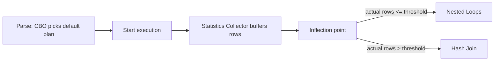

# Adaptive Plans

## Overview

**Adaptive Plans** (12c+) let CBO **defer the final choice** between two candidate plan operations until runtime — specifically at the point where the actual row count from the driving table is known. The optimizer picks between **nested loops** and **hash join** based on how many rows the outer table actually produced.

Enabled by default in 19c (`optimizer_adaptive_plans=TRUE`). This helps when statistics are approximately right but not exact — CBO gets a second chance at runtime.

## Architecture



## Internal Working

### The Statistics Collector

CBO inserts a **STATISTICS COLLECTOR** operator into the plan. It buffers the output of the driving row source until the inflection point (a computed threshold, `_optimizer_adaptive_plans_inflection_pct`, default). If actual rows ≤ threshold, use NL; else HJ.

### Plan Layout

```
| Id | Operation                          | Name    | Rows | Cost |
| 0  | SELECT STATEMENT                   |         |      |      |
| 1  |  HASH JOIN                         |         |  100 |   50 |
|- 2 |   NESTED LOOPS                     |         |  100 |   50 |
|- 3 |    STATISTICS COLLECTOR            |         |      |      |
|  4 |     TABLE ACCESS FULL              | DEPT    |   10 |   10 |
|- 5 |    INDEX RANGE SCAN                | EMP_IDX |   10 |    2 |
|  6 |   TABLE ACCESS FULL                | EMP     | 1000 |   40 |
```

Rows marked with `-` are the **inactive** subplan for the switching decision. The plan chosen at runtime is the active one.

### `+ADAPTIVE` in DBMS_XPLAN

```sql
SELECT * FROM TABLE(DBMS_XPLAN.DISPLAY_CURSOR('&sql_id',NULL,'ALL +ADAPTIVE'));
```

Shows both branches, marks final choice, and includes a "Note" section explaining the adaptation.

### Also Applies To

- **Adaptive Parallel Distribution Methods** — parallel query can switch broadcast → hash distribution based on row counts.
- **Bitmap Index Access** — dynamic switch between bitmap and B-tree access.

## Session / System Control

```sql
-- Disable at session level
ALTER SESSION SET optimizer_adaptive_plans = FALSE;

-- System-wide
ALTER SYSTEM SET optimizer_adaptive_plans = TRUE SCOPE=BOTH;

-- Hint
SELECT /*+ NO_ADAPTIVE_PLAN */ ... FROM ...;
```

## When It Helps

- Cardinality estimates approximately right but off by 2–5×.
- Bind-sensitive queries — different binds cause different volumes.
- Table stats stale but adequate.

## When It Hurts

- Very tight elapsed-time budgets where the STATISTICS COLLECTOR overhead matters.
- Plans that would have been correct with `_optimizer_use_feedback`.

## Diagnostic Queries

```sql
-- Was a plan adapted?
SELECT sql_id, plan_hash_value, is_resolved_adaptive_plan
FROM   v$sql
WHERE  is_resolved_adaptive_plan = 'Y';

-- Explain a cursor showing both branches
SELECT * FROM TABLE(DBMS_XPLAN.DISPLAY_CURSOR('&sql_id',NULL,'ALL +ADAPTIVE'));

-- Feature status
SHOW PARAMETER optimizer_adaptive
```

## Common Issues

- **Plan flip surprises** — Same SQL sometimes uses NL, sometimes HJ, depending on runtime data. If plan flips hurt SLA, use SPM baseline.
- **AWR shows multiple plans for same sql_id** — Adaptive plans generate variations; expected behavior.
- **Statistics collector overhead** — Small in most cases; noticeable in very fast OLTP.

## Best Practices

1. **Leave adaptive plans ON** in 19c (default).
2. Use `+ADAPTIVE` when reading plans in DBMS_XPLAN.
3. For **critical stable SQL**, lock a plan via SPM baseline — that plan doesn't adapt.
4. Test post-upgrade — some 11g plans may adapt differently in 19c.
5. Consider `NO_ADAPTIVE_PLAN` hint for stress-tested SQL where you want the original plan.

## Interview Questions

1. **Q:** What are adaptive plans?
   **A:** 12c+ feature where CBO switches join method (NL ↔ HJ) at runtime based on actual row counts.

2. **Q:** How does it work?
   **A:** Statistics collector buffers driving rows; at an inflection point, CBO chooses which branch to execute.

3. **Q:** Default in 19c?
   **A:** ON.

4. **Q:** How do you see the alternate plan?
   **A:** `DBMS_XPLAN.DISPLAY_CURSOR(..., 'ALL +ADAPTIVE')`.

5. **Q:** Adaptive plans vs adaptive stats?
   **A:** Plans: runtime plan switching. Statistics: parse-time additional sampling. In 19c, plans default ON, stats OFF.

6. **Q:** How do you disable?
   **A:** `ALTER SESSION SET optimizer_adaptive_plans = FALSE;` or `/*+ NO_ADAPTIVE_PLAN */`.

## References

- Oracle Database SQL Tuning Guide 19c — Adaptive Query Optimization
- MOS Doc ID 2312911.1 — Adaptive Features
- MOS Doc ID 1966211.1 — Adaptive Plans
