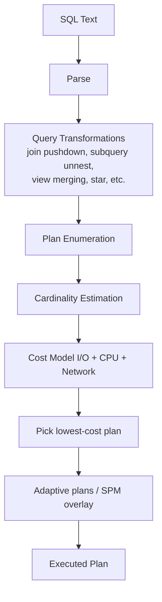

# Cost-Based Optimizer (CBO)

## Overview

The **Cost-Based Optimizer** transforms SQL text into an execution plan by evaluating candidate plans and choosing the one with the lowest estimated **cost** (a unitless number representing I/O + CPU + network). CBO has been the sole optimizer since 10g (RBO — rule-based — is desupported).

Every plan choice depends on **statistics**, **cardinality estimates**, and **transformations**. Getting these right is the difference between a 10-second query and a 10-hour query.

## Architecture



## Internal Working

### Optimizer Steps

1. **Parse** — syntax + semantic (schema resolution).
2. **Query transformation** — Optimizer rewrites SQL into equivalent forms it can more efficiently execute:
   - Subquery unnesting (correlated → JOIN).
   - View merging.
   - Predicate pushing.
   - Star transformation (DW).
   - Or-expansion.
   - Group-by placement.
   - Materialized view rewrite.
3. **Enumeration** — Consider access paths (index, full scan, index skip scan), join methods (nested loop, hash, sort-merge), join order (left-deep, bushy).
4. **Cardinality estimation** — How many rows will each step produce? Comes from statistics.
5. **Cost** — Convert cardinality into predicted I/O + CPU. System stats provide the conversion factors.
6. **Pick** — Lowest cost plan wins.

### Access Paths

| Path                        | When Optimal                             |
| --------------------------- | ---------------------------------------- |
| Full table scan             | High-selectivity query, or small table   |
| Index unique scan           | UNIQUE index / PK lookup                 |
| Index range scan            | Range on indexed column                  |
| Index skip scan             | Leading column has few distinct values   |
| Bitmap index                | DW, low-cardinality columns              |
| Index fast full scan        | Query needs only index columns, big data |
| ROWID                       | Sub-second single row lookup             |
| Table access by index rowid | After index scan                         |

### Join Methods

| Method              | When Optimal                                              |
| ------------------- | --------------------------------------------------------- |
| Nested Loops        | Small outer set + index on inner join key                 |
| Hash Join           | Large sets, equi-join, no outer index or large row counts |
| Sort-Merge          | Sorted inputs already or full-scan both                   |
| Star Transformation | DW fact + dimensions                                      |
| Cartesian           | Small (usually a bug)                                     |

### Optimizer Parameters

| Parameter                              | Purpose                                                        |
| -------------------------------------- | -------------------------------------------------------------- |
| `optimizer_mode`                       | `ALL_ROWS` (default), `FIRST_ROWS_n`                           |
| `optimizer_features_enable`            | Feature version — controls what optimizer features are enabled |
| `optimizer_index_cost_adj`             | Bias toward indexes (1..10000, default 100)                    |
| `optimizer_index_caching`              | Estimated % of index blocks in cache (default 0)               |
| `optimizer_dynamic_sampling`           | Dynamic sampling level (default 2)                             |
| `optimizer_use_sql_plan_baselines`     | SPM enable                                                     |
| `optimizer_capture_sql_plan_baselines` | Auto-capture baselines                                         |
| `optimizer_adaptive_plans`             | Adaptive plans on/off (default TRUE in 19c)                    |
| `optimizer_adaptive_statistics`        | Adaptive statistics (default FALSE in 19c)                     |
| `_optimizer_use_feedback`              | Statistics feedback                                            |

### Adaptive Optimizer (12c+)

- **Adaptive plans** — Optimizer defers final plan choice to runtime, switching join method based on actual row counts.
- **Adaptive statistics** — Optimizer collects extra stats at runtime for reuse.

19c default: adaptive plans ON, adaptive statistics OFF (regression risk).

### Statistics-Driven

Everything CBO does is downstream of statistics. Stale or missing stats → bad cardinality → bad plan.

### Optimizer Environment

Session parameters (`optimizer_mode`, NLS\_\*, hints, etc.) form part of the **optimizer environment**. Two sessions with different environments produce different child cursors for the same SQL.

## Components

| Component         | Purpose                          |
| ----------------- | -------------------------------- |
| Parser            | Text → parse tree                |
| Query transformer | Rewrites for cost reduction      |
| Estimator         | Cardinality + selectivity + cost |
| Plan generator    | Enumerate + pick                 |
| Executor          | Runs plan                        |

## Important Parameters

See table above.

## Important Views

| View                                           | Purpose                           |
| ---------------------------------------------- | --------------------------------- |
| `V$SQL`, `V$SQL_PLAN`, `V$SQL_PLAN_STATISTICS` | Runtime plans + stats             |
| `V$SQL_SHARED_CURSOR`                          | Reasons for child cursor mismatch |
| `DBA_HIST_SQL_PLAN`                            | Historical plans                  |
| `V$SYS_OPTIMIZER_ENV`                          | Optimizer environment             |
| `V$SES_OPTIMIZER_ENV`                          | Session-level                     |
| `V$SQL_OPTIMIZER_ENV`                          | Per-cursor                        |

## Diagnostic Queries

```sql
-- Fetch execution plan for a running SQL
SELECT * FROM TABLE(DBMS_XPLAN.DISPLAY_CURSOR('sql_id_here',NULL,'ALL +ADAPTIVE +REPORT'));

-- Fetch from AWR
SELECT * FROM TABLE(DBMS_XPLAN.DISPLAY_AWR('sql_id_here',null,null,'ALL +ADAPTIVE'));

-- How many plans exist per SQL
SELECT sql_id, COUNT(*) AS plans
FROM   (SELECT DISTINCT sql_id, plan_hash_value FROM v$sql)
GROUP  BY sql_id
ORDER  BY plans DESC
FETCH FIRST 10 ROWS ONLY;

-- Optimizer env for a session
SELECT name, value, isdefault
FROM   v$ses_optimizer_env
WHERE  sid = SYS_CONTEXT('userenv','sid')
   AND isdefault = 'NO';
```

## Common Issues

- **Bad plan after upgrade** — `optimizer_features_enable` change. Set to older version to isolate: `ALTER SESSION SET optimizer_features_enable = '11.2.0.4';`.
- **Bad plan after DDL** — cursor invalidated, hard parse picks different plan.
- **Cardinality misestimate** — Missing stats, correlated columns, bind peeking, function on column (`WHERE UPPER(name) = 'X'`).
- **Full scan instead of index** — Stats incorrect; try `optimizer_index_cost_adj` (session), gather stats, or add hint.
- **Wrong join order** — `LEADING` / `ORDERED` hint temporarily; long-term: fix stats.
- **Plan flip** — Same SQL uses different plans at different times. Consider SPM baseline to lock a good plan.

## Troubleshooting

1. **Get the actual plan** — `DBMS_XPLAN.DISPLAY_CURSOR` or SQL Monitor.
2. **Compare estimated vs actual row counts** — SQL Monitor shows Rows Actual vs Rows Estimated.
3. **Statistics fresh?** — `DBA_TAB_STATISTICS.LAST_ANALYZED`.
4. **Bind peeking** — Check `V$SQL.PLAN_HASH_VALUE` variations for the same SQL.
5. **Check parameter overrides** — `V$SQL_OPTIMIZER_ENV`.
6. **SQL profile / baseline** in place? — `DBA_SQL_PROFILES`, `DBA_SQL_PLAN_BASELINES`.

## Best Practices

1. Gather statistics **regularly and correctly**. Rely on the AutoTask default (nightly) plus manual after big data changes.
2. Use **DBMS_STATS**, not `ANALYZE`.
3. Do not routinely change `optimizer_index_cost_adj` — mask over bad statistics rather than fixing them.
4. Adopt **SQL Plan Management** for critical statements — lock in known-good plans.
5. Learn to read `DBMS_XPLAN.DISPLAY_CURSOR` output — the estimated vs actual row count column is the most important diagnostic in Oracle tuning.
6. Avoid unnecessary hints — they lock you out of optimizer improvements.
7. Set `optimizer_features_enable` explicitly during upgrades — freeze then release.
8. Understand your **workload optimizer mode** — OLTP typically `ALL_ROWS`; DW mixed.
9. Use `parallel_degree_policy=AUTO` in DW; hint or table-level in OLTP for specific reports.

## Interview Questions

1. **Q:** What does the CBO do?
   **A:** Turns SQL text into an execution plan by cost-comparing candidates using cardinality estimates driven by statistics.

2. **Q:** Main plan operations to know?
   **A:** Full/index scans, nested loops, hash join, sort-merge join, GROUP BY methods, PX distribution.

3. **Q:** What breaks CBO cardinality?
   **A:** Stale/missing statistics, correlated columns, functions on columns, non-representative bind peek.

4. **Q:** How do you get the actual plan of a running SQL?
   **A:** `SELECT * FROM TABLE(DBMS_XPLAN.DISPLAY_CURSOR('sql_id',NULL,'ALL +ADAPTIVE'));`.

5. **Q:** What is adaptive plans?
   **A:** 12c+ ability to switch join method (NL ↔ HJ) at runtime based on actual row counts.

6. **Q:** Difference between SQL Profile and SQL Plan Baseline?
   **A:** Profile adds hints to nudge cost; baseline locks a specific plan.

7. **Q:** `optimizer_features_enable`?
   **A:** Controls which optimizer features are active — freezing at older version can prevent post-upgrade regressions.

## References

- Oracle Database SQL Tuning Guide 19c — Query Optimizer
- Jonathan Lewis, _Cost-Based Oracle Fundamentals_
- MOS Doc ID 47611.1 — SQL Trace and CBO
- MOS Doc ID 271196.1 — CBO Q&A
