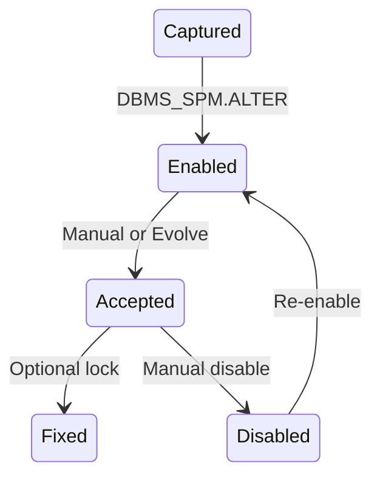

# SQL Plan Baselines

## Overview

A **SQL Plan Baseline** is a set of accepted plans for a SQL statement. Once a baseline is enabled and populated with accepted plans, CBO must generate a plan that matches an accepted baseline — otherwise it uses the accepted plan anyway. This is Oracle's answer to "keep this plan I like."

Baselines live in the **SQL Management Base (SMB)** in the SYSAUX tablespace and are managed via `DBMS_SPM`. See also [SQL Plan Management](sql-plan-management.md) for the framework overview.

## Lifecycle



## Attributes

| Attribute    | Purpose                                 |
| ------------ | --------------------------------------- |
| `ENABLED`    | Baseline can be used                    |
| `ACCEPTED`   | Baseline is chosen by CBO               |
| `FIXED`      | Priority baseline; skipped by evolution |
| `AUTOPURGE`  | Auto-purge if unused                    |
| `ADAPTIVE`   | Adaptive plan variant                   |
| `REPRODUCED` | CBO can still produce the plan          |

## Creating Baselines

### From a currently-cached cursor

```sql
DECLARE n NUMBER;
BEGIN
  n := DBMS_SPM.LOAD_PLANS_FROM_CURSOR_CACHE(
    sql_id => '&sql_id',
    plan_hash_value => &plan_hash);
END;
/
```

The current plan becomes ENABLED + ACCEPTED.

### From SQL Tuning Set (STS)

```sql
-- Create STS
BEGIN
  DBMS_SQLTUNE.CREATE_SQLSET(
    sqlset_name => 'MY_STS',
    description => 'Frozen good plans');
END;
/

-- Load top SQLs from AWR into STS
DECLARE
  bf VARCHAR2(200) := 'parsing_schema_name = ''HR''';
  cursor_sts DBMS_SQLTUNE.SQLSET_CURSOR;
BEGIN
  OPEN cursor_sts FOR
    SELECT VALUE(p) FROM TABLE(
      DBMS_SQLTUNE.SELECT_WORKLOAD_REPOSITORY(
        begin_snap => 1000, end_snap => 1100,
        basic_filter => bf)) p;
  DBMS_SQLTUNE.LOAD_SQLSET(
    sqlset_name => 'MY_STS',
    populate_cursor => cursor_sts);
END;
/

-- Baseline from STS
DECLARE n NUMBER;
BEGIN
  n := DBMS_SPM.LOAD_PLANS_FROM_SQLSET(sqlset_name => 'MY_STS');
END;
/
```

### From AWR

```sql
DECLARE n NUMBER;
BEGIN
  n := DBMS_SPM.LOAD_PLANS_FROM_AWR(
    begin_snap => 1000,
    end_snap   => 1100,
    basic_filter => 'sql_id = ''&sql_id''');
END;
/
```

## Managing Baselines

```sql
-- List
SELECT sql_handle, plan_name, sql_text,
       enabled, accepted, fixed, reproduced,
       optimizer_cost, executions,
       last_modified
FROM   dba_sql_plan_baselines
WHERE  sql_text LIKE '%CUSTOMERS%';

-- Enable / disable
DECLARE n NUMBER;
BEGIN
  n := DBMS_SPM.ALTER_SQL_PLAN_BASELINE(
    sql_handle => '&sql_handle',
    plan_name => '&plan_name',
    attribute_name => 'ENABLED', attribute_value => 'NO');
END;
/

-- Fix
DECLARE n NUMBER;
BEGIN
  n := DBMS_SPM.ALTER_SQL_PLAN_BASELINE(
    sql_handle => '&sql_handle',
    plan_name => '&plan_name',
    attribute_name => 'FIXED', attribute_value => 'YES');
END;
/

-- Drop
DECLARE n NUMBER;
BEGIN
  n := DBMS_SPM.DROP_SQL_PLAN_BASELINE(sql_handle => '&sql_handle');
END;
/
```

## Export / Import (for testing or backup)

```sql
-- Create staging table
BEGIN
  DBMS_SPM.CREATE_STGTAB_BASELINE(table_name => 'SPM_STAGE');
END;
/

-- Pack
DECLARE n NUMBER;
BEGIN
  n := DBMS_SPM.PACK_STGTAB_BASELINE(
    table_name => 'SPM_STAGE',
    sql_handle => '&sql_handle');
END;
/

-- Data Pump export SPM_STAGE, import at target, then:
DECLARE n NUMBER;
BEGIN
  n := DBMS_SPM.UNPACK_STGTAB_BASELINE(table_name => 'SPM_STAGE');
END;
/
```

## Diagnostic Queries

```sql
-- Baselines currently used in the shared pool
SELECT sql_id, sql_plan_baseline, plan_hash_value,
       executions, elapsed_time/DECODE(executions,0,1,executions) AS avg_us
FROM   v$sql
WHERE  sql_plan_baseline IS NOT NULL;

-- Compare accepted vs unaccepted plans for a SQL
SELECT plan_name, enabled, accepted, fixed, optimizer_cost, executions
FROM   dba_sql_plan_baselines
WHERE  sql_handle = '&sql_handle'
ORDER  BY optimizer_cost;

-- SMB space
SELECT * FROM dba_sql_management_config;

-- Baseline plan explain
SELECT * FROM TABLE(DBMS_XPLAN.DISPLAY_SQL_PLAN_BASELINE(
  sql_handle => '&sql_handle', plan_name => '&plan_name',
  format => 'ALL'));
```

## Common Issues

- **Baseline not used** — Reproducibility failed (`REPRODUCED = NO`). Refresh or evolve.
- **Auto-purge removed baseline** — Set `AUTOPURGE = NO` for critical.
- **SMB full** — Increase SMB space in `DBA_SQL_MANAGEMENT_CONFIG`.
- **Different sql_handle for same statement** — Case, whitespace, comments can produce different handles.

## Best Practices

1. Baseline top-N critical SQLs before upgrades.
2. **Fix** the winning plan for zero surprises.
3. Set retention appropriate to workload (default 53 weeks).
4. Monitor `DBA_SQL_PLAN_BASELINES.LAST_EXECUTED` — stale baselines can be dropped.
5. Combine with SQL Tuning Advisor: pick a plan from advisor recommendation as baseline.
6. Export baselines with Data Pump when refreshing dev from prod.
7. In multitenant, baselines are per-PDB.

## Interview Questions

1. **Q:** What is a baseline?
   **A:** A set of accepted execution plans for a specific SQL statement; CBO uses only accepted plans.

2. **Q:** How do you create one?
   **A:** `DBMS_SPM.LOAD_PLANS_FROM_CURSOR_CACHE`, `LOAD_PLANS_FROM_AWR`, or `LOAD_PLANS_FROM_SQLSET`.

3. **Q:** FIXED baseline?
   **A:** Locked plan; evolution won't reconsider. Highest priority.

4. **Q:** Where do baselines live?
   **A:** SQL Management Base (SMB) in SYSAUX.

5. **Q:** What happens if the baseline plan can't be reproduced?
   **A:** Marked `REPRODUCED=NO`. CBO uses the accepted plan with best available approximation, or falls back to best-cost.

6. **Q:** How do you move baselines between databases?
   **A:** `PACK_STGTAB_BASELINE` + Data Pump + `UNPACK_STGTAB_BASELINE`.

## References

- Oracle Database SQL Tuning Guide 19c — SQL Plan Baselines
- MOS Doc ID 1470091.1 — Managing SPM
- MOS Doc ID 787692.1 — SPM Best Practices
