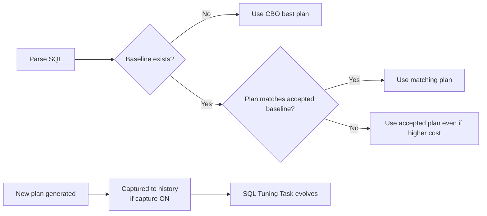

# SQL Plan Management (SPM)

## Overview

**SQL Plan Management (SPM)** captures execution plans for statements and lets Oracle "accept" them as **baselines**. Once a baseline is accepted for a statement, CBO must produce a plan that matches an accepted baseline — new plans are evaluated but not used until explicitly evolved.

SPM is the **safety net against post-upgrade / post-stats regression**. It's included in Enterprise Edition (no separate license).

## Building Blocks

- **SQL Plan History** — every plan CBO has generated for a statement.
- **SQL Plan Baseline** — plans marked ACCEPTED for use.
- **Enabled** — baseline is active.
- **Fixed** — no evolution; this plan is locked.
- **Reproducible** — CBO can still generate this plan under current stats/features.

## Architecture



## Enabling

```sql
-- Session
ALTER SESSION SET optimizer_capture_sql_plan_baselines = TRUE;
ALTER SESSION SET optimizer_use_sql_plan_baselines = TRUE;

-- System
ALTER SYSTEM SET optimizer_use_sql_plan_baselines = TRUE SCOPE=BOTH;
ALTER SYSTEM SET optimizer_capture_sql_plan_baselines = TRUE SCOPE=BOTH;
```

`USE` — enforce baselines when they exist.
`CAPTURE` — auto-capture new plans into baselines (accepted state depends on config).

## Loading Baselines

### From Cursor Cache

```sql
DECLARE
  n NUMBER;
BEGIN
  n := DBMS_SPM.LOAD_PLANS_FROM_CURSOR_CACHE(sql_id => '&sql_id');
END;
/
```

### From AWR (Historical)

```sql
DECLARE
  n NUMBER;
BEGIN
  n := DBMS_SPM.LOAD_PLANS_FROM_AWR(
    begin_snap => 1000, end_snap => 1100,
    basic_filter => 'sql_id = ''&sql_id''');
END;
/
```

### From STS (SQL Tuning Set)

```sql
DECLARE
  n NUMBER;
BEGIN
  n := DBMS_SPM.LOAD_PLANS_FROM_SQLSET(
    sqlset_name => 'MY_STS',
    basic_filter => 'sql_id = ''&sql_id''');
END;
/
```

## Baseline Lifecycle

1. **Capture** — Plans stored in history.
2. **Enable** — Baseline can influence execution.
3. **Accept** — Only accepted plans are used.
4. **Fixed** — Marked as "the canonical plan"; not subject to evolution.

## Evolution

When new plans appear (CAPTURE ON), they enter history as NOT ACCEPTED. Run **SQL Plan Evolution** task to compare and possibly accept them if they're better:

```sql
DECLARE
  task_name VARCHAR2(30);
  report CLOB;
BEGIN
  task_name := DBMS_SPM.CREATE_EVOLVE_TASK(
    sql_handle => '&sql_handle');
  DBMS_SPM.EXECUTE_EVOLVE_TASK(task_name);
  report := DBMS_SPM.REPORT_EVOLVE_TASK(task_name);
  DBMS_OUTPUT.PUT_LINE(report);
END;
/
```

Automatic evolution task runs during maintenance windows (12c+).

## Diagnostic Queries

```sql
-- Baselines defined
SELECT sql_handle, plan_name, sql_text, enabled, accepted, fixed,
       reproduced, autopurge, adaptive
FROM   dba_sql_plan_baselines
ORDER  BY last_modified DESC;

-- Baseline usage in cursor cache
SELECT sql_id, sql_plan_baseline, plan_hash_value
FROM   v$sql
WHERE  sql_plan_baseline IS NOT NULL;

-- Was a baseline used? DBMS_XPLAN Note:
-- - SQL plan baseline SQL_PLAN_xxx used for this statement

-- Explain a specific baseline plan
SELECT * FROM TABLE(DBMS_XPLAN.DISPLAY_SQL_PLAN_BASELINE(
  sql_handle => '&sql_handle', plan_name => '&plan_name'));
```

## Baseline Management

### Fix a specific plan

```sql
DECLARE
  n NUMBER;
BEGIN
  n := DBMS_SPM.ALTER_SQL_PLAN_BASELINE(
    sql_handle => '&sql_handle', plan_name => '&plan_name',
    attribute_name => 'FIXED', attribute_value => 'YES');
END;
/
```

### Drop a baseline

```sql
DECLARE
  n NUMBER;
BEGIN
  n := DBMS_SPM.DROP_SQL_PLAN_BASELINE(sql_handle => '&sql_handle');
END;
/
```

## Common Issues

- **Baseline "not reproducible"** — CBO can no longer produce this plan (stats change, index dropped). Baseline is skipped.
- **Baseline suppresses new better plan** — Evolution task rebalances; or drop baseline.
- **CAPTURE fills baseline table** — Disable capture in production; capture selectively.
- **Multiple accepted baselines** — CBO picks lowest cost among them.
- **Cross-plan sharing between SQLs** — Not automatic; baselines are per SQL handle.

## Best Practices

1. **Enable USE, disable CAPTURE by default.** Capture selectively when needed.
2. **Baseline mission-critical SQL** before major changes (upgrade, stats overhaul).
3. Use `LOAD_PLANS_FROM_AWR` to grab known-good historical plans.
4. Run evolution during maintenance windows (automatic task).
5. Mark truly locked plans as `FIXED = YES`.
6. Do not baseline every SQL — only the ones that matter.
7. Post-upgrade: baseline top SQLs from previous version to prevent regressions.
8. Monitor `V$SQL.SQL_PLAN_BASELINE` — see which SQLs are using baselines.
9. Retain baselines: `DBMS_SPM.PACK_STGTAB_BASELINE` exports for backup.
10. Verify baseline reproducibility periodically.

## Interview Questions

1. **Q:** What is SPM?
   **A:** SQL Plan Management — stores accepted execution plans as baselines; CBO must produce a matching plan.

2. **Q:** Baseline vs SQL Profile?
   **A:** Baseline: locks a specific plan. Profile: hints that adjust cost — CBO still chooses.

3. **Q:** Capture vs Use parameter?
   **A:** `CAPTURE` auto-adds new plans to history. `USE` forces CBO to prefer accepted baselines.

4. **Q:** Where do baselines live?
   **A:** `DBA_SQL_PLAN_BASELINES`; SQL Management Base in SYSAUX.

5. **Q:** Evolution?
   **A:** Task that compares new plans in history against accepted baselines; can promote better plans.

6. **Q:** FIXED baseline?
   **A:** Locked; evolution won't touch. Highest-priority accepted plan.

7. **Q:** When would you use SPM?
   **A:** Prevent plan regressions post-upgrade, freeze known-good plans for critical SQL, and manage plan drift.

## References

- Oracle Database SQL Tuning Guide 19c — SQL Plan Management
- MOS Doc ID 1470091.1 — SPM Overview
- MOS Doc ID 787692.1 — SPM Best Practices
