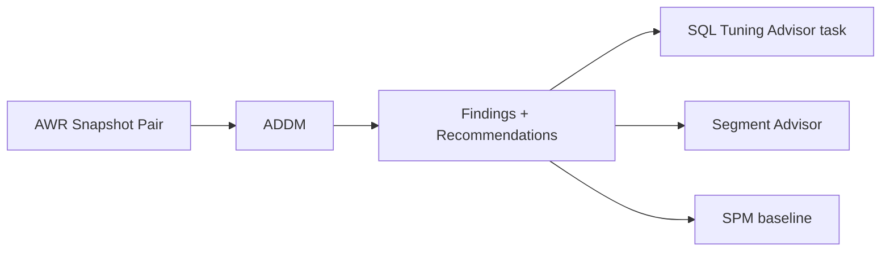

# ADDM — Automatic Database Diagnostic Monitor

## Overview

**ADDM** analyzes each AWR snapshot pair and produces prioritized findings + recommendations: which SQL is dominating time, which resource is bottleneck, which subsystem needs tuning. Automatic; runs after every AWR snapshot. Requires **Diagnostic Pack + Tuning Pack** for full functionality.

## Architecture



## Internal Working

### What ADDM Analyzes

- Time model (parse, CPU, execution) vs DB Time.
- Wait events by class.
- SQL by elapsed time / CPU / I/O.
- Segment access patterns.
- SGA/PGA sizing.
- Undo, redo, temp usage.
- RAC-specific (`gc buffer busy`, `gc cr grant congested`).

### Output

Each finding has:

- **Impact** (% of DB Time contributed).
- **Recommendation** (specific action).
- **Type** (SQL tuning, buffer cache, undo, etc.).

## Getting Reports

### Auto-generated (after each snapshot)

```sql
-- List recent ADDM tasks
SELECT task_name, execution_start, execution_end, status
FROM   dba_advisor_tasks
WHERE  advisor_name = 'ADDM'
ORDER  BY execution_start DESC
FETCH FIRST 20 ROWS ONLY;

-- Get findings text for a snapshot pair
SELECT DBMS_ADVISOR.GET_TASK_REPORT(
  task_name => (SELECT task_name FROM dba_advisor_tasks
                WHERE  advisor_name = 'ADDM'
                ORDER  BY execution_start DESC
                FETCH FIRST 1 ROWS ONLY),
  type => 'TEXT',
  level => 'ALL') AS report
FROM   dual;
```

### Manual for a period

```sql
DECLARE
  task_id NUMBER;
  task_name VARCHAR2(64) := 'MY_ADDM_' || TO_CHAR(SYSDATE,'YYYYMMDD_HH24MI');
BEGIN
  DBMS_ADVISOR.CREATE_TASK('ADDM', task_id, task_name);
  DBMS_ADVISOR.SET_TASK_PARAMETER(task_name, 'START_SNAPSHOT', 1000);
  DBMS_ADVISOR.SET_TASK_PARAMETER(task_name, 'END_SNAPSHOT', 1010);
  DBMS_ADVISOR.EXECUTE_TASK(task_name);
  DBMS_OUTPUT.PUT_LINE(
    DBMS_ADVISOR.GET_TASK_REPORT(task_name, 'TEXT', 'ALL'));
END;
/
```

### SQL\*Plus scripts

```sql
@?/rdbms/admin/addmrpt.sql       -- Standard
@?/rdbms/admin/addmrpti.sql      -- Multi-instance
```

## Sample Finding

```
FINDING 1: 42% impact (1834 seconds)
SQL statements consuming significant database time were found.

   RECOMMENDATION 1: SQL Tuning, 42% benefit (1834 seconds)
   ACTION: Investigate the SQL statement with SQL_ID "abc123def456"
      for possible performance improvements. Consider using SQL
      Advisor to further investigate the statement.
   RATIONALE: The SQL spent 100% of its Database Time on CPU.
   The SQL was executed 1000 times with average elapsed time of
      1.8 seconds per execution.
```

## Recommendation Types

- **SQL Tuning** — run SQL Tuning Advisor on the specific SQL.
- **Segment Tuning** — run Segment Advisor.
- **Undo Sizing** — enlarge UNDO tablespace / retention.
- **DB Config** — change parameter (SGA, PGA target).
- **Application Analysis** — commit frequency, connection issues.
- **Host Config** — CPU, memory, I/O beyond DB scope.

## Diagnostic Queries

```sql
-- Top findings across all ADDM tasks in last 24h
SELECT t.task_name, f.impact, f.type, f.finding_name,
       f.recommend_action
FROM   dba_advisor_findings f JOIN dba_advisor_tasks t USING (task_id)
WHERE  t.advisor_name = 'ADDM'
   AND t.execution_start > SYSDATE - 1
ORDER  BY f.impact DESC
FETCH FIRST 30 ROWS ONLY;

-- Actions taken (or recommended)
SELECT t.task_name, a.action_id, a.command, a.attr1, a.attr2
FROM   dba_advisor_actions a JOIN dba_advisor_tasks t USING (task_id)
WHERE  t.advisor_name = 'ADDM'
   AND t.execution_start > SYSDATE - 1
ORDER  BY t.execution_start DESC;
```

## Common Issues

- **ADDM finding "SQL Tuning" repeatedly** — Same query dominating; fix or SPM.
- **No findings** — Very quiet database or `STATISTICS_LEVEL=BASIC`.
- **License warnings** — Full ADDM needs Diagnostic + Tuning Pack.
- **Findings pointing to `gc` events** — RAC hot block; consider partitioning or interconnect health.

## Best Practices

1. Read ADDM after every AWR review — helps prioritize.
2. Feed high-impact findings into your engineering backlog.
3. Do not blindly implement — validate in staging.
4. Use ADDM to justify infrastructure spend (more CPU, storage IOPS).
5. Trust Segment Advisor / SQL Tuning Advisor recommendations from ADDM.
6. Verify Diagnostic + Tuning Pack licensing before using.
7. Compare ADDM findings across periods (before/after change).

## Interview Questions

1. **Q:** What does ADDM do?
   **A:** Analyzes AWR snapshot pairs and produces prioritized findings + tuning recommendations.

2. **Q:** When does it run?
   **A:** Automatically after every AWR snapshot.

3. **Q:** License?
   **A:** Diagnostic + Tuning Pack (Tuning Pack for the SQL-tuning parts).

4. **Q:** Common recommendation types?
   **A:** SQL Tuning, Segment Tuning, Undo Sizing, DB config, App analysis.

5. **Q:** How do you get a manual ADDM report?
   **A:** `@?/rdbms/admin/addmrpt.sql` or programmatic via `DBMS_ADVISOR`.

## References

- Oracle Database Performance Tuning Guide 19c — ADDM
- MOS Doc ID 741603.1 — ADDM Overview
