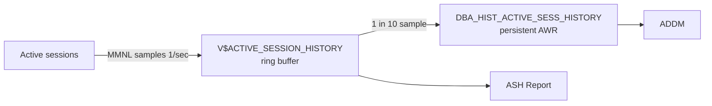

# ASH — Active Session History

## Overview

**Active Session History** is a per-second sampling of all active sessions. Every second, MMNL captures a snapshot of `V$SESSION` for every session that is currently active (working on CPU or waiting on non-idle event). Samples land in an in-memory ring buffer (`V$ACTIVE_SESSION_HISTORY`) and 10% are persisted to `DBA_HIST_ACTIVE_SESS_HISTORY` for AWR retention.

ASH is the DBA's time machine — "what was happening at 3:15 PM yesterday?" — answered by joining samples to `V$SQL`, `V$SQL_PLAN`, and object dictionary.

Requires **Diagnostic Pack** license.

## Architecture



## Internal Working

### Sampling

Each second, MMNL scans `V$SESSION`. A session is **active** if:

- `STATUS = 'ACTIVE'` AND
- (currently on CPU OR waiting on a non-idle event).

For each active session, ASH records:

- SID, USER, MODULE, ACTION, PROGRAM
- SQL_ID + SQL_PLAN_HASH_VALUE + SQL_CHILD_NUMBER
- EVENT (wait event; NULL if on CPU)
- WAIT_CLASS, SEQ#, P1, P2, P3
- SESSION_STATE (`ON CPU` or `WAITING`)
- BLOCKING_SESSION
- Current_obj#, current_file#, current_block# (which block is being accessed)
- PGA_ALLOCATED, TEMP_SPACE_ALLOCATED
- USER_ID, USERGROUP

### Ring Buffer Size

Roughly `_ash_size` bytes (2 MB per CPU by default), holding minutes to a couple hours depending on activity.

### Persistence

MMON flushes 1 in every 10 samples to `DBA_HIST_ACTIVE_SESS_HISTORY`. This preserves ASH-like time-slicing beyond the ring buffer's lifetime, at 10% resolution.

## Getting ASH Data

### Ring buffer

```sql
SELECT * FROM v$active_session_history WHERE ...;
```

### Persistent

```sql
SELECT * FROM dba_hist_active_sess_history WHERE ...;
```

### ASH Report

```sql
@?/rdbms/admin/ashrpt.sql        -- Standard
@?/rdbms/admin/ashrpti.sql       -- Instance-specific (multi-CDB/RAC)
```

Prompts for time window, output format.

### Programmatic

```sql
SELECT output FROM TABLE(
  DBMS_WORKLOAD_REPOSITORY.ASH_REPORT_HTML(
    l_dbid => (SELECT dbid FROM v$database),
    l_inst_num => 1,
    l_btime => SYSTIMESTAMP - INTERVAL '1' HOUR,
    l_etime => SYSTIMESTAMP));
```

## Reading ASH

### Top Sessions

```sql
SELECT session_id, session_serial#, COUNT(*) AS samples
FROM   v$active_session_history
WHERE  sample_time BETWEEN TIMESTAMP '2026-08-06 14:00:00'
                        AND TIMESTAMP '2026-08-06 15:00:00'
GROUP  BY session_id, session_serial#
ORDER  BY samples DESC
FETCH FIRST 20 ROWS ONLY;
```

Each sample = 1 second of active work. Top session by samples = biggest consumer.

### Top SQL by ASH

```sql
SELECT sql_id, sql_plan_hash_value, COUNT(*) AS samples,
       ROUND(COUNT(*)/60,1) AS approx_minutes,
       COUNT(DISTINCT session_id) AS sessions
FROM   v$active_session_history
WHERE  sample_time > SYSDATE - 1/24
   AND sql_id IS NOT NULL
GROUP  BY sql_id, sql_plan_hash_value
ORDER  BY samples DESC
FETCH FIRST 20 ROWS ONLY;
```

Multiply samples by average concurrency for effort estimation. `COUNT(*)/60` = minutes.

### Top Events

```sql
SELECT NVL(event, 'ON CPU') AS event, wait_class,
       COUNT(*) AS samples
FROM   v$active_session_history
WHERE  sample_time > SYSDATE - 1/24
GROUP  BY event, wait_class
ORDER  BY samples DESC
FETCH FIRST 15 ROWS ONLY;
```

### Blocking Chains

```sql
SELECT sample_time, session_id, blocking_session,
       event, sql_id
FROM   v$active_session_history
WHERE  blocking_session IS NOT NULL
   AND sample_time > SYSDATE - 1/24
ORDER  BY sample_time DESC
FETCH FIRST 30 ROWS ONLY;
```

### Object Hotspots

```sql
SELECT o.owner || '.' || o.object_name AS segment,
       ash.event, COUNT(*) AS samples
FROM   v$active_session_history ash
JOIN   dba_objects o ON o.object_id = ash.current_obj#
WHERE  ash.sample_time > SYSDATE - 1/24
   AND ash.current_obj# > 0
GROUP  BY o.owner, o.object_name, ash.event
ORDER  BY samples DESC
FETCH FIRST 20 ROWS ONLY;
```

## Common ASH Patterns

- **All samples ON CPU** — Optimize SQL for CPU efficiency, add CPU, or paralellelize.
- **Concentrated on one SQL** — Focus tuning there.
- **`db file sequential read` heavy** — Index/lookup I/O; check buffer cache, storage, and query plans.
- **`db file scattered read` heavy** — Full scans; missing index or forced scan.
- **`log file sync` heavy** — Redo I/O or commit rate. See [Commit Processing](../06-redo/commit-processing.md).
- **`enq: TX - row lock contention`** — Blocking session. See [Blocking Sessions](../13-locking/blocking-sessions.md).
- **`latch: shared pool`** — Hard parse storm.

## Diagnostic Queries

```sql
-- Ring buffer age
SELECT MIN(sample_time), MAX(sample_time),
       COUNT(*) AS samples
FROM   v$active_session_history;

-- ASH samples per second (density)
SELECT TO_CHAR(sample_time, 'HH24:MI') AS minute,
       COUNT(*) AS samples,
       COUNT(DISTINCT session_id) AS sessions
FROM   v$active_session_history
WHERE  sample_time > SYSDATE - 1/24
GROUP  BY TO_CHAR(sample_time, 'HH24:MI')
ORDER  BY minute;

-- Session timeline for one session
SELECT sample_time, sql_id, event, session_state,
       blocking_session, p1, p2, p3
FROM   v$active_session_history
WHERE  session_id = 123
ORDER  BY sample_time;
```

## Common Issues

- **Ring buffer too small on busy systems** — Old samples age out fast. Rely on `DBA_HIST_ACTIVE_SESS_HISTORY` for anything beyond a couple hours.
- **`statistics_level=BASIC`** disables ASH — must be TYPICAL or ALL.
- **Missing samples** — MMNL not running or CPU-starved.
- **Sample count under-representing very short SQL** — 1-sec sampling misses sub-second sessions.

## Best Practices

1. Set `STATISTICS_LEVEL=TYPICAL`.
2. Enable AWR retention 30+ days so `DBA_HIST_ACTIVE_SESS_HISTORY` covers your investigation window.
3. Learn the top-10 ASH queries by heart.
4. Cross-reference ASH samples with `V$SQL.EXECUTIONS_DELTA` to spot execution spikes.
5. For blocking analysis, ASH's `blocking_session` + `event` chain is unbeatable.
6. In RAC, use `GV$ACTIVE_SESSION_HISTORY` and `awr_gpg_report`.
7. Do not tune based on averages; ASH shows time-based samples — much richer.

## Interview Questions

1. **Q:** What is ASH?
   **A:** 1-second sampling of active sessions; captures wait event, SQL, blocker, and object per sample.

2. **Q:** Ring buffer vs DBA*HIST*?
   **A:** Ring buffer: recent minutes/hours in memory. `DBA_HIST_`: 1 in 10 samples persisted.

3. **Q:** ASH sample count of 60 for one SQL — meaning?
   **A:** ~60 seconds of active time. Multiply by concurrency for effort estimation.

4. **Q:** How do you generate an ASH report?
   **A:** `@?/rdbms/admin/ashrpt.sql`.

5. **Q:** ASH vs AWR?
   **A:** AWR: hourly aggregates. ASH: 1-second session samples. Use ASH for zeroing in on a specific timeframe.

6. **Q:** License?
   **A:** Diagnostic Pack.

7. **Q:** Blocking analysis via ASH?
   **A:** `V$ACTIVE_SESSION_HISTORY.blocking_session` shows who blocks whom, sample by sample.

## References

- Oracle Database Performance Tuning Guide 19c — Active Session History
- MOS Doc ID 243132.1 — ASH Concepts
- Kyle Hailey — ASH deep-dive blog series
