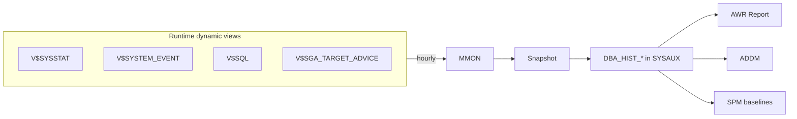

# AWR — Automatic Workload Repository

## Overview

**AWR** is Oracle's historical performance repository. Every hour (by default), MMON snapshots dozens of dynamic performance views (`V$SYSSTAT`, `V$SYSTEM_EVENT`, `V$SQL`, `V$SEGMENT_STATISTICS`, `V$OSSTAT`, ...) into persistent `DBA_HIST_*` tables in SYSAUX. AWR reports comparing two snapshots give a comprehensive workload characterization for that window.

Requires **Diagnostic Pack** license (bundled with Enterprise Edition + Diagnostic Pack — usually licensed together).

## Architecture



## Internal Working

### Snapshots

- Interval: 60 minutes default.
- Retention: 8 days default.
- Configure:

```sql
BEGIN
  DBMS_WORKLOAD_REPOSITORY.MODIFY_SNAPSHOT_SETTINGS(
    interval  => 30,                    -- minutes
    retention => 30 * 24 * 60,          -- 30 days
    topnsql   => 100);                  -- top-N SQL captured
END;
/
```

Recommended: **retention 30 days**, interval **30 min** for busy databases.

### Manual snapshot

```sql
EXEC DBMS_WORKLOAD_REPOSITORY.CREATE_SNAPSHOT;
```

Use before / after a workload event you want to bracket.

### AWR Baselines

Baselines are named windows of snapshots (e.g., "MonthEndBatch") kept immune from automatic purging — used for comparison later.

```sql
BEGIN
  DBMS_WORKLOAD_REPOSITORY.CREATE_BASELINE(
    start_snap_id => 1000, end_snap_id => 1100,
    baseline_name => 'MonthEndBatch');
END;
/
```

Moving baselines (last 7 days, last 24h) are also available.

## Generating Reports

### From SQL\*Plus scripts

```sql
@?/rdbms/admin/awrrpt.sql       -- Standard report
@?/rdbms/admin/awrsqrpt.sql     -- Per-SQL report
@?/rdbms/admin/awrddrpt.sql     -- Compare two periods
@?/rdbms/admin/awrgrpt.sql      -- Global AWR (all RAC instances)
@?/rdbms/admin/awrgdrpt.sql     -- Global compare periods
```

Scripts prompt for begin/end snap IDs and output format (HTML preferred).

### Programmatic

```sql
SELECT output FROM TABLE(
  DBMS_WORKLOAD_REPOSITORY.AWR_REPORT_HTML(
    l_dbid   => (SELECT dbid FROM v$database),
    l_inst_num => 1,
    l_bid    => 1000,
    l_eid    => 1010));
```

### Multitenant

19c supports **AWR at PDB level**:

```sql
ALTER SYSTEM SET awr_pdb_autoflush_enabled = TRUE SCOPE=BOTH;
```

Per-PDB report:

```sql
@?/rdbms/admin/awrrpti.sql  -- Prompts for DBID + inst; use PDB DBID
```

## Reading an AWR Report

### Top Sections (in order of triage)

1. **Load Profile** — DB Time, Logical/Physical reads, Redo size, User calls per sec.
2. **Instance Efficiency** — buffer hit, library hit, execute-to-parse. Beware: hit ratios can mislead.
3. **Top 10 Foreground Wait Events** — the most important table. Compare each event's `Avg Wait (ms)` to workload expectation.
4. **Time Model Statistics** — CPU vs I/O vs Parse vs Recursive.
5. **Operating System Statistics** — Load avg, CPU %, RAM.
6. **Top SQL by Elapsed Time** — the query workhorses.
7. **Top SQL by CPU Time / Buffer Gets / Physical Reads / Executions**.
8. **Segments by Logical Reads / Physical Reads / Row Lock Waits**.
9. **Instance Activity Stats** — the `V$SYSSTAT` counters.
10. **IO Stats / Tablespace IO Stats / File IO Stats** — I/O breakdown.

### DB Time vs Elapsed

- **Elapsed** = wall clock time of the AWR window.
- **DB Time** = sum of active session time. `DB Time / (Elapsed × CPU count)` gives average session concurrency.
- If DB Time > many × Elapsed, the DB is heavily concurrent.
- If DB Time ≈ Elapsed, quiet database.

### Wait Class Ratio

Total wait time on non-idle events vs CPU. If waits >> CPU, workload is I/O / concurrency bound. If CPU >> waits, workload is CPU bound (fix SQL efficiency).

## Diagnostic Queries

```sql
-- AWR config
SELECT snap_interval, retention, snapshot_status
FROM   dba_hist_wr_control;

-- Recent snapshots
SELECT snap_id, begin_interval_time, end_interval_time,
       snap_flag AS type
FROM   dba_hist_snapshot
ORDER  BY snap_id DESC
FETCH FIRST 20 ROWS ONLY;

-- Baselines
SELECT baseline_name, baseline_type, start_snap_id, end_snap_id, expiration
FROM   dba_hist_baseline;

-- SYSAUX space by AWR
SELECT * FROM v$sysaux_occupants WHERE occupant_name = 'SM/AWR';

-- Missed snapshots (gaps)
SELECT s1.snap_id, s1.end_interval_time,
       s2.snap_id AS next_snap, s2.begin_interval_time AS next_start,
       (s2.begin_interval_time - s1.end_interval_time) * 24 * 60 AS gap_minutes
FROM   dba_hist_snapshot s1
JOIN   dba_hist_snapshot s2 ON s2.snap_id = s1.snap_id + 1
WHERE  (s2.begin_interval_time - s1.end_interval_time) * 24 * 60 > 5
ORDER  BY s1.snap_id DESC;
```

## Common Issues

- **SYSAUX growing rapidly** — Excessive AWR retention or high `topnsql`. Adjust settings or move AWR objects to their own tablespace.
- **Missed snapshots** — MMON hung. Manually create snapshot; investigate MMON.
- **`STATISTICS_LEVEL=BASIC`** disables AWR — never set on production.
- **Cross-instance/cluster reporting** — use global (`awrgrpt.sql`) scripts.
- **Report format issues** — Use HTML in browser, not text.

## Best Practices

1. **Retention 30 days** minimum. 60–90 days for regulated environments.
2. **Interval 30 min** for busy OLTP; 60 min for stable systems.
3. Baseline **month-end batch** and other repeatable heavy workloads.
4. Save AWR reports for known-good periods for post-upgrade comparison.
5. Use `awrddrpt.sql` (compare periods) after any change — before/after.
6. Monitor SYSAUX space; enable PDB-level AWR only if you need per-PDB detail.
7. Export AWR baselines with Data Pump for permanent retention.
8. Interpret hit ratios in context — 99% buffer cache hit + high `db file sequential read` still means I/O trouble.
9. Read the top 5 wait events **first**; SQL sections second.
10. Cross-reference top SQL with `V$SQL_MONITOR` / `V$SQL_PLAN` to see the plan.

## Interview Questions

1. **Q:** What is AWR?
   **A:** Automatic Workload Repository — hourly persistent snapshots of dynamic performance views. Enables historical performance analysis.

2. **Q:** Retention default?
   **A:** 8 days. Recommend 30+.

3. **Q:** Where do AWR tables live?
   **A:** `DBA_HIST_*` in SYSAUX.

4. **Q:** How do you generate a report?
   **A:** `@?/rdbms/admin/awrrpt.sql` in SQL\*Plus.

5. **Q:** DB Time vs Elapsed?
   **A:** DB Time = sum of active session time. Elapsed = wall clock. DB Time ≫ Elapsed = high concurrency.

6. **Q:** First section to look at in AWR?
   **A:** Top wait events (foreground). Then top SQL by elapsed.

7. **Q:** License?
   **A:** Diagnostic Pack.

8. **Q:** AWR in multitenant?
   **A:** 19c supports per-PDB AWR via `awr_pdb_autoflush_enabled`.

## References

- Oracle Database Performance Tuning Guide 19c — AWR
- MOS Doc ID 748642.1 — MMON Slaves
- MOS Doc ID 785761.1 — AWR Sizing SYSAUX
- MOS Doc ID 2316482.1 — PDB-level AWR
