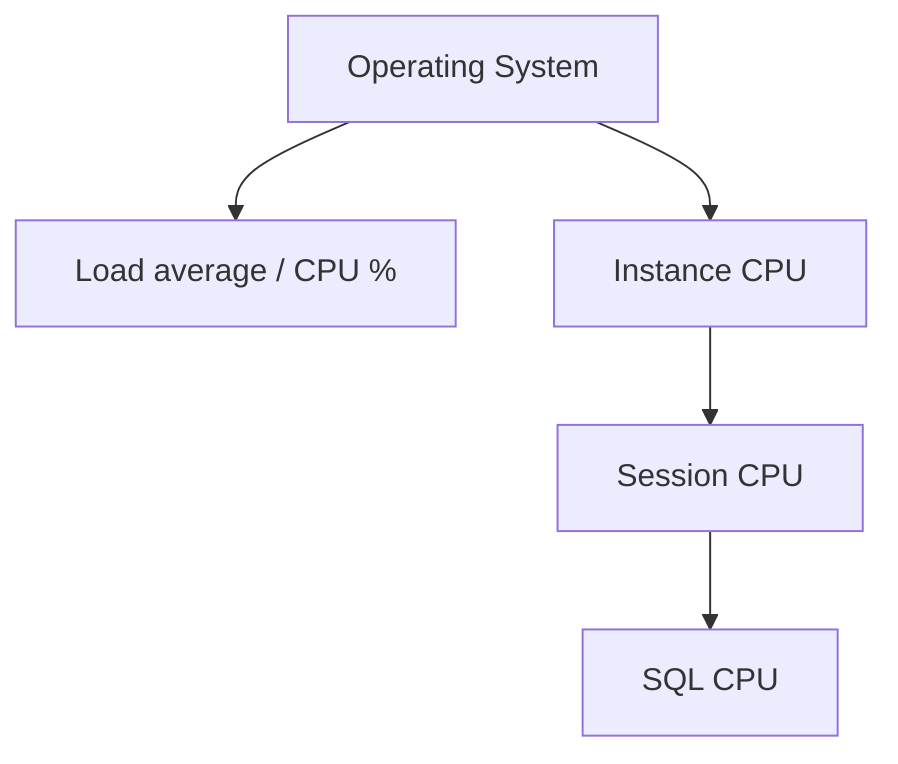

# CPU Analysis

## Overview

CPU is either the bottleneck or the excess. When Oracle reports "CPU used by this session" as the top wait, or `V$OSSTAT` shows high `LOAD` and low `IDLE_TIME`, the DB is CPU bound. This page covers OS-level, instance-level, and SQL-level CPU diagnosis.

## Layers



## OS-Level

### From Oracle

```sql
SELECT stat_name, value FROM v$osstat
WHERE  stat_name IN ('NUM_CPUS','NUM_CPU_CORES','LOAD','BUSY_TIME',
                     'IDLE_TIME','USER_TIME','SYS_TIME','IOWAIT_TIME',
                     'RSRC_MGR_CPU_WAIT_TIME');
```

- **LOAD** — 1-minute load average (Unix).
- **BUSY_TIME / IDLE_TIME** — cumulative centiseconds.
- **IOWAIT_TIME** — time processes waited on I/O.

### From OS

```bash
# Linux
top                 # live view
uptime              # load
vmstat 1 10         # queue, swap, CPU breakdown
mpstat -P ALL 1     # per-CPU
pidstat -u 1        # per-process CPU
```

- `%us` — user CPU (Oracle running SQL).
- `%sy` — kernel CPU (I/O, context switches).
- `%wa` — waiting on I/O (not real CPU busy).
- `%id` — idle.
- `%si`, `%hi` — softirq/hardirq.

### Interpreting

- **Load ≈ CPU count** — Fully utilized, healthy.
- **Load > 2× CPU count** — CPU-constrained; queueing.
- **`%us` high, `%sy` low** — Oracle SQL is the load; tune SQL.
- **`%sy` high** — Kernel: many context switches, poor process affinity, or hard I/O.
- **`%wa` high** — I/O-bound; check storage.

## Instance-Level

### Time Model — where DB Time is spent

```sql
SELECT stat_name, value, ROUND(value/1e6/60, 1) AS minutes
FROM   v$sys_time_model
WHERE  stat_name IN ('DB CPU', 'DB time',
                     'sql execute elapsed time',
                     'parse time elapsed',
                     'hard parse elapsed time',
                     'PL/SQL execution elapsed time',
                     'connection management call elapsed time')
ORDER  BY value DESC;
```

Compare `DB CPU` vs `DB time`:

- **DB CPU / DB time ≈ 1** — Almost all time is CPU (waits negligible).
- **DB CPU / DB time much < 1** — Mostly waiting (I/O, locks); tune waits, not CPU.

### CPU Utilization by Session

```sql
-- Top sessions by CPU last hour (ASH)
SELECT session_id, COUNT(*) AS samples_on_cpu
FROM   v$active_session_history
WHERE  session_state = 'ON CPU'
   AND sample_time > SYSDATE - 1/24
GROUP  BY session_id
ORDER  BY samples_on_cpu DESC
FETCH FIRST 20 ROWS ONLY;
```

### CPU by SQL

```sql
SELECT sql_id, COUNT(*) AS samples_on_cpu
FROM   v$active_session_history
WHERE  session_state = 'ON CPU'
   AND sample_time > SYSDATE - 1/24
GROUP  BY sql_id
ORDER  BY samples_on_cpu DESC
FETCH FIRST 20 ROWS ONLY;
```

Each sample = 1 second. Multiply by concurrency for total time.

## Session-Level

```sql
-- Snapshot session CPU
SELECT s.sid, s.username, s.machine, s.program, s.sql_id,
       ss.value/100 AS cpu_seconds
FROM   v$sesstat ss JOIN v$statname sn ON sn.statistic# = ss.statistic#
       JOIN v$session s ON s.sid = ss.sid
WHERE  sn.name = 'CPU used by this session'
   AND s.type = 'USER'
ORDER  BY ss.value DESC
FETCH FIRST 20 ROWS ONLY;
```

For OS-level CPU per Oracle process:

```bash
# Match SPID to session
ps -o pid,pcpu,pmem,etime,args -p $SPID
top -p $SPID
```

## Common Patterns

- **DB CPU dominant** — Tune SQL to reduce CPU (better plan, indexes, less parsing).
- **Hard parse elapsed time high** — Literal SQL; use binds.
- **`resmgr:cpu quantum`** in waits — Resource Manager throttling.
- **CPU steal on VMs** — Neighboring VMs consuming physical CPU. Check `%st` in `vmstat`.

## Runtime Investigations

### `pstack` / `strace` — What is a process doing?

```bash
sudo pstack $SPID     # thread stacks
sudo strace -p $SPID -c -e trace=all -w 10  # syscall summary for 10 sec
```

### `perf` — CPU profiling

```bash
sudo perf top -p $SPID              # live CPU per function
sudo perf record -p $SPID sleep 60  # capture 60s
sudo perf report                    # analyze
```

Look for Oracle internal function names — patterns like `kkopmVecTypeCheck` (parse), `qkkq` (query kernel) reveal the internal hotspot.

## Diagnostic Queries

```sql
-- CPU vs Wait per snapshot (AWR)
SELECT snap_id,
       SUM(CASE WHEN stat_name = 'DB CPU' THEN value_delta END)/1e6 AS db_cpu_sec,
       SUM(CASE WHEN stat_name = 'DB time' THEN value_delta END)/1e6 AS db_time_sec,
       ROUND(SUM(CASE WHEN stat_name = 'DB CPU' THEN value_delta END) /
             GREATEST(SUM(CASE WHEN stat_name = 'DB time' THEN value_delta END), 1) * 100, 1) AS cpu_pct_of_dbtime
FROM   dba_hist_sys_time_model
WHERE  snap_id > (SELECT MAX(snap_id) - 24 FROM dba_hist_snapshot)
GROUP  BY snap_id
ORDER  BY snap_id;

-- Wait vs CPU class
SELECT event, wait_class, total_waits,
       ROUND(time_waited/100, 1) AS wait_sec
FROM   v$system_event
WHERE  wait_class <> 'Idle'
ORDER  BY wait_sec DESC
FETCH FIRST 10 ROWS ONLY;
```

## Common Issues

- **`_optimizer_use_feedback` overhead** — Rare CPU hit; disable if measured.
- **Excessive parse** — Hard parses eat CPU. Fix with bind variables.
- **Recursive SQL** — Data dictionary lookups from apps issuing DDL frequently.
- **PL/SQL loops** — CPU in `PL/SQL execution elapsed time`.
- **HugePages misconfigured** — Extra TLB thrashing; check `/proc/meminfo`.
- **Insufficient CPUs** — Fundamental capacity issue.

## Best Practices

1. Compare `DB CPU` to `DB time` — decide if you should tune CPU or waits.
2. Check top SQL by CPU when `DB CPU` dominates.
3. Watch OS metrics alongside Oracle metrics.
4. Enable HugePages for large SGAs (Linux).
5. Ensure `resource_manager_plan` isn't throttling unexpectedly.
6. Pin critical processes to CPU sets in extreme cases.
7. Use `perf` on production only if necessary; low overhead but not free.

## Interview Questions

1. **Q:** How do you tell CPU-bound vs I/O-bound?
   **A:** `DB CPU / DB time`. Near 1 = CPU-bound. Much lower = wait-bound.

2. **Q:** Where is Oracle-visible CPU?
   **A:** `V$SYS_TIME_MODEL.DB CPU`, `V$SESSTAT` "CPU used by this session".

3. **Q:** How do you find top-CPU SQL from ASH?
   **A:** `SELECT sql_id, COUNT(*) FROM v$active_session_history WHERE session_state='ON CPU' GROUP BY sql_id ORDER BY COUNT(*) DESC;`.

4. **Q:** `%st` in `vmstat` means?
   **A:** CPU stolen by hypervisor — neighbor VM consumed physical CPU.

5. **Q:** How to profile a specific server process?
   **A:** `perf record -p $SPID` on Linux; then `perf report`.

6. **Q:** Hard parse and CPU?
   **A:** Hard parsing is CPU-intensive. Bind variables reduce it.

## References

- Oracle Database Performance Tuning Guide 19c
- Cary Millsap, _Optimizing Oracle Performance_
- MOS Doc ID 164768.1 — CPU consumption breakdown
- Brendan Gregg's blog — Systems performance
