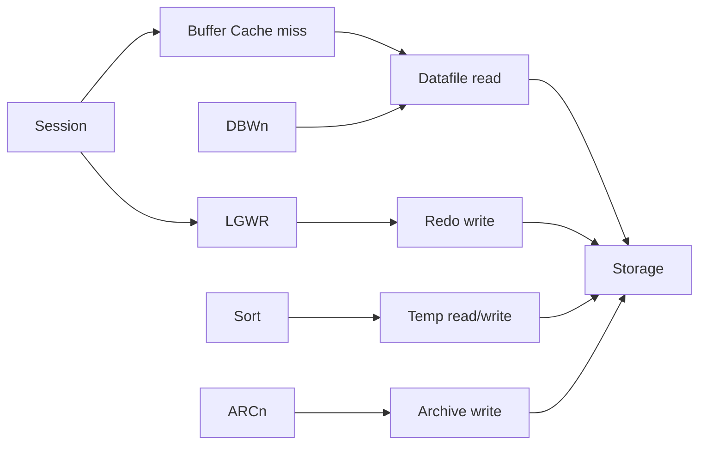

# I/O Analysis

## Overview

Every buffer miss in Oracle turns into a physical I/O. Datafile I/O, redo I/O, temp I/O, archive I/O — each has different characteristics (random vs sequential, sync vs async, latency-sensitive vs throughput). This page covers per-file, per-tablespace, and per-segment I/O analysis to find bottlenecks and validate storage decisions.

## Layers



## Wait-Event View

Most-common I/O wait events:

- `db file sequential read` — single-block read (index).
- `db file scattered read` — multi-block read (full scan).
- `direct path read` — bypass buffer cache (parallel, large scans).
- `direct path read temp` / `direct path write temp` — sort/hash spill.
- `log file parallel write` — LGWR redo write.
- `log file sync` — commit wait.
- `control file parallel write` — control file update.
- `db file async I/O submit` — async I/O queue.

Query:

```sql
SELECT event, wait_class, total_waits,
       ROUND(time_waited_micro/1e6, 1) AS total_sec,
       ROUND(time_waited_micro/DECODE(total_waits,0,1,total_waits)/1000, 2) AS avg_ms
FROM   v$system_event
WHERE  wait_class LIKE '%I/O%'
ORDER  BY time_waited_micro DESC;
```

## Per-Datafile I/O

```sql
SELECT df.tablespace_name, df.file_name,
       fs.phyrds, fs.phyblkrd,
       ROUND(fs.readtim/DECODE(fs.phyrds,0,1,fs.phyrds)*10, 2) AS avg_read_ms,
       fs.phywrts, fs.phyblkwrt,
       ROUND(fs.writetim/DECODE(fs.phywrts,0,1,fs.phywrts)*10, 2) AS avg_write_ms
FROM   dba_data_files df JOIN v$filestat fs ON df.file_id = fs.file#
ORDER  BY fs.phyrds + fs.phywrts DESC
FETCH FIRST 20 ROWS ONLY;
```

`v$filestat.readtim / writetim` is in centiseconds; divide by `phyrds`/`phywrts` and × 10 → avg ms per I/O.

## Per-Tablespace I/O

```sql
SELECT ts.name AS tablespace_name,
       SUM(fs.phyrds) AS phyrds,
       SUM(fs.phywrts) AS phywrts,
       ROUND(SUM(fs.readtim)/GREATEST(SUM(fs.phyrds),1)*10, 2) AS avg_read_ms
FROM   v$filestat fs JOIN v$datafile df ON df.file# = fs.file#
       JOIN v$tablespace ts ON ts.ts# = df.ts#
GROUP  BY ts.name
ORDER  BY phyrds + phywrts DESC;
```

## Per-Segment I/O

```sql
-- Top-N segments by physical reads
SELECT owner, object_name, object_type, value AS physical_reads
FROM   v$segment_statistics
WHERE  statistic_name = 'physical reads'
ORDER  BY value DESC
FETCH FIRST 20 ROWS ONLY;

-- Top segments by row lock waits (contention)
SELECT owner, object_name, object_type, value AS row_lock_waits
FROM   v$segment_statistics
WHERE  statistic_name = 'row lock waits' AND value > 0
ORDER  BY value DESC
FETCH FIRST 20 ROWS ONLY;
```

## Redo I/O

```sql
-- LGWR write throughput and latency
SELECT event, total_waits,
       ROUND(time_waited_micro/1e6, 1) AS total_sec,
       ROUND(time_waited_micro/DECODE(total_waits,0,1,total_waits)/1000, 2) AS avg_ms
FROM   v$system_event
WHERE  event IN ('log file parallel write', 'log file sync');

-- Redo size generated
SELECT ROUND(value/1024/1024/1024, 2) AS gb
FROM   v$sysstat WHERE name = 'redo size';

-- Redo per hour
SELECT TO_CHAR(begin_time, 'YYYY-MM-DD HH24') AS hr,
       ROUND(SUM(value)/1024/1024, 1) AS mb
FROM   v$sysmetric_history
WHERE  metric_name = 'Redo Generated Per Sec'
GROUP  BY TO_CHAR(begin_time, 'YYYY-MM-DD HH24')
ORDER  BY hr DESC
FETCH FIRST 24 ROWS ONLY;
```

## Temp I/O

```sql
-- Recent sessions using TEMP
SELECT s.sid, s.username, s.machine, s.program, s.sql_id,
       ROUND(u.blocks * 8 / 1024, 1) AS temp_mb,
       u.tablespace
FROM   v$sort_usage u JOIN v$session s ON s.saddr = u.session_addr
ORDER  BY u.blocks DESC
FETCH FIRST 20 ROWS ONLY;

-- Waits on temp
SELECT event, total_waits,
       ROUND(time_waited_micro/1e6, 1) AS sec
FROM   v$system_event
WHERE  event LIKE 'direct path%temp';
```

## OS-Level I/O

```bash
# Linux
iostat -xz 1 10     # per-device throughput and latency
sar -d 1 10         # historical I/O
iotop               # per-process I/O
```

- `await` — avg I/O wait time in ms.
- `%util` — device saturation.
- `r/s`, `w/s` — IOPS.
- `rMB/s`, `wMB/s` — throughput.

Latency benchmarks (rough):

| Storage                        | Read latency |
| ------------------------------ | ------------ |
| NVMe SSD                       | < 1 ms       |
| Enterprise SATA/SAS SSD        | 1–2 ms       |
| Battery-backed RAID10 spindles | 3–5 ms       |
| Cloud EBS gp3                  | 1–5 ms       |
| Cloud SAN NAS                  | 5–20 ms      |

If `db file sequential read` avg > 20 ms, storage is the constraint.

## Bandwidth Testing

Oracle ships **`orion`** for baseline I/O testing:

```bash
$ORACLE_HOME/bin/orion -run simple -testname iotest -num_disks 4 -matrix basic
```

Compare Oracle-observed latency to `orion` baseline.

## Diagnostic Queries

```sql
-- I/O metrics from AWR
SELECT snap_id,
       ROUND(SUM(CASE WHEN metric_name = 'Physical Reads Per Sec' THEN average END), 0) AS reads_per_sec,
       ROUND(SUM(CASE WHEN metric_name = 'Physical Writes Per Sec' THEN average END), 0) AS writes_per_sec,
       ROUND(SUM(CASE WHEN metric_name = 'Redo Generated Per Sec' THEN average END)/1024, 1) AS redo_kbps
FROM   dba_hist_sysmetric_summary
WHERE  snap_id > (SELECT MAX(snap_id) - 24 FROM dba_hist_snapshot)
GROUP  BY snap_id
ORDER  BY snap_id;

-- Async I/O in use?
SHOW PARAMETER disk_asynch_io
SHOW PARAMETER filesystemio_options    -- SETALL recommended for fs
```

## Common Issues

- **`db file sequential read` avg > 20 ms** — Slow storage or oversubscribed.
- **`db file scattered read` heavy** — Full scans; check plans.
- **`log file parallel write` > 5 ms** — Redo storage slow. NVMe or ASM +REDO with HIGH.
- **Async I/O not enabled** — `disk_asynch_io = FALSE` on Linux fs; `filesystemio_options=SETALL` for fs-based.
- **Uneven file I/O** — One datafile receiving all writes; check ASM diskgroup rebalance, or datafile placement.
- **Temp thrashing** — Small PGA forcing spill; enlarge `pga_aggregate_target`.

## Best Practices

1. **Baseline I/O latency** with Orion before production.
2. Enable **async I/O** (`disk_asynch_io=TRUE`) and O_DIRECT (`filesystemio_options=SETALL`) on Linux.
3. Redo on **lowest-latency storage**.
4. Separate redo from datafile I/O.
5. TEMP on fast storage; size PGA to minimize spillage.
6. Monitor per-datafile and per-segment I/O periodically.
7. Alert on `db file sequential read` avg > 15 ms.
8. Use ASM for I/O balance.
9. In cloud, provisioned IOPS matter — right-size for peak.
10. Understand cloud storage tiering (gp3 vs io2, hot/cool/archive).

## Interview Questions

1. **Q:** How do you find slow I/O in Oracle?
   **A:** `V$SYSTEM_EVENT` for wait events; `V$FILESTAT` for per-file avg latency.

2. **Q:** `db file sequential read` avg 25 ms — problem?
   **A:** Yes. Modern storage should be < 10 ms. Investigate storage.

3. **Q:** Async I/O?
   **A:** `disk_asynch_io = TRUE`, `filesystemio_options = SETALL` on Linux fs.

4. **Q:** How do you baseline I/O?
   **A:** `$ORACLE_HOME/bin/orion`.

5. **Q:** Per-segment I/O?
   **A:** `V$SEGMENT_STATISTICS`.

6. **Q:** Where does temp I/O appear?
   **A:** `direct path read temp` / `direct path write temp` events; `V$TEMPSTAT`.

## References

- Oracle Database Performance Tuning Guide 19c — I/O
- MOS Doc ID 555601.1 — Orion Usage
- MOS Doc ID 793845.1 — I/O tuning
- MOS Doc ID 240710.1 — Diagnosing I/O bottlenecks
