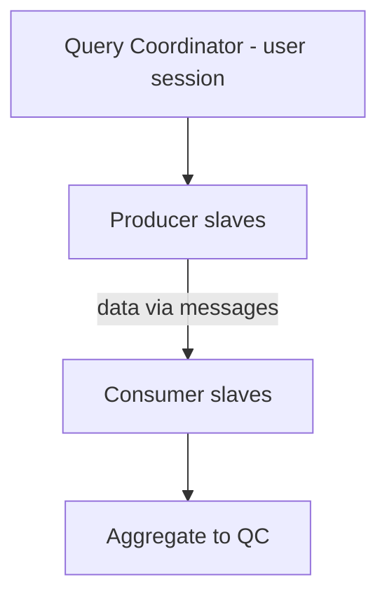

# Parallel Execution Tuning

## Overview

**Parallel Execution (PX)** turns a single SQL into a coordinated set of processes: one **query coordinator (QC)** and a set of **parallel slaves** (or servers). Done right, PX cuts data-warehouse queries from hours to minutes. Done wrong, it wastes resources, causes contention, or _slows down_ work by mis-partitioning it.

## Architecture



## Key Concepts

- **DOP (Degree of Parallelism)** — how many slaves total.
- **Producer / Consumer slaves** — two sets, communicating via **PX message queues**.
- **Distribution methods** — HASH, BROADCAST, RANGE, PARTITION.
- **Statement Queuing** — running PX statement queues if pool exhausted.
- **In-Memory PX** — parallel scans of In-Memory Column Store.

## Enabling PX

```sql
-- On a table
ALTER TABLE hr.orders PARALLEL 8;

-- On a query
SELECT /*+ PARALLEL(orders, 8) */ * FROM hr.orders WHERE ...;

-- Automatic (AUTO DOP)
ALTER SESSION SET parallel_degree_policy = AUTO;
```

Options for `parallel_degree_policy`:

| Value      | Effect                                                      |
| ---------- | ----------------------------------------------------------- |
| `MANUAL`   | Only when explicitly requested (hint or table attribute)    |
| `LIMITED`  | AUTO for tables set PARALLEL; MANUAL otherwise              |
| `AUTO`     | Optimizer decides; enables statement queuing + in-memory PX |
| `ADAPTIVE` | Like AUTO plus performance feedback                         |

## Parameters

| Parameter                         | Purpose                                     |
| --------------------------------- | ------------------------------------------- |
| `parallel_max_servers`            | Cap on concurrent PX slaves per instance    |
| `parallel_min_servers`            | Pre-spawned pool (fast start)               |
| `parallel_degree_limit`           | DOP ceiling under AUTO                      |
| `parallel_servers_target`         | Threshold for statement queuing             |
| `parallel_execution_message_size` | Message buffer size (16 KB default in 12c+) |
| `parallel_min_time_threshold`     | AUTO DOP kicks in above this cost           |
| `parallel_min_percent`            | Fail if less than X% of DOP available       |
| `parallel_force_local`            | TRUE = single-instance PX in RAC            |

## Interpreting PX Plans

```sql
SELECT * FROM TABLE(DBMS_XPLAN.DISPLAY_CURSOR('&sql_id', NULL,
  'ALL +ADAPTIVE +PARALLEL'));
```

Look for:

- `PX COORDINATOR` — QC.
- `PX SEND HASH` — producer sends to consumer via hash distribution.
- `PX RECEIVE` — consumer receives.
- `PX BLOCK ITERATOR` — parallel table access.
- **TQ (Table Queue)** columns show data flow between slave sets.

## Diagnostic Queries

```sql
-- Current PX processes
SELECT status, COUNT(*) AS n FROM v$px_process GROUP BY status;

-- Active PX sessions
SELECT qcsid AS qc_sid, qcinst_id, qcserial# AS qc_serial,
       server_group, server_set, server#,
       degree AS actual_dop, req_degree AS requested_dop
FROM   v$px_session ORDER BY qcsid, server#;

-- PX statistics
SELECT name, value FROM v$sysstat
WHERE  name LIKE 'Parallel%';

-- Downgrades — indicates parallel_max_servers is tight
SELECT name, value FROM v$sysstat
WHERE  name IN ('Parallel operations downgraded to serial',
                'Parallel operations downgraded 1 to 25 pct',
                'Parallel operations downgraded 25 to 50 pct',
                'Parallel operations downgraded 50 to 75 pct',
                'Parallel operations downgraded 75 to 99 pct');

-- Per-slave contribution (after query complete)
SELECT dfo_number, tq_id, server_type, process,
       num_rows, bytes
FROM   v$pq_tqstat
ORDER  BY dfo_number, tq_id, process;
```

## Skew — the Biggest PX Problem

**Data skew** — one slave gets much more work than others, so the whole query waits for the slowest.

Detection:

- SQL Monitor shows one slave with much longer elapsed than others.
- `V$PQ_TQSTAT` shows uneven `num_rows` across processes.

Common causes:

- Skewed join key (`HASH` distribution based on a low-NDV column).
- Skewed partition key (`PARTITION` distribution when partitions are unbalanced).

Fixes:

- Change join predicate.
- Use `PQ_DISTRIBUTE` hint with a better method.
- Add histogram on skewed column.
- Better partitioning.

## Distribution Methods

| Method        | When                                  |
| ------------- | ------------------------------------- |
| **BROADCAST** | Small side broadcast to all consumers |
| **HASH**      | Both sides hash on join key           |
| **RANGE**     | Sort-merge join                       |
| **PARTITION** | Full/partial partition-wise join      |

`PQ_DISTRIBUTE` hint format:

```sql
SELECT /*+ PARALLEL(o 8) PARALLEL(c 8) PQ_DISTRIBUTE(c HASH HASH) */ ...
FROM orders o JOIN customers c ON o.cust_id = c.id;
```

## Statement Queuing

If `parallel_servers_target < parallel_max_servers`, statements requesting more slaves than available queue rather than downgrading. Preferable to downgrade for stable DOP.

Enable:

```sql
ALTER SESSION SET parallel_degree_policy = AUTO;
```

Wait event: `PX Queuing: statement queue`.

## Common Issues

- **Downgrade to serial** — `parallel_max_servers` at cap. Increase or enable queuing.
- **Excessive downgrade** — `parallel_min_percent` too strict; consider AUTO with queuing.
- **Slave inactivity in RAC** — cross-instance PX with poor interconnect. Use `parallel_force_local=TRUE`.
- **Message queue full** — increase `parallel_execution_message_size`.
- **PX for tiny tables** — overhead exceeds benefit. Don't hint PARALLEL on small tables.
- **Locks blocking PX** — parallel DML acquires table-level locks.

## Best Practices

1. **DW: PX yes; OLTP: PX rarely.**
2. Prefer `parallel_degree_policy = AUTO` in DW.
3. Set table-level `PARALLEL 8` (or matching CPU count) rather than per-query hints when workload is uniform.
4. Enable **statement queuing** (`parallel_servers_target < parallel_max_servers`).
5. In RAC, `parallel_force_local = TRUE` unless you have very large scans.
6. Watch **SQL Monitor** for skew.
7. `parallel_min_percent = 25` — fail rather than run at 1× DOP.
8. Verify `parallel_max_servers = 2 × CPU × instances` as starting point.
9. Alert on excessive downgrades in AWR.
10. Statistics matter enormously for PX plans; keep them fresh.

## Interview Questions

1. **Q:** DOP?
   **A:** Degree of Parallelism — number of slaves per query.

2. **Q:** Producer vs consumer slaves?
   **A:** Two sets of slaves; producer feeds consumer via PX message queues (Table Queues).

3. **Q:** Statement queuing?
   **A:** When `parallel_servers_target` reached, further PX statements queue instead of downgrading.

4. **Q:** How to detect skew?
   **A:** SQL Monitor (uneven slave elapsed); `V$PQ_TQSTAT` per-process row counts.

5. **Q:** `PQ_DISTRIBUTE(t HASH HASH)`?
   **A:** Hint forcing HASH-HASH distribution for a table in a parallel join.

6. **Q:** RAC PX consideration?
   **A:** Cross-instance PX loads interconnect; `parallel_force_local=TRUE` to keep on one node.

## References

- Oracle Database VLDB and Partitioning Guide 19c — Parallel Execution
- Oracle Database Performance Tuning Guide 19c — Parallel Execution
- MOS Doc ID 203238.1 — Understanding PX
- MOS Doc ID 1620444.1 — Auto DOP + In-Memory PX
