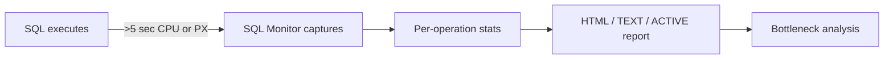

# SQL Monitor

## Overview

**Real-Time SQL Monitoring** shows a live, second-by-second view of a running SQL: per-plan-operation elapsed time, actual row counts, wait events, PGA/temp usage, parallel slave activity. Turns on automatically for any SQL that takes > 5 seconds of CPU or is executed in parallel.

Requires **Tuning Pack** license.

## Architecture



## Getting a Monitor Report

### Latest running / recently completed

```sql
SELECT DBMS_SQLTUNE.REPORT_SQL_MONITOR(
  sql_id => '&sql_id',
  type => 'ACTIVE') FROM dual;
```

Formats:

- `TEXT` — plain text (fits SQL\*Plus output).
- `HTML` — printable HTML.
- `ACTIVE` — HTML with JavaScript, interactive.
- `XML` — machine-readable.

### Specific execution ID

```sql
SELECT sql_id, sql_exec_id, status, elapsed_time/1e6 AS elapsed_sec,
       cpu_time/1e6 AS cpu_sec, buffer_gets, disk_reads,
       io_interconnect_bytes/1024/1024 AS io_mb
FROM   v$sql_monitor
WHERE  sql_id = '&sql_id'
ORDER  BY sql_exec_start DESC;

-- Report for specific execution
SELECT DBMS_SQLTUNE.REPORT_SQL_MONITOR(
  sql_id => '&sql_id',
  sql_exec_id => &sql_exec_id,
  type => 'HTML') FROM dual;
```

### Force monitor for short SQL

```sql
SELECT /*+ MONITOR */ ... FROM ...;
```

## Reading a Monitor Report

An HTML/ACTIVE monitor report shows:

- **General info**: status (EXECUTING / DONE), start time, duration.
- **Time distribution**: CPU vs waits, breakdown per wait event.
- **Metrics timeline**: PGA usage, temp usage, over time.
- **Plan**: full plan with per-line **actual** rows, elapsed time, memory, temp, wait activity.
- **Parallel Execution**: PX slave contribution, coordinator vs slaves.

### Bottleneck Identification

Look at "Activity %" per plan line. The operation with highest activity % is the bottleneck.

## Diagnostic Queries

```sql
-- All currently-monitored executions
SELECT sql_id, sql_exec_id, status, session_id, sid,
       ROUND(elapsed_time/1e6, 1) AS elapsed_sec,
       px_qcinst_id, px_qcsid, px_maxdop, px_maxdop_instances
FROM   v$sql_monitor
WHERE  status IN ('EXECUTING','QUEUED')
ORDER  BY elapsed_time DESC;

-- Historical (recent) monitored SQL
SELECT sql_id, sql_exec_id, sql_exec_start, sql_exec_end, status,
       ROUND(elapsed_time/1e6, 1) AS elapsed_sec,
       ROUND(cpu_time/1e6, 1) AS cpu_sec,
       buffer_gets, disk_reads
FROM   v$sql_monitor
WHERE  sql_exec_start > SYSDATE - 1/24
ORDER  BY elapsed_time DESC
FETCH FIRST 20 ROWS ONLY;

-- Per-operation stats for a specific execution
SELECT plan_line_id, plan_operation, plan_options,
       output_rows, starts,
       ROUND(elapsed_time/1e6, 3) AS elapsed_sec,
       ROUND(activity_time/1e6, 3) AS activity_sec,
       plan_object_name
FROM   v$sql_plan_monitor
WHERE  sql_id = '&sql_id' AND sql_exec_id = &sql_exec_id
ORDER  BY plan_line_id;
```

## Common Findings

- **One PX slave doing most work** — Data skew; check distribution.
- **Sort spilling to temp** — PGA too small or PARALLEL used inefficiently.
- **Hash join build-side much bigger than estimated** — Cardinality miss; fix stats.
- **Waits on `direct path read temp`** — Temp I/O bottleneck.
- **Nested loops with very high starts** — Wrong join order or missing index.
- **PX Deq wait dominating** — Producer/consumer skew or inter-slave delay.

## Common Issues

- **License warning** — Tuning Pack is required. Check `control_management_pack_access`.
- **Monitor stops mid-way** — SQL completes; report shows final state.
- **PX plan hard to read** — Use ACTIVE format (interactive).

## Best Practices

1. **Use SQL Monitor first** for any long-running query — beats reading static plans.
2. Save monitor reports as ACTIVE HTML for offline analysis.
3. Hint `/*+ MONITOR */` for testing tuning changes.
4. Watch **Activity %** per operation to find bottlenecks.
5. Correlate with ASH for wider context (blocker, module).
6. Use SQL Monitor to catch parallel skew — the biggest DW performance issue.
7. Check "Total Instances" in RAC — PX may span nodes.

## Interview Questions

1. **Q:** What is SQL Monitor?
   **A:** Real-Time SQL Monitoring — captures per-operation runtime stats for long-running or parallel SQL.

2. **Q:** When does it activate?
   **A:** SQL takes > 5 seconds of CPU, or runs in parallel, or hinted with `/*+ MONITOR */`.

3. **Q:** License?
   **A:** Tuning Pack.

4. **Q:** How to get report?
   **A:** `SELECT DBMS_SQLTUNE.REPORT_SQL_MONITOR('sql_id',type=>'ACTIVE') FROM dual;`.

5. **Q:** Activity % column?
   **A:** Percentage of total elapsed time spent in that operation — largest = bottleneck.

6. **Q:** Format best for browser?
   **A:** ACTIVE — JavaScript-based interactive HTML.

## References

- Oracle Database SQL Tuning Guide 19c — Monitoring Database Operations
- MOS Doc ID 262687.1 — SQL Monitoring
- MOS Doc ID 1478038.1 — SQL Monitor Report
