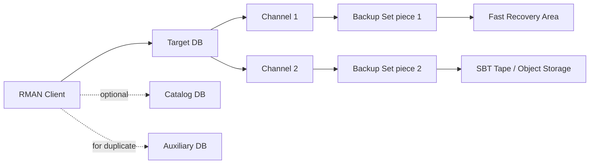

# RMAN Architecture

## Overview

RMAN is a client-server utility. The **RMAN client** connects to a **target database** and optionally to a **recovery catalog** and/or **auxiliary database**. It orchestrates **channels** (backup workers), reads or writes **backup sets**, and records everything in the control file (or catalog).

## Architecture



## Components

### Target Database

The database being backed up. RMAN opens a SYSBACKUP (or SYSDBA) session on the target.

### Recovery Catalog (optional but recommended)

A separate database + schema (`RMAN` user by convention) that stores backup metadata for one or more targets. Advantages:

- Retention of backup metadata beyond `CONTROL_FILE_RECORD_KEEP_TIME`.
- Cross-database views (which targets are backed up when).
- Stored scripts (`CREATE SCRIPT ...`).

Without a catalog, RMAN uses the target's **control file** as the metadata store — bounded by `CONTROL_FILE_RECORD_KEEP_TIME`.

### Auxiliary Database

Used only for `DUPLICATE` operations. A shell instance (started NOMOUNT) that RMAN populates from backups.

### Channels

Worker threads that read/write backup pieces:

- **Disk channels** — write to disk (FRA, filesystem, ASM).
- **SBT channels** — write via SBT tape API (NetBackup, TSM, Data Domain, cloud object storage).

Parallelism is per-channel: 4 channels = 4 parallel streams.

### Backup Sets and Backup Pieces

- **Backup set** — logical unit; a collection of one or more datafiles' blocks.
- **Backup piece** — physical file within a backup set. Multiple pieces per set if `MAX PIECE SIZE` set (helps SBT).

### Image Copies

Alternative to backup sets: bit-for-bit copies of individual datafiles (`BACKUP AS COPY`). Larger, but restore is instant (`SWITCH DATAFILE` uses the copy in place).

## Persistent Configuration

Configured once and stored in control file / catalog:

```sql
RMAN> CONFIGURE RETENTION POLICY TO RECOVERY WINDOW OF 7 DAYS;
RMAN> CONFIGURE DEVICE TYPE DISK PARALLELISM 4 BACKUP TYPE TO BACKUPSET;
RMAN> CONFIGURE CHANNEL DEVICE TYPE DISK FORMAT '+RECO/%d/backupset/%U';
RMAN> CONFIGURE CONTROLFILE AUTOBACKUP ON;
RMAN> CONFIGURE BACKUP OPTIMIZATION ON;
RMAN> CONFIGURE COMPRESSION ALGORITHM 'MEDIUM';
RMAN> CONFIGURE ENCRYPTION FOR DATABASE ON;
RMAN> CONFIGURE ENCRYPTION ALGORITHM 'AES256';
RMAN> CONFIGURE ARCHIVELOG DELETION POLICY TO APPLIED ON ALL STANDBY BACKED UP 1 TIMES TO DISK;
```

Review current:

```
RMAN> SHOW ALL;
```

## Connecting

```bash
# Target only (control file as catalog)
rman target /

# Target + catalog
rman target / catalog rman_user/pwd@catalog_db

# Target + auxiliary (for duplicate)
rman target sys/pwd@prod auxiliary sys/pwd@aux nomount
```

## Sample Backup Session

```
RMAN> CONNECT TARGET /

RMAN> BACKUP DATABASE PLUS ARCHIVELOG DELETE INPUT;

Starting backup at 06-AUG-26
using channel ORA_DISK_1
using channel ORA_DISK_2
...
channel ORA_DISK_1: starting incremental level 0 datafile backup set
input datafile file number=00001 name=+DATA/PROD/DATAFILE/system.257.1140000001
...
Finished backup at 06-AUG-26
```

## Diagnostic Queries

```sql
-- Recent backups
SELECT session_key, input_type, status,
       start_time, end_time,
       ROUND(elapsed_seconds/60, 1) AS minutes,
       ROUND(output_bytes/1024/1024/1024, 2) AS output_gb
FROM   v$rman_backup_job_details
WHERE  start_time > SYSDATE - 30
ORDER  BY start_time DESC;

-- Backup piece detail
SELECT file#, incremental_level, start_time, end_time,
       ROUND(blocks*block_size/1024/1024, 1) AS mb
FROM   v$backup_datafile
WHERE  start_time > SYSDATE - 7
ORDER  BY start_time DESC
FETCH FIRST 20 ROWS ONLY;

-- Archive log backups
SELECT thread#, sequence#, first_time, backup_count
FROM   v$archived_log
WHERE  first_time > SYSDATE - 2
ORDER  BY first_time DESC;

-- FRA usage
SELECT file_type, percent_space_used, percent_space_reclaimable
FROM   v$recovery_area_usage;
```

## Common RMAN Commands

```
LIST BACKUP [SUMMARY | OF DATABASE | OF ARCHIVELOG ALL];
LIST INCARNATION;

REPORT NEED BACKUP;
REPORT OBSOLETE;
REPORT SCHEMA;

CROSSCHECK BACKUP;         -- verify existence
CROSSCHECK ARCHIVELOG ALL;

DELETE OBSOLETE;
DELETE EXPIRED BACKUP;
DELETE NOPROMPT ARCHIVELOG ALL COMPLETED BEFORE 'SYSDATE-7';

VALIDATE BACKUPSET n;
VALIDATE DATABASE;
RESTORE DATABASE VALIDATE;  -- dry-run restore
```

## Best Practices

1. **CONFIGURE CONTROLFILE AUTOBACKUP ON** — always.
2. Use a **recovery catalog** for production.
3. Set retention policy explicitly (`RECOVERY WINDOW OF N DAYS`).
4. **CROSSCHECK + DELETE EXPIRED** weekly.
5. Parallelism = min(CPUs, storage channels, 4–8 sensible default).
6. **Block Change Tracking** — see [Backup Strategy](backup-strategy.md).
7. Ship RMAN backups off-site (tape or cloud object storage).
8. **Test restore quarterly.**
9. Encrypt backups (Advanced Security).
10. Monitor `V$RMAN_BACKUP_JOB_DETAILS.STATUS` and alert on failures.

## Interview Questions

1. **Q:** What is RMAN?
   **A:** Oracle's backup and recovery utility — supports online backup, incremental, block-level recovery, and duplicate.

2. **Q:** Catalog vs no catalog?
   **A:** Catalog holds backup metadata across databases and beyond `CONTROL_FILE_RECORD_KEEP_TIME`. Recommended for production.

3. **Q:** Backup set vs backup piece?
   **A:** Set = logical group of blocks; piece = physical file within a set.

4. **Q:** Autobackup?
   **A:** Control file (and SPFILE) auto-backed up after every structural change or backup command.

5. **Q:** Channels?
   **A:** Worker threads reading/writing backup pieces; each channel is a parallel stream.

6. **Q:** Where do backups go by default?
   **A:** Fast Recovery Area (`db_recovery_file_dest`).

## References

- Oracle Database Backup and Recovery User's Guide 19c
- MOS Doc ID 388422.1 — RMAN Overview
- MOS Doc ID 1268927.1 — RMAN Best Practices
