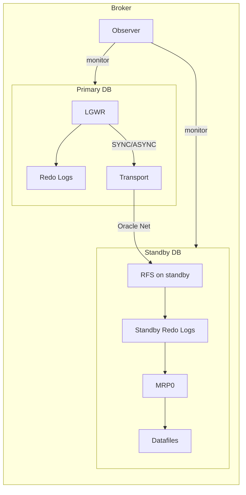

# Data Guard Architecture

## Overview

Data Guard is a **primary database** shipping **redo** to one or more **standby databases**. Each standby applies the redo to stay in sync. On failure of the primary, a standby takes over (failover). On planned maintenance, roles reverse (switchover).

## Roles

- **Primary** — read-write; source of truth.
- **Physical Standby** — block-for-block copy; redo applied by Managed Recovery Process (MRP0).
- **Logical Standby** — schema copy; SQL statements applied by LSP0. Deprecated in favor of GoldenGate for logical replication.
- **Snapshot Standby** — physical standby temporarily open R/W (converted for testing); reverts to standby via flashback.

## Architecture



## Redo Flow

1. Foreground on primary commits.
2. LGWR flushes redo to primary online redo log.
3. Redo is shipped over Net to standby's **RFS** (Remote File Server) process.
4. RFS writes to a **Standby Redo Log (SRL)** — a mirror of primary's redo log group structure.
5. MRP0 (Managed Recovery Process) reads SRLs and applies redo to standby datafiles.

## Transport Modes

| Mode                         | Wait for standby ack?         | Zero data loss?              |
| ---------------------------- | ----------------------------- | ---------------------------- |
| **SYNC (AFFIRM)**            | Yes, after standby disk flush | Yes                          |
| **FASTSYNC (SYNC/NOAFFIRM)** | Yes, on standby receipt only  | Almost — 1-in-a-billion race |
| **ASYNC (LGWR ASYNC)**       | No — primary continues        | No — small window of loss    |

See [Redo Transport](redo-transport.md).

## Protection Modes

| Mode                     | Description                                                              | Transport                 |
| ------------------------ | ------------------------------------------------------------------------ | ------------------------- |
| **Maximum Protection**   | Zero data loss guaranteed; primary halts if standby unreachable          | SYNC (AFFIRM)             |
| **Maximum Availability** | Zero data loss when standby available; primary continues if standby down | SYNC (AFFIRM) or FASTSYNC |
| **Maximum Performance**  | Best effort; possible loss                                               | ASYNC                     |

## Data Guard Broker

Optional but strongly recommended: a management framework that adds:

- **`dgmgrl`** command-line utility.
- Configuration file (`dr1<db>.dat` / `dr2<db>.dat`) with topology metadata.
- Simplified switchover / failover commands.
- Automated **Observer** for FSFO.
- Automatic redo transport setup.

Without the broker, you configure Data Guard manually via `LOG_ARCHIVE_DEST_n` and MRP0 startup — supported but tedious.

## Observer

The **Observer** is a lightweight process (started by `dgmgrl`) that monitors primary and standby. For **Fast-Start Failover**, the Observer initiates automatic failover when the primary is unreachable beyond a threshold.

Must run on a **third host** — never on primary or standby.

## Prerequisites

- Primary and standby on **compatible Oracle Home** (same version + PSU).
- Primary in **ARCHIVELOG mode**.
- **FORCE LOGGING** enabled: `ALTER DATABASE FORCE LOGGING;`.
- **Standby Redo Logs** created on both sides (for switchover-ability).
- Network path — separate DG network preferred.
- `DB_UNIQUE_NAME` differs between primary and standby.
- Both accessible via TNS.

## Creating a Physical Standby

Most common approach: RMAN active duplicate:

```rman
$ rman target sys/pwd@prod auxiliary sys/pwd@aux

RUN {
  DUPLICATE TARGET DATABASE FOR STANDBY
    FROM ACTIVE DATABASE
    DORECOVER
    SPFILE
      SET DB_UNIQUE_NAME='prod_dr'
      SET LOG_ARCHIVE_CONFIG='DG_CONFIG=(prod,prod_dr)'
      SET LOG_ARCHIVE_DEST_2='SERVICE=prod ASYNC VALID_FOR=(ONLINE_LOGFILE,PRIMARY_ROLE) DB_UNIQUE_NAME=prod'
      SET FAL_SERVER='prod'
      SET FAL_CLIENT='prod_dr'
      SET STANDBY_FILE_MANAGEMENT='AUTO'
    NOFILENAMECHECK;
}
```

Post-duplicate:

```sql
-- On standby
ALTER DATABASE MOUNT STANDBY DATABASE;
ALTER DATABASE RECOVER MANAGED STANDBY DATABASE USING CURRENT LOGFILE DISCONNECT;
```

## Diagnostic Queries

```sql
-- On primary
SELECT dest_id, dest_name, status, target, error, gap_status
FROM   v$archive_dest
WHERE  status <> 'INACTIVE';

-- Gap check
SELECT * FROM v$archive_gap;

-- Data Guard stats
SELECT name, value, unit FROM v$dataguard_stats;

-- On standby: apply state
SELECT process, status, sequence#, block#, delay_mins
FROM   v$managed_standby;
```

## Best Practices

1. **Use Data Guard Broker.** Simpler management, better observability.
2. `DB_UNIQUE_NAME` **must differ** between primary and standby.
3. FORCE LOGGING on primary — prevent NOLOGGING invalidation.
4. Standby Redo Logs: **one more group than primary** and matching size.
5. Separate DG traffic on its own network segment.
6. Match Oracle version + PSU exactly.
7. FSFO with Observer on **independent site** (not primary or standby).
8. Monitor DG lag — alert if > 60 seconds.
9. Test switchover annually.
10. Test failover in a lower environment quarterly.

## Interview Questions

1. **Q:** What is Data Guard?
   **A:** Oracle's DR framework: standby databases receiving and applying redo from a primary.

2. **Q:** Physical vs logical standby?
   **A:** Physical: block-for-block copy applied by MRP0. Logical: schema copy applied via SQL by LSP0 — allows different schema/version but has many restrictions.

3. **Q:** Protection modes?
   **A:** Maximum Protection, Maximum Availability, Maximum Performance.

4. **Q:** Broker?
   **A:** Optional management framework; enables `dgmgrl`, FSFO, Observer.

5. **Q:** How is standby created?
   **A:** `RMAN DUPLICATE ... FOR STANDBY FROM ACTIVE DATABASE`.

6. **Q:** Where should Observer run?
   **A:** Independent third host — never primary or standby.

## References

- Oracle Data Guard Concepts and Administration 19c
- Oracle Data Guard Broker 19c
- MOS Doc ID 1265700.1 — Data Guard Best Practices
- MOS Doc ID 1919850.1 — Data Guard 19c New Features
