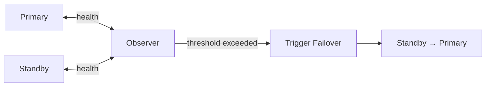

# FSFO — Fast-Start Failover

## Overview

**Fast-Start Failover** automates failover: when the **Observer** confirms the primary is unreachable beyond a configured threshold, it triggers failover to a designated **target standby** automatically. Combined with **Application Continuity**, applications can survive database failure with sub-minute impact.

Requires the **broker** and a designated **Observer** running on an **independent third host**.

## Architecture



## Configuration

### 1. Enable Flashback on both

```sql
ALTER DATABASE FLASHBACK ON;
```

Essential for reinstate.

### 2. Configure protection mode

```
DGMGRL> EDIT CONFIGURATION SET PROTECTION MODE AS MAXAVAILABILITY;
```

FSFO requires Max Availability or Max Protection (both use SYNC/FASTSYNC).

### 3. Configure Standby's LogXptMode

```
DGMGRL> EDIT DATABASE 'prod_dr' SET PROPERTY 'LogXptMode' = 'SYNC';
```

### 4. Set FSFO parameters

```
DGMGRL> EDIT CONFIGURATION SET PROPERTY 'FastStartFailoverThreshold' = 30;
DGMGRL> EDIT CONFIGURATION SET PROPERTY 'FastStartFailoverPmyShutdown' = TRUE;
```

- `FastStartFailoverThreshold` — seconds Observer waits before failover.
- `FastStartFailoverPmyShutdown` — if TRUE, primary self-terminates if it loses connection to standby+observer.

### 5. Enable

```
DGMGRL> ENABLE FAST_START FAILOVER;
```

### 6. Start Observer on independent host

```
$ dgmgrl sys/pwd@prod
DGMGRL> START OBSERVER;
```

Run in a persistent screen / systemd service. Observer logs to `$ORACLE_BASE/admin/observer.log`.

## Fast-Start Failover Conditions

Failover initiated if:

- Primary unreachable > `FastStartFailoverThreshold` seconds.
- Primary explicitly signals failure (e.g., `INSTANCE HANG`).
- User-configured failover condition (`ORA-#####` in `HealthCheck`).

Not initiated if:

- Standby has apply lag > `FastStartFailoverLagLimit`.
- Standby role broken.
- Observer loses standby but retains primary (split scenario).

## Reinstate After FSFO

Once old primary reappears, Observer's `REINSTATE DATABASE 'prod'` is automatic if `FastStartFailoverAutoReinstate` is TRUE. Otherwise manual:

```
DGMGRL> REINSTATE DATABASE 'prod';
```

Requires Flashback Database on old primary.

## Multiple Standbys

Broker supports multiple standbys. Designate one as FSFO target:

```
DGMGRL> EDIT CONFIGURATION SET PROPERTY 'FastStartFailoverTarget' = 'prod_dr';
```

## Observer Placement

- **Third host** — not primary, not standby.
- Ideally in a **third data center** (not the primary or standby DC).
- Reliable network to both DBs.
- Multiple Observers (12c+): "shadow" observers for HA of the Observer itself.

```
DGMGRL> START OBSERVER FILE=/etc/observer/prod_observer.dat;
```

## Diagnostic Queries

```sql
-- On primary — FSFO state
SELECT fs_failover_status, fs_failover_current_target,
       fs_failover_threshold, fs_failover_observer_present
FROM   v$database;

-- Broker
DGMGRL> SHOW CONFIGURATION VERBOSE;
DGMGRL> SHOW FAST_START FAILOVER;
```

## Common Issues

- **Observer disconnected** — Alerts. Restart Observer.
- **Failover not happening on primary crash** — Threshold not reached, or Observer split from primary.
- **`ORA-16820: fast-start failover observer is no longer observing this database`** — Observer down. Restart.
- **Reinstate hangs** — Flashback logs insufficient. Fall back to RMAN duplicate.

## Best Practices

1. **Observer on independent third host** in a third data center if possible.
2. **Multiple Observers** for HA.
3. **`FastStartFailoverThreshold = 30`** typical (adjust per SLA).
4. **`FastStartFailoverPmyShutdown = TRUE`** — prevents split-brain.
5. **Flashback enabled** on all databases in configuration.
6. Test failover quarterly.
7. Alert on `V$DATABASE.FS_FAILOVER_OBSERVER_PRESENT = 'NO'`.
8. Combine with **Application Continuity** for seamless client failover.
9. Document observer restart procedure.
10. Monitor Observer log.

## Interview Questions

1. **Q:** What is FSFO?
   **A:** Fast-Start Failover — Observer automatically triggers failover when primary unreachable beyond a threshold.

2. **Q:** Where does Observer run?
   **A:** Independent third host, ideally third DC.

3. **Q:** Protection mode requirement?
   **A:** Max Availability or Max Protection (SYNC transport).

4. **Q:** Reinstate?
   **A:** After FSFO, `REINSTATE DATABASE` (automatic or manual) brings old primary back as new standby. Requires Flashback Database.

5. **Q:** Multiple observers?
   **A:** Yes (12c+) — HA for the Observer itself.

6. **Q:** How to prevent split-brain?
   **A:** `FastStartFailoverPmyShutdown = TRUE` — primary self-terminates if it loses standby and observer.

## References

- Oracle Data Guard Broker 19c — Fast-Start Failover
- MOS Doc ID 1587855.1 — FSFO Best Practices
- MOS Doc ID 1265700.1 — DG Best Practices
