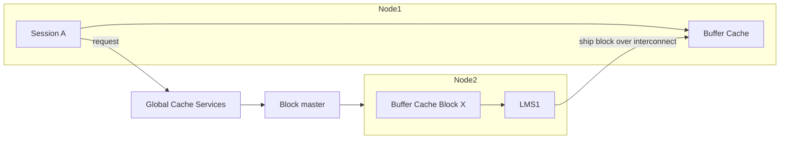

# Cache Fusion

## Overview

**Cache Fusion** is RAC's mechanism for sharing data blocks across instances without going through disk. When Instance A needs a block currently in Instance B's buffer cache, B ships the block to A over the private interconnect — often in a few hundred microseconds — rather than forcing A to read from disk.

Cache Fusion depends on two subsystems: **Global Cache Services (GCS)** for block coordination and **Global Enqueue Services (GES)** for enqueue coordination. Both are managed by the **LMSn** processes.

## Architecture



## Block Modes

Every block in every buffer cache has a **role** and **mode**:

- **Local** — this instance owns; block currently here.
- **Global** — coordinated across instances.

Modes:

- **N (Null)** — no interest.
- **S (Shared)** — read; multiple instances may hold.
- **X (Exclusive)** — write; only one instance may hold.

Transitions coordinated by GCS.

## Block Transfers

- **2-way** — Instance A requests, master is on B (which also holds the block); B ships to A directly.
- **3-way** — Instance A requests, master is on B, block is on C; B directs C to ship to A.

Wait events:

- `gc cr block 2-way` / `3-way`
- `gc current block 2-way` / `3-way`
- `gc buffer busy acquire`
- `gc buffer busy release`

## Consistent Read via Cache Fusion

A session on A needing a **consistent read** version of a block currently modified on B:

1. A asks GCS.
2. GCS routes request to B's LMS.
3. B constructs a CR version using undo (as if a local reader) and ships it to A.

Much faster than A reading the block from disk and reconstructing itself.

## LMSn Processes

**LMS (Lock Manager Server)** processes ship blocks between instances. Count: `gcs_server_processes` (default computed from CPU count). More is not always better; monitor `gc` waits.

Related:

- **LMD** — Lock Manager Daemon; handles enqueue requests.
- **LMON** — Global Enqueue Service Monitor; recovers dead instances.
- **LCK0** — Instance enqueue process.
- **LCK1..N** — Additional enqueue processes.

## Diagnostic Queries

```sql
-- Top GC wait events
SELECT event, total_waits,
       ROUND(time_waited_micro/1e6, 1) AS total_sec,
       ROUND(time_waited_micro/DECODE(total_waits,0,1,total_waits)/1000, 2) AS avg_ms
FROM   v$system_event
WHERE  event LIKE 'gc %'
ORDER  BY total_sec DESC;

-- Cross-instance block transfers
SELECT name, value FROM v$sysstat
WHERE  name LIKE 'gc%';

-- LMS activity
SELECT name, description, paddr FROM v$bgprocess
WHERE  name LIKE 'LMS%' AND paddr <> '00';

-- Blocks bounced between instances (hot blocks)
SELECT owner, object_name, statistic_name, value
FROM   v$segment_statistics
WHERE  statistic_name IN ('gc buffer busy','gc cr blocks received',
                          'gc current blocks received')
   AND value > 0
ORDER  BY value DESC
FETCH FIRST 20 ROWS ONLY;
```

## Common Issues

- **`gc cr block busy` avg > 5 ms** — Interconnect latency or overloaded LMS.
- **`gc buffer busy acquire`** — Hot block bouncing between instances.
- **Cross-node hot rows** — Sequence with `ORDER` clause makes every instance hit right-most leaf.
- **Interconnect saturation** — check `oifcfg iflist -p -n`; consider bonded 10G/25G/100G.

## Best Practices

1. **Fast, redundant interconnect** — bonded 10G+ NICs, dedicated switches.
2. **Sequence CACHE 10000+ NOORDER** — avoids cross-node coordination.
3. **Service-based partitioning** — direct related sessions to same instance.
4. **Hash-partitioned tables** on high-DML segments — spreads blocks.
5. Monitor `gc` events in AWR — should be < 5% of DB Time.
6. Use `parallel_force_local=TRUE` unless you need multi-node PX.
7. Investigate hot segments via `V$SEGMENT_STATISTICS`.
8. Right-size `gcs_server_processes` — measure LMS utilization.
9. Use RAT (Real Application Testing) to model interconnect impact.

## Interview Questions

1. **Q:** What is Cache Fusion?
   **A:** RAC's mechanism to ship blocks between instances via interconnect instead of disk.

2. **Q:** GCS vs GES?
   **A:** GCS coordinates blocks. GES coordinates enqueues (locks).

3. **Q:** LMS?
   **A:** Lock Manager Server — process shipping blocks between instances.

4. **Q:** `gc buffer busy acquire` — cause?
   **A:** Hot block bouncing between instances or interconnect latency.

5. **Q:** 2-way vs 3-way transfer?
   **A:** 2-way: master and holder are same node. 3-way: master, holder, and requester are all different nodes.

6. **Q:** Reduce interconnect load?
   **A:** Service-based partitioning, sequence caches, hash partitioning, `parallel_force_local`.

## References

- Oracle Real Application Clusters Administration 19c — Cache Fusion
- MOS Doc ID 730079.1 — Cache Fusion Basics
- MOS Doc ID 811293.1 — Interconnect Best Practices
