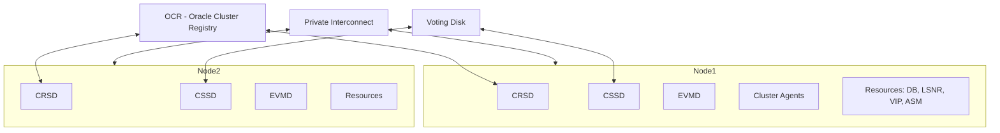

# Oracle Clusterware

## Overview

**Oracle Clusterware** (part of Grid Infrastructure) is the cluster manager underpinning RAC. It maintains cluster membership, coordinates resources (VIPs, listeners, databases, ASM, services), and initiates recovery actions (node eviction, resource restart). Every RAC installation includes Clusterware — you cannot run RAC without it.

Grid Infrastructure = Clusterware + ASM + necessary utilities. Installed from a separate ZIP into `$GRID_HOME` (owned by `grid` user by convention).

## Architecture



## Daemons

| Daemon            | Role                                                             |
| ----------------- | ---------------------------------------------------------------- |
| **`ohasd`**       | Oracle High Availability Services Daemon — bootstraps everything |
| **`cssd`**        | Cluster Synchronization Services — membership, heartbeat         |
| **`crsd`**        | Cluster Ready Services — resource management                     |
| **`evmd`**        | Event Management Daemon — publishes events                       |
| **`ora.gpnpd`**   | Grid Plug and Play daemon                                        |
| **`ora.gipcd`**   | Grid Inter-Process Communication daemon                          |
| **`ora.diskmon`** | Disk monitor                                                     |
| **`ora.crf.*`**   | Cluster Health Monitor                                           |
| **`ora.mdnsd`**   | mDNS daemon for GNS                                              |

Verify:

```bash
crsctl stat res -t
crsctl check crs
ps -ef | grep -E 'ohasd|crsd|cssd|evmd'
```

## Resources

Every managed entity is a **resource** with attributes (name, type, state, node placement, restart policy). Examples: `ora.orcl.db`, `ora.LISTENER_SCAN1.lsnr`, `ora.<node>.vip`, `ora.DATA.dg`.

```bash
crsctl stat res -t
crsctl stat res ora.orcl.db -v
```

## SRVCTL — Application-Level Management

`srvctl` is the friendlier front-end for common RAC operations:

```bash
srvctl status database -db orcl
srvctl start database -db orcl
srvctl stop database -db orcl -stopoption immediate
srvctl config database -db orcl

srvctl add service -db orcl -service oltp -preferred orcl1 -available orcl2
srvctl start service -db orcl -service oltp
```

Use `srvctl` for databases and services; `crsctl` for cluster-level operations.

## OCR + Voting Disk

- **OCR (Oracle Cluster Registry)** — persistent metadata about resources.
- **Voting Disk** — cluster membership consensus.

Both stored in shared storage (usually ASM). See [OCR](ocr.md) and [Voting Disk](voting-disk.md).

## GI Startup Sequence

1. OS starts `ohasd` (via systemd / init).
2. `ohasd` starts sub-tier: gpnpd, gipcd, mdnsd, diskmon, cssd.
3. CSSD joins cluster (uses voting disk).
4. CRSD starts, reads OCR, begins managing resources.
5. Resources come up per configuration: ASM instance, listeners, VIPs, RAC databases.

Full cluster start:

```bash
sudo crsctl start crs         # this node
sudo crsctl start cluster -all  # all nodes
```

## Diagnostic Queries

```bash
# Cluster health
crsctl check crs
crsctl check cluster -all
crsctl stat res -t

# CSS state
crsctl get css misscount
crsctl get css disktimeout
crsctl get css reboottime

# Nodes in cluster
olsnodes -s -n

# Cluster interconnect
oifcfg getif

# Config
srvctl config nodeapps -a
```

Logs:

```
$ORACLE_BASE/diag/crs/<host>/crs/alert.log        # CRS alert log
$ORACLE_BASE/diag/crs/<host>/crs/trace/           # per-component
$ORACLE_BASE/diag/asm/+asm/+ASMn/alert/log.xml
```

Modern versions consolidate under ADR.

## Common Issues

- **`CRS-0184: Cannot communicate with the CRS daemon`** — CRSD down. Check its log.
- **`ORA-15064: communication failure with ASM instance`** — ASM instance down or not started.
- **Node not joining cluster** — network / voting disk / OCR issue.
- **Slow start** — CSSD waiting for interconnect discovery.

## Best Practices

1. **Separate `grid` and `oracle` users** — GI owned by grid, DB owned by oracle.
2. Grid Infrastructure Home is **read-only** in 19c (`roohctl -enable`).
3. Redundant **interconnects**.
4. Redundant **voting disks and OCR** in HIGH-redundancy ASM.
5. Time sync (chrony/NTP) across nodes.
6. Use `srvctl` for DB and services; `crsctl` for cluster.
7. Monitor CRS alert log — issues surface here first.
8. Automate cluster health checks in monitoring.
9. Test node fencing / recovery in a lower environment.
10. Never `kill -9` CRSD or CSSD.

## Interview Questions

1. **Q:** What is Grid Infrastructure?
   **A:** Clusterware + ASM + utilities. Underpins RAC.

2. **Q:** Main daemons?
   **A:** ohasd (bootstrap), cssd (membership), crsd (resources), evmd (events).

3. **Q:** OCR vs Voting Disk?
   **A:** OCR: resource metadata. Voting Disk: cluster membership consensus.

4. **Q:** `srvctl` vs `crsctl`?
   **A:** srvctl for DBs/services; crsctl for cluster-level.

5. **Q:** How to check cluster health?
   **A:** `crsctl check cluster -all`, `crsctl stat res -t`.

## References

- Oracle Grid Infrastructure Installation and Upgrade Guide 19c
- Oracle Real Application Clusters Administration 19c
- MOS Doc ID 265769.1 — Grid Infrastructure Overview
- MOS Doc ID 1050908.1 — Clusterware Troubleshooting
