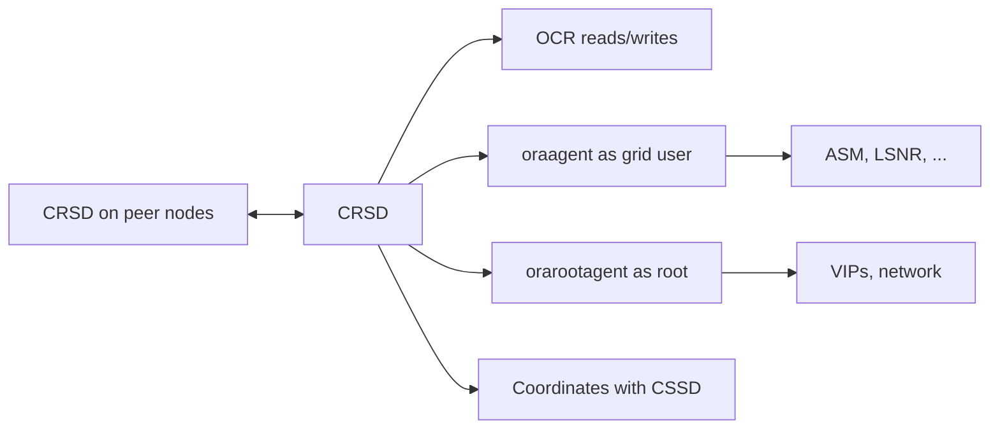

# CRSD — Cluster Ready Services Daemon

## Overview

**CRSD (Cluster Ready Services Daemon)** manages all cluster resources: databases, ASM instances, listeners, VIPs, services, ACFS mounts, and application resources. Every start/stop/failover of a managed resource goes through CRSD.

CRSD reads the **OCR (Oracle Cluster Registry)** for resource definitions, coordinates with peer CRSDs on other nodes, and spawns **agents** to perform actual resource actions.

Runs as **root** on each node (with grid-owned sub-processes for actual ORACLE_HOME operations).

## Architecture



## Agents

CRSD spawns specialized agents to handle resources of similar type:

- **`oraagent.bin`** — runs as grid user; manages ASM instances, listeners, RAC DB instances (via srvctl), services.
- **`orarootagent.bin`** — runs as root; manages VIPs, network resources.
- **`scriptagent`** — for user-defined script resources.
- **`appagent`** — for application resources.

## Common CRSD Operations

```bash
# Resource state on this node
crsctl stat res -t

# On all nodes
crsctl stat res -t -init

# Specific resource detail
crsctl stat res ora.orcl.db -v

# Manual state change (rare; use srvctl for DBs)
crsctl start resource ora.LISTENER_SCAN1.lsnr
crsctl stop resource ora.LISTENER_SCAN1.lsnr
```

## Managed Resource Types

| Resource Type  | Example                                        | Managed via           |
| -------------- | ---------------------------------------------- | --------------------- |
| Database       | `ora.orcl.db`                                  | `srvctl`              |
| Instance       | `ora.orcl.i` (11g)                             | (deprecated)          |
| Service        | `ora.orcl.oltp.svc`                            | `srvctl service`      |
| Listener       | `ora.LISTENER.lsnr`, `ora.LISTENER_SCAN1.lsnr` | `srvctl listener`     |
| VIP            | `ora.<node>.vip`, `ora.scan1.vip`              | `srvctl`              |
| ASM            | `ora.asm`                                      | `srvctl asm`          |
| ASM disk group | `ora.DATA.dg`                                  | `srvctl diskgroup`    |
| ACFS mount     | `ora.<name>.acfs`                              | `srvctl`              |
| Application    | user-defined                                   | `crsctl add resource` |

## CRSD Failures

If CRSD dies:

- Alert log records termination.
- `ohasd` may restart it — check logs.
- If persistent, examine `$ORACLE_BASE/diag/crs/<host>/crs/trace/crsd.trc`.

CSSD is **not** dependent on CRSD — cluster membership persists even if CRSD dies. But **resource management stops** — new starts / stops / failovers won't happen until CRSD recovers.

## Diagnostic Queries

```bash
# CRSD state
crsctl check crs
crsctl stat res -t | head

# CRSD process
ps -ef | grep crsd.bin

# CRSD trace
tail -f $ORACLE_BASE/diag/crs/$(hostname -s)/crs/trace/crsd.trc

# CRSD alert log
tail -f $ORACLE_BASE/diag/crs/$(hostname -s)/crs/alert.log

# Recent restart events
grep -i restart $ORACLE_BASE/diag/crs/$(hostname -s)/crs/alert.log | tail
```

## Common Issues

- **`CRS-0184: Cannot communicate with the CRS daemon`** — CRSD down. Restart CRS or investigate crash cause.
- **Resource fails to start** — check dependencies (`crsctl stat res <name> -v` for STARTUP_REQUIRED).
- **CRSD looping restart** — usually OCR corruption. Restore OCR from backup.
- **Agent errors** — permissions on ORACLE_HOME, wrong owner.

## Best Practices

1. **Never kill CRSD manually.**
2. Monitor CRSD process presence.
3. Alert on CRSD restarts.
4. Use `srvctl` for DBs; direct CRSCTL for cluster resources only.
5. Backup OCR regularly (`ocrconfig -manualbackup`).
6. Keep GI patched (RUs for GI).
7. Understand agent identity — mismatch causes silent failures.
8. Ensure `grid` user is properly configured (permissions, .bash_profile).
9. Alert log is authoritative.

## Interview Questions

1. **Q:** What does CRSD do?
   **A:** Manages cluster resources (DBs, listeners, VIPs, services) — starts, stops, monitors, fails over.

2. **Q:** Where is CRSD metadata?
   **A:** OCR (Oracle Cluster Registry).

3. **Q:** Agents?
   **A:** oraagent (grid tasks), orarootagent (root/network), scriptagent, appagent.

4. **Q:** srvctl vs crsctl?
   **A:** srvctl for DB and services (friendly wrapper). crsctl for cluster-level operations.

5. **Q:** CRSD dies — what happens?
   **A:** Cluster membership persists (CSSD). New resource actions blocked until CRSD recovers.

## References

- Oracle Grid Infrastructure Administration 19c
- MOS Doc ID 265769.1 — GI Overview
- MOS Doc ID 942166.1 — CRSD Troubleshooting
