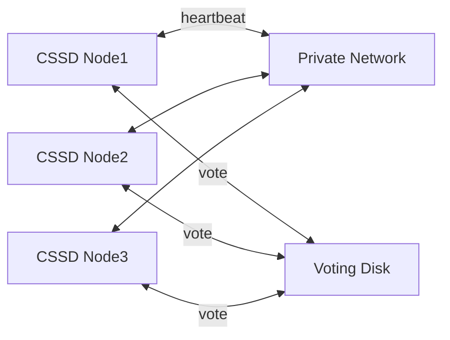

# CSSD — Cluster Synchronization Services Daemon

## Overview

**CSSD (Cluster Synchronization Services Daemon)** is the cluster's membership and heartbeat manager. It determines which nodes are members of the cluster, detects node failures, and — critically — **evicts** unhealthy nodes to prevent split-brain corruption. If CSSD decides a node should leave the cluster, that node's OS reboots (or CSSD is forcibly terminated).

CSSD is the most safety-critical Grid Infrastructure daemon. It coordinates via two mechanisms: the **private interconnect** and the **voting disk**.

## Architecture



## Heartbeats

Two independent heartbeats:

- **Network heartbeat** — CSSD sends heartbeat messages over the private interconnect to every other node. Interval configurable (default 1 second).
- **Disk heartbeat** — CSSD writes to the voting disk with a timestamp; other CSSDs read.

Both must fail for a node to be presumed dead.

## Miscount, Disktimeout, Reboottime

Key timeouts:

- **`misscount`** — Seconds CSSD tolerates missed network heartbeats (default 30).
- **`disktimeout`** — Seconds CSSD tolerates missed disk heartbeats (default 200).
- **`reboottime`** — Seconds after which the offending node reboots itself (default 3).

Query / set:

```bash
crsctl get css misscount
crsctl get css disktimeout
crsctl get css reboottime

# Change (rarely; requires cluster restart)
sudo crsctl set css misscount 30
```

## Eviction

When CSSD determines a node is unhealthy (network split, disk timeout, hang), it evicts the node:

- **Preferred method (12c+)**: `IPMI` (Intelligent Platform Management Interface) power-cycle.
- **Fallback**: node reboots itself via CSSD's rebootscript.
- **Legacy**: `oclskd` (kill daemon) fires.

The rest of the cluster continues without the evicted node.

## Split-Brain Prevention

The **voting disk** is the tiebreaker. If a network partition splits the cluster, each partition writes its perceived membership to the voting disk. The larger partition wins; the smaller partition self-evicts. With even-node clusters (2, 4, ...), a third voting disk in a **quorum failure group** prevents ties.

## CSS Startup

CSSD is the first cluster-management process (after ohasd). It:

1. Reads GPnP profile for cluster identity.
2. Discovers voting disks.
3. Joins cluster (via interconnect + voting disk).
4. Begins heartbeats.

Until CSSD reports the cluster as healthy, other GI processes (CRSD) don't fully start.

## Diagnostic Queries

```bash
# CSS state
crsctl check css

# CSS votes
crsctl query css votedisk

# CSS parameters
crsctl get css misscount
crsctl get css disktimeout
crsctl get css reboottime

# CSSD process
ps -ef | grep cssd.bin
ps -ef | grep ocssd

# CSSD logs
tail -f $ORACLE_BASE/diag/crs/$(hostname -s)/crs/trace/ocssd.trc
tail -f $ORACLE_BASE/diag/crs/$(hostname -s)/crs/alert.log

# Recent evictions
grep -i evict $ORACLE_BASE/diag/crs/$(hostname -s)/crs/alert.log | tail
```

## Common Issues

- **Node evicted** — see [RAC Node Eviction runbook](../27-runbooks/rac-node-eviction.md).
- **CSSD hang** — extremely rare; investigate OS-level scheduler / IPI issues.
- **Interconnect flap** — inconsistent heartbeats → premature eviction.
- **Voting disk unavailable** — cluster hangs or evicts.

## Best Practices

1. **Redundant private interconnect** — bonded NICs, dedicated switches.
2. **Redundant voting disks** — 3 or 5 (odd) on separate storage domains.
3. Do **not** change `misscount` without Oracle Support guidance.
4. Time sync across nodes (chrony/NTP).
5. Monitor `crsctl check css` in cluster health checks.
6. Investigate every eviction — root cause is usually network or OS scheduling.
7. Keep GI patched — CSSD improvements come in RUs.
8. `oclumon` for interconnect quality monitoring.
9. Never disable IPMI without alternative fencing.

## Interview Questions

1. **Q:** What does CSSD do?
   **A:** Maintains cluster membership via network + disk heartbeats; evicts unhealthy nodes to prevent split-brain.

2. **Q:** What is `misscount`?
   **A:** Seconds of missed network heartbeat before CSSD marks a node unhealthy. Default 30.

3. **Q:** How does CSSD prevent split-brain?
   **A:** Voting disk tiebreaker; smaller partition self-evicts.

4. **Q:** Voting disk minimum?
   **A:** Odd number (1, 3, 5) in HIGH-redundancy diskgroup.

5. **Q:** Where are CSSD logs?
   **A:** `$ORACLE_BASE/diag/crs/<host>/crs/trace/ocssd.trc` and `crs/alert.log`.

6. **Q:** IPMI's role?
   **A:** Cluster fencing — CSSD power-cycles a node via IPMI when eviction is required.

## References

- Oracle Grid Infrastructure Administration 19c
- MOS Doc ID 1050908.1 — CSS Troubleshooting
- MOS Doc ID 265769.1 — GI Overview
