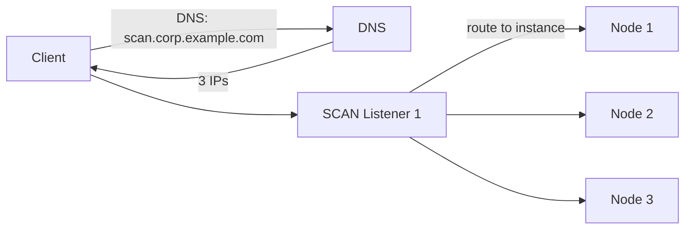

# SCAN Listener

## Overview

**SCAN (Single Client Access Name)** is a single DNS name that resolves to 3 (typically) IP addresses, each hosting a **SCAN listener**. Clients connect to `scan.corp.example.com:1521`; DNS returns 3 IPs; client picks one; that SCAN listener routes the connection to the least-loaded RAC instance offering the requested service.

SCAN decouples client connect strings from instance / node topology. Add nodes, remove nodes, patch — client connect string never changes.

## Architecture



## Setup

Typically configured at cluster install time. DNS admin creates:

```
scan.corp.example.com  IN  A  10.0.0.101
                       IN  A  10.0.0.102
                       IN  A  10.0.0.103
```

3 IPs is standard. Fewer is possible but less HA.

GI creates 3 SCAN listeners as cluster resources (`ora.scan1.vip`, `ora.LISTENER_SCAN1.lsnr`, etc.).

## Instance Registration with SCAN

Every RAC instance registers with **all SCAN listeners** via `REMOTE_LISTENER`:

```sql
ALTER SYSTEM SET remote_listener = 'scan.corp.example.com:1521' SCOPE=BOTH;
```

Each instance also registers with its node's local listener via `LOCAL_LISTENER`.

## Client Connect String

```
PROD =
  (DESCRIPTION =
    (ADDRESS = (PROTOCOL = TCP)(HOST = scan.corp.example.com)(PORT = 1521))
    (CONNECT_DATA =
      (SERVER = DEDICATED)
      (SERVICE_NAME = prod_oltp.corp.example.com)))
```

One host entry — SCAN. One service name.

## Load Balancing

SCAN performs **connect-time load balancing** based on load information registered by LREG. Instances also report load via `dbms_service` and Oracle Notification Services (ONS).

## SCAN vs Node VIP

Legacy alternative: each RAC node has a **VIP** (Virtual IP). Client connect string listed all node VIPs. If a node was down, client fell back to next in list.

SCAN adds a level of indirection — much cleaner. But node VIPs still exist for local listener addressing.

## Management

```bash
# SCAN listener status
srvctl status scan_listener
srvctl status scan

# SCAN VIPs
srvctl config scan

# Add / remove SCAN VIPs
srvctl add scan -netnum 1 -scanname scan.corp.example.com
srvctl remove scan -force

# Start / stop
srvctl start scan_listener
srvctl stop scan_listener
```

## Diagnostic Queries

```bash
# What does SCAN resolve to?
nslookup scan.corp.example.com
dig scan.corp.example.com

# Which services are registered with SCAN?
lsnrctl services LISTENER_SCAN1
lsnrctl services LISTENER_SCAN2
lsnrctl services LISTENER_SCAN3

# Instance-side
srvctl config database -db orcl
```

```sql
SHOW PARAMETER remote_listener;
SELECT name, network_name FROM v$active_services;
```

## Common Issues

- **`ORA-12545: Connect failed because target host or object does not exist`** — DNS wrong; only 1 or 0 IPs resolvable.
- **`ORA-12514: TNS: listener does not currently know of service`** — Instance not registered with SCAN; check `remote_listener`.
- **Uneven load across nodes** — Client-side DNS caching sticky; verify DNS TTL is short (60s common).
- **SCAN VIPs failover slow** — Node failure detection tunable via CSSD parameters; test.

## Best Practices

1. **3 SCAN VIPs and DNS entries** — HA.
2. Set DNS **TTL 60** or less — quick failover during outages.
3. Instances `REMOTE_LISTENER = SCAN:1521`.
4. Client connect strings use SCAN only.
5. Test load balancing — connect 100 sessions, check distribution.
6. Monitor SCAN listener logs.
7. Use `srvctl` for all SCAN management.
8. Avoid custom SCAN listener names — stick with defaults.

## Interview Questions

1. **Q:** What is SCAN?
   **A:** Single Client Access Name — DNS entry resolving to 3 IPs, each hosting a SCAN listener that routes to RAC instances.

2. **Q:** Why 3 IPs?
   **A:** High availability + connect-time load distribution.

3. **Q:** Client connect string difference from single-instance?
   **A:** Use SCAN host name instead of individual node host names.

4. **Q:** Instance registration?
   **A:** Via `REMOTE_LISTENER = 'scan:1521'`.

5. **Q:** SCAN vs Node VIP?
   **A:** SCAN is cluster-wide entry; node VIP is per-node. SCAN abstracts topology.

## References

- Oracle Real Application Clusters Administration 19c — SCAN
- MOS Doc ID 887522.1 — SCAN Overview
- MOS Doc ID 2018188.1 — SCAN Best Practices
