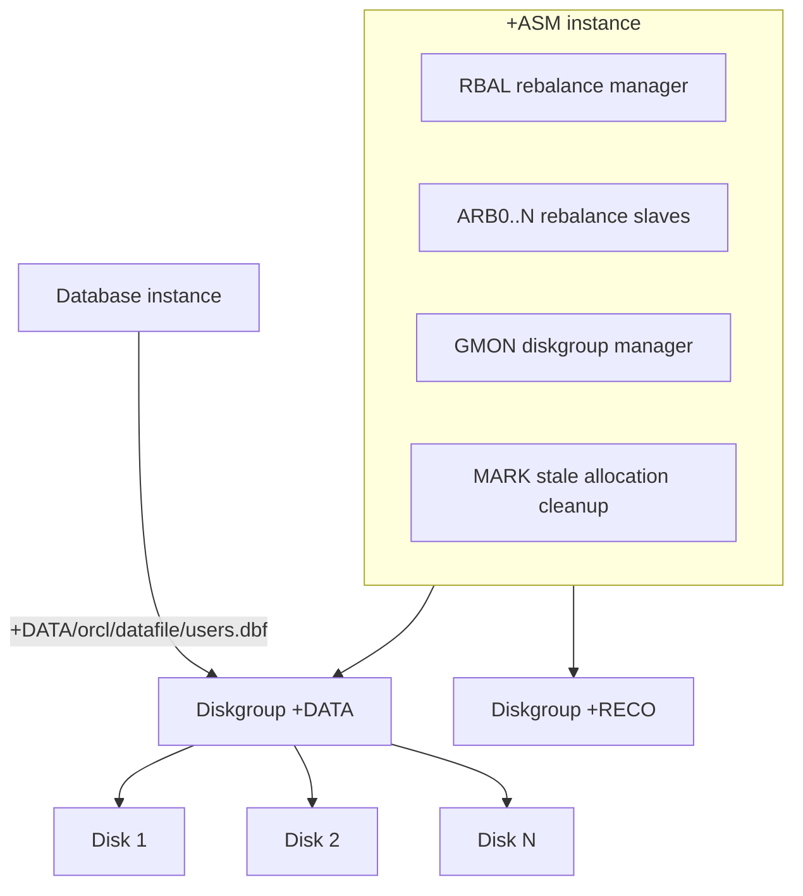

# ASM Architecture

## Overview

ASM is a **volume manager** and **filesystem** for Oracle database files. It runs as a lightweight Oracle instance (`+ASM` on single-instance; `+ASM1`, `+ASM2`, ... on RAC) that manages **diskgroups** of raw block devices. Databases use ASM by naming files with `+DISKGROUP` paths (e.g., `+DATA/orcl/datafile/users.001`).

Key benefits:

- **Automatic striping** across all disks in a diskgroup.
- **Mirror redundancy** (NORMAL / HIGH) at ASM level — no OS RAID needed.
- **Online rebalance** when disks added/removed.
- **RAC-friendly** — shared storage abstraction.
- **Snapshot / clone via ACFS** (Automatic Cluster File System) for non-DB files.

## Architecture



## Processes

Every ASM instance has:

- **RBAL** — coordinates rebalance operations.
- **ARBn** — rebalance slaves (parallelism `ASM_POWER_LIMIT`).
- **GMON** — diskgroup monitor; disk-online/offline events.
- **MARK** — marks allocation units for stale cleanup.
- **PING** — checks for peer ASM instances (RAC).
- **PZ99** — background housekeeping.
- Standard Oracle background: PMON, SMON, DBWn, LGWR, CKPT.

## Diskgroups

A **diskgroup** is a collection of disks striped and (optionally) mirrored together. Typical naming:

- **+DATA** — datafiles.
- **+RECO** — FRA (backups, archives, flashback logs).
- **+CRS** — OCR + voting disks (may be combined with DATA).
- **+REDO** — dedicated redo log storage (optional).

## Redundancy

- **EXTERNAL** — rely on storage array redundancy (RAID). No ASM mirroring.
- **NORMAL** — 2-way mirror. Two failure groups minimum.
- **HIGH** — 3-way mirror. Three failure groups minimum.
- **FLEX** (12.2+) — 2 mirrors per default; can be varied per file.
- **EXTENDED** (18c+) — for extended clusters (stretched sites).

See [Failure Groups](failure-groups.md).

## Allocation Units

An **allocation unit (AU)** is the smallest ASM allocation. Default 1 MB (4 MB on Exadata). Files are composed of multiple AUs distributed across disks. Larger AU sizes (up to 64 MB) benefit very large diskgroups.

See [Allocation Units](allocation-units.md).

## File Naming

Full ASM filename: `+DISKGROUP/DBNAME/FILETYPE/name.ora`.

Oracle-managed: `+DATA/ORCL/DATAFILE/users.257.1234567890` — Oracle assigns.

## ASMLIB / AFD

ASM needs raw block devices. Options for device identification:

- **ASMLIB** (Linux) — legacy kernel module that persistently labels devices.
- **ASM Filter Driver (AFD)** — 12.1+ replacement; kernel filter that also blocks non-Oracle writes to disks. Recommended.
- **udev rules** — set permissions on `/dev/sd*` for ASM.

See [ASM Filter Driver](asm-filter-driver.md).

## ACFS — Automatic Cluster File System

ACFS is a general-purpose cluster filesystem built on ASM. Used for non-database files that need to be shared across RAC nodes (application binaries, config, GoldenGate trails).

```bash
# Create ACFS volume
asmcmd volcreate -G DATA -s 100G myacfs

# Mount
srvctl add filesystem -device /dev/asm/myacfs-123 -path /acfs/myacfs
```

## Diagnostic Queries

```sql
-- On +ASM instance
CONNECT / AS SYSASM

-- Diskgroups
SELECT name, state, type, total_mb/1024 AS gb, free_mb/1024 AS free_gb,
       usable_file_mb/1024 AS usable_gb
FROM   v$asm_diskgroup;

-- Disks per diskgroup
SELECT dg.name AS diskgroup, d.name AS disk, d.path,
       d.state, d.mount_status, d.mode_status,
       d.total_mb/1024 AS total_gb, d.free_mb/1024 AS free_gb,
       d.failgroup
FROM   v$asm_diskgroup dg JOIN v$asm_disk d ON d.group_number = dg.group_number
ORDER  BY dg.name, d.disk_number;

-- Client databases using ASM
SELECT instance_name, db_name, status
FROM   v$asm_client;

-- Files
SELECT dg.name AS dg, f.file_number, f.type, f.bytes/1024/1024 AS mb
FROM   v$asm_file f JOIN v$asm_diskgroup dg ON dg.group_number = f.group_number
ORDER  BY f.bytes DESC
FETCH FIRST 20 ROWS ONLY;

-- Rebalance state
SELECT * FROM v$asm_operation;
```

## Common Issues

- **`ORA-15040: diskgroup is incomplete`** — Missing disks. Rebalance or restore.
- **`ORA-15041: diskgroup space exhausted`** — Add disks or drop unused files.
- **`ORA-15055: unable to connect to ASM instance`** — ASM instance down.
- **Slow rebalance** — Adjust `ASM_POWER_LIMIT`.

## Best Practices

1. **Use ASM** for all production Oracle datafiles.
2. **AFD** on Linux (12.1+) — replaces ASMLIB.
3. Standard diskgroups: **+DATA**, **+RECO** (minimum).
4. NORMAL or HIGH redundancy in ASM if storage isn't RAID.
5. **Same-size, same-vendor disks** in a diskgroup for uniform performance.
6. **`AU_SIZE=4M`** for very large diskgroups (Exadata standard).
7. Monitor `V$ASM_DISKGROUP.FREE_MB` and `USABLE_FILE_MB`.
8. **Rebalance** with `POWER 4+` for maintenance windows.
9. Never manually format ASM disks.
10. Use `asmcmd` for scripting; `srvctl` for lifecycle.

## Interview Questions

1. **Q:** What is ASM?
   **A:** Oracle's volume manager and filesystem for database files — striped, mirrored, RAC-friendly.

2. **Q:** Redundancy modes?
   **A:** EXTERNAL (none), NORMAL (2-way), HIGH (3-way), FLEX, EXTENDED.

3. **Q:** Diskgroups?
   **A:** Collection of raw disks striped/mirrored together. Named +DATA, +RECO, etc.

4. **Q:** Allocation unit?
   **A:** Smallest ASM allocation. Default 1 MB (4 MB on Exadata).

5. **Q:** AFD vs ASMLIB?
   **A:** AFD (12.1+) is the modern kernel-level filter; ASMLIB is legacy.

6. **Q:** ACFS?
   **A:** Cluster filesystem on top of ASM for non-DB files.

## References

- Oracle Automatic Storage Management Administrator's Guide 19c
- MOS Doc ID 265769.1 — GI + ASM
- MOS Doc ID 1523046.1 — ASM Best Practices
