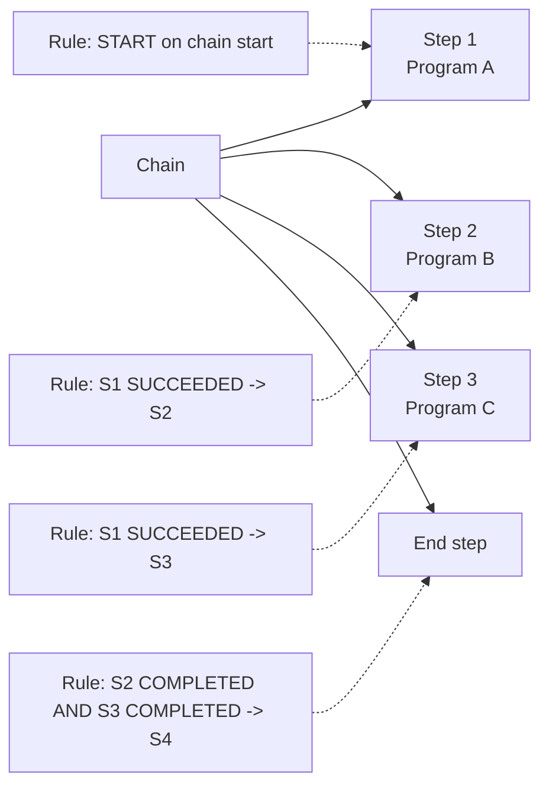

# Scheduler Chains

## Overview

A **Chain** is a directed graph of Scheduler steps with dependency rules — Oracle's built-in workflow engine for the database. Each step points at a **program** (or a nested chain); rules of the form `IF <expr> THEN action` decide when to start, skip, or terminate steps. Chains are the right abstraction for multi-stage ETL, patch orchestration, and any pipeline where you'd otherwise glue jobs together with lock tables and sentinel rows.

Chains run under a single "chain job" — you `CREATE_JOB` with `job_type=>'CHAIN'` and the chain instance becomes visible in `DBA_SCHEDULER_RUNNING_CHAINS`.

## Object Model



## Building a Chain

Four steps: create the chain, add steps, add rules, enable, start.

```sql
-- 1. Create the chain shell
BEGIN
  DBMS_SCHEDULER.CREATE_CHAIN(
    chain_name          => 'OPS.NIGHTLY_ETL_CHAIN',
    rule_set_name       => NULL,
    evaluation_interval => NULL,
    comments            => 'Extract -> Load -> Aggregate');
END;
/

-- 2. Add steps that call programs
BEGIN
  DBMS_SCHEDULER.DEFINE_CHAIN_STEP('OPS.NIGHTLY_ETL_CHAIN', 'EXTRACT',   'OPS.EXTRACT_PRG');
  DBMS_SCHEDULER.DEFINE_CHAIN_STEP('OPS.NIGHTLY_ETL_CHAIN', 'LOAD_A',    'OPS.LOAD_A_PRG');
  DBMS_SCHEDULER.DEFINE_CHAIN_STEP('OPS.NIGHTLY_ETL_CHAIN', 'LOAD_B',    'OPS.LOAD_B_PRG');
  DBMS_SCHEDULER.DEFINE_CHAIN_STEP('OPS.NIGHTLY_ETL_CHAIN', 'AGGREGATE', 'OPS.AGG_PRG');
END;
/

-- 3. Add rules (condition -> action)
BEGIN
  DBMS_SCHEDULER.DEFINE_CHAIN_RULE(
    chain_name => 'OPS.NIGHTLY_ETL_CHAIN',
    condition  => 'TRUE',
    action     => 'START EXTRACT',
    rule_name  => 'R_START');

  DBMS_SCHEDULER.DEFINE_CHAIN_RULE(
    'OPS.NIGHTLY_ETL_CHAIN',
    'EXTRACT SUCCEEDED', 'START LOAD_A, LOAD_B',
    'R_FANOUT');

  DBMS_SCHEDULER.DEFINE_CHAIN_RULE(
    'OPS.NIGHTLY_ETL_CHAIN',
    'LOAD_A SUCCEEDED AND LOAD_B SUCCEEDED', 'START AGGREGATE',
    'R_JOIN');

  DBMS_SCHEDULER.DEFINE_CHAIN_RULE(
    'OPS.NIGHTLY_ETL_CHAIN',
    'AGGREGATE COMPLETED', 'END',
    'R_END');

  DBMS_SCHEDULER.DEFINE_CHAIN_RULE(
    'OPS.NIGHTLY_ETL_CHAIN',
    'EXTRACT FAILED OR LOAD_A FAILED OR LOAD_B FAILED OR AGGREGATE FAILED',
    'END 1',
    'R_ANY_FAIL');

  DBMS_SCHEDULER.ENABLE('OPS.NIGHTLY_ETL_CHAIN');
END;
/

-- 4. Create a job that starts the chain on a schedule
BEGIN
  DBMS_SCHEDULER.CREATE_JOB(
    job_name        => 'OPS.NIGHTLY_ETL_JOB',
    job_type        => 'CHAIN',
    job_action      => 'OPS.NIGHTLY_ETL_CHAIN',
    repeat_interval => 'FREQ=DAILY; BYHOUR=1',
    enabled         => TRUE);
END;
/
```

## Rule Syntax

**Condition** — SQL expression over step states:

```
<step> SUCCEEDED | FAILED | STOPPED | COMPLETED | NOT STARTED
```

Combine with `AND`, `OR`, `NOT`. `COMPLETED` = SUCCEEDED or FAILED or STOPPED.

**Actions**:

| Action               | Meaning                                            |
| -------------------- | -------------------------------------------------- |
| `START <step>[,...]` | Run the named steps (parallel if listed together). |
| `STOP <step>`        | Cancel a running step.                             |
| `END`                | End the chain successfully.                        |
| `END <exit_code>`    | End the chain with that exit code (>0 = failure).  |
| `PAUSE <step>`       | Hold at that step until resumed.                   |

## Diagnostic Queries

```sql
-- All chains and their step counts
SELECT owner, chain_name, enabled, number_of_rules
FROM   dba_scheduler_chains;

-- Steps in a chain
SELECT step_name, program_name, skip, pause
FROM   dba_scheduler_chain_steps
WHERE  chain_name = 'NIGHTLY_ETL_CHAIN'
ORDER  BY step_name;

-- Rules
SELECT rule_name, condition, action
FROM   dba_scheduler_chain_rules
WHERE  chain_name = 'NIGHTLY_ETL_CHAIN';

-- Currently running chain instances
SELECT owner, job_name, chain_name, session_id
FROM   dba_scheduler_running_chains;

-- Step-level state within a running chain
SELECT owner, job_name, step_name, state, error_code, start_date, end_date
FROM   dba_scheduler_running_chains
WHERE  job_name = 'NIGHTLY_ETL_JOB';
```

## Advanced Features

### Nested Chains

A step's action can be another chain — set `program_name` to a chain name and set `step_type='CHAIN'`. Useful for reusing sub-workflows.

### Parallel Fan-Out with Join

The `R_FANOUT` rule above starts `LOAD_A` and `LOAD_B` simultaneously. `R_JOIN` waits for both to `SUCCEED` before starting `AGGREGATE`. Oracle handles the wait — no manual polling.

### Skip / Pause

```sql
-- Skip a step at runtime
EXEC DBMS_SCHEDULER.ALTER_CHAIN_STEP('OPS.NIGHTLY_ETL_CHAIN','LOAD_B','skip','TRUE');

-- Pause the chain at a step
EXEC DBMS_SCHEDULER.PAUSE_CHAIN(chain_job_name => 'OPS.NIGHTLY_ETL_JOB', step_name => 'LOAD_A');
EXEC DBMS_SCHEDULER.RESUME_CHAIN(chain_job_name => 'OPS.NIGHTLY_ETL_JOB');
```

### Restart After Failure

```sql
-- Chain is in a stuck state after a failed run. Resume from a specific step
EXEC DBMS_SCHEDULER.ALTER_RUNNING_CHAIN(
       job_name  => 'OPS.NIGHTLY_ETL_JOB',
       step_name => 'LOAD_A',
       attribute => 'state',
       value     => 'SCHEDULED');
```

## Common Issues

- **Chain never starts** — Missing `R_START` rule or condition evaluates false. Ensure a rule with `condition='TRUE'` exists.
- **Chain hangs on a step** — Rule to move past that step is missing. Query `DBA_SCHEDULER_RUNNING_CHAINS` for stuck steps.
- **Rule condition never true** — Careful with `SUCCEEDED` vs `COMPLETED`. If a step fails, `SUCCEEDED` will never fire — you need a `FAILED` branch or `COMPLETED`.
- **`ORA-27479: chain is invalid`** — Rules reference undefined steps. Query `DBA_SCHEDULER_CHAIN_RULES` and reconcile.
- **`ORA-27409: step has failed`** propagating up — Set an explicit `FAILED` rule with `END 1` so the chain terminates cleanly instead of hanging.

## Best Practices

1. Always include a **catch-all failure rule** ending the chain with a nonzero exit code.
2. Give every rule a **meaningful name** (`R_START`, `R_JOIN`, `R_AGG_TO_END`) — invaluable when debugging.
3. Keep each step in its own **program** — makes reuse and testing possible.
4. Use nested chains for reusable sub-workflows (a "cleanup" chain reused by many main chains).
5. Use `raise_events=>DBMS_SCHEDULER.JOB_FAILED` on the chain job so ops gets a page when the whole chain fails.
6. Test with `DBMS_SCHEDULER.RUN_CHAIN(chain_name => 'OPS.NIGHTLY_ETL_CHAIN', start_steps => 'EXTRACT');` before scheduling.
7. Keep chains **idempotent** — a failed step should be safely re-runnable.
8. Avoid chains > 30 steps; break them into nested chains for readability.

## Interview Questions

1. **Q:** What is a chain in Oracle Scheduler?
   **A:** A directed graph of steps with rules — Oracle's workflow engine inside the database.

2. **Q:** How do you make two steps run in parallel and then join?
   **A:** A rule `START A, B` fans out; a rule `A SUCCEEDED AND B SUCCEEDED THEN START C` joins.

3. **Q:** How do you handle failure in a chain?
   **A:** Explicit rule matching `X FAILED` that either compensates or ends the chain with a nonzero exit code.

4. **Q:** What is the difference between SUCCEEDED and COMPLETED?
   **A:** SUCCEEDED = ran with no error. COMPLETED = ran, regardless of outcome (SUCCEEDED, FAILED, or STOPPED).

5. **Q:** How do you restart a failed chain from a specific step?
   **A:** `ALTER_RUNNING_CHAIN` sets the target step's state back to `SCHEDULED` on the still-running chain job.

## References

- Oracle Database Administrator's Guide 19c — Scheduler Chains
- `DBMS_SCHEDULER.CREATE_CHAIN`, `DEFINE_CHAIN_STEP`, `DEFINE_CHAIN_RULE` reference
- MOS Doc ID 1959123.1 — Chain troubleshooting
