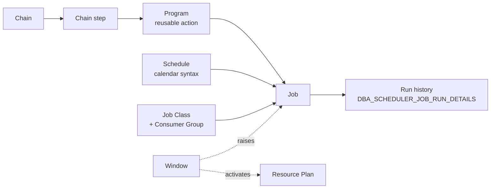

# Oracle Scheduler

The **Oracle Scheduler** (`DBMS_SCHEDULER`) is Oracle's built-in enterprise job automation platform, introduced in Oracle 10g as a replacement for the legacy `DBMS_JOB` package. It runs PL/SQL blocks, stored procedures, external shell scripts, and remote agents on a schedule, with dependency chains, resource governance, event triggers, and centralized logging.

Every 19c database ships with the Scheduler enabled and a set of **auto-tasks** (statistics gathering, SQL Tuning Advisor, segment advisor) already running in the default maintenance windows.

## Contents

| Page                                                    | Purpose                                                     |
| ------------------------------------------------------- | ----------------------------------------------------------- |
| [Jobs](jobs.md)                                         | `DBMS_SCHEDULER.CREATE_JOB`, one-shot and repeating jobs    |
| [Programs](programs.md)                                 | Reusable job actions (PL/SQL, executable, chain step)       |
| [Job Classes](job-classes.md)                           | Grouping jobs, log level, resource consumer group binding   |
| [Chains](chains.md)                                     | Multi-step dependency workflows with branching              |
| [Windows](windows.md)                                   | Time-of-day activation of resource plans and job priorities |
| [Resource Consumer Groups](resource-consumer-groups.md) | CPU / parallel / IO shaping for scheduled work              |
| [File Watchers](file-watchers.md)                       | Event-driven jobs triggered by file arrival                 |

## Auto-Tasks Shipped in 19c

Three maintenance auto-tasks run in the default `MAINTENANCE_WINDOW_GROUP`:

| Auto-task                         | Purpose                                      |
| --------------------------------- | -------------------------------------------- |
| `auto optimizer stats collection` | Gathers stale/missing optimizer statistics.  |
| `auto space advisor`              | Runs Segment Advisor on top space consumers. |
| `sql tuning advisor`              | Analyzes top SQL for tuning recommendations. |

Verify with:

```sql
SELECT client_name, status
FROM   dba_autotask_client;
```

## Why the Scheduler over `DBMS_JOB`

- Native OS-authenticated **external jobs** (no shell wrappers).
- **Chains** with parallel branching, conditional steps, restart-on-failure.
- **Job classes** wire into Resource Manager for CPU/IO limits.
- **File watchers** and **event-based** triggers.
- **Remote agents** (`DBMS_SCHEDULER.CREATE_CREDENTIAL`) for OS-level orchestration.
- Full **history / logging** in `DBA_SCHEDULER_JOB_RUN_DETAILS`.

Since Oracle 12c, `DBMS_JOB` internally routes to the Scheduler; direct use of `DBMS_JOB` is deprecated.

## High-Level Object Model



## Related

- [Undo Retention](../05-undo/undo-retention.md) — `MMON` auto-tunes it during maintenance windows.
- [AWR](../12-performance-tuning/awr.md) — snapshot job runs under the Scheduler.
- [Resource Manager](../09-user-management/resource-manager.md) — plans that Windows activate.
- [FBDA process](../03-instance-architecture/processes/fbda.md) — a Scheduler client.
