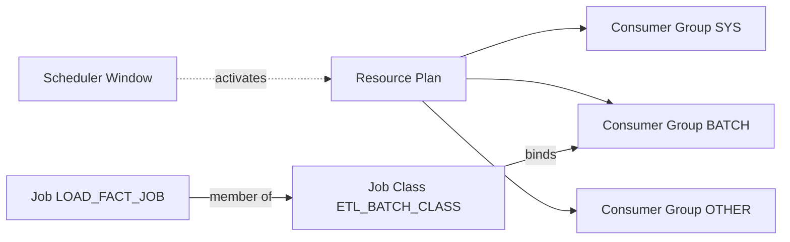

# Scheduler Job Classes

## Overview

A **Job Class** groups jobs that share common characteristics and — critically — binds them to a **Resource Manager consumer group**. When a Resource Plan is active, all jobs in a class run under the CPU / parallel / IO caps of that consumer group. Job classes also control **logging level**, **service** affinity in RAC, and **run history purge policy**.

Job class is where Scheduler meets Resource Manager. Without job classes, every job runs under whatever session-level consumer group it lands in — usually `OTHER_GROUPS`, which has no ceiling and can starve interactive users during a maintenance run.

## Attributes

| Attribute                 | Purpose                                                         |
| ------------------------- | --------------------------------------------------------------- |
| `resource_consumer_group` | Resource Manager group whose CPU/parallel caps jobs inherit.    |
| `service`                 | RAC service — jobs only run on instances offering that service. |
| `logging_level`           | `OFF`, `RUNS`, or `FULL`.                                       |
| `log_history`             | Days of run history to keep (default 30).                       |
| `comments`                | Description.                                                    |

## Creating a Job Class

```sql
BEGIN
  DBMS_SCHEDULER.CREATE_JOB_CLASS(
    job_class_name          => 'ETL_BATCH_CLASS',
    resource_consumer_group => 'BATCH_GROUP',
    service                 => 'ETL_SVC',
    logging_level           => DBMS_SCHEDULER.LOGGING_RUNS,
    log_history             => 60,
    comments                => 'Overnight ETL jobs capped by BATCH plan');
END;
/
```

## Wiring a Job to a Class

```sql
BEGIN
  DBMS_SCHEDULER.CREATE_JOB(
    job_name        => 'ETL.LOAD_FACT_JOB',
    program_name    => 'ETL.LOAD_FACT_PRG',
    job_class       => 'ETL_BATCH_CLASS',
    repeat_interval => 'FREQ=DAILY; BYHOUR=1',
    enabled         => TRUE);
END;
/
```

Change the class of an existing job:

```sql
EXEC DBMS_SCHEDULER.SET_ATTRIBUTE('ETL.LOAD_FACT_JOB', 'job_class', 'ETL_BATCH_CLASS');
```

## Built-in Job Class

Oracle ships a default class **`DEFAULT_JOB_CLASS`** — no consumer group, no service pinning. If you don't specify `job_class`, this is what jobs join. Fine for ad-hoc jobs; **never** for production batches.

## How Classes Interact with Resource Manager



When the Window opens the plan, `BATCH_GROUP` gets (say) 20% of CPU. Every job in `ETL_BATCH_CLASS` runs under that 20% ceiling regardless of how many slaves the Scheduler starts.

## RAC Service Affinity

Setting `service=>'ETL_SVC'` restricts jobs in the class to run only on instances offering that service. This is how you dedicate batch nodes:

```sql
srvctl add service -d PRD -s ETL_SVC -preferred PRD2 -available PRD1
srvctl start service -d PRD -s ETL_SVC
```

Jobs in the class will now run on `PRD2` unless it's down, then failover to `PRD1`.

## Logging Levels

| Level          | What's recorded                                                  |
| -------------- | ---------------------------------------------------------------- |
| `LOGGING_OFF`  | Nothing.                                                         |
| `LOGGING_RUNS` | One row per run in `DBA_SCHEDULER_JOB_RUN_DETAILS`.              |
| `LOGGING_FULL` | RUNS + every state change (`SCHEDULED`, `STARTED`, `COMPLETED`). |

`FULL` is expensive on high-frequency jobs — use temporarily while diagnosing.

## Diagnostic Queries

```sql
-- All job classes
SELECT job_class_name, resource_consumer_group, service,
       logging_level, log_history
FROM   dba_scheduler_job_classes;

-- Jobs in a given class
SELECT owner, job_name, state, enabled
FROM   dba_scheduler_jobs
WHERE  job_class = 'ETL_BATCH_CLASS';

-- Verify consumer group actually mapped in active plan
SELECT   group_or_subplan, cpu_p1, cpu_p2, active_sess_pool_p1,
         parallel_degree_limit_p1
FROM     dba_rsrc_plan_directives
WHERE    plan = SYS_CONTEXT('USERENV','CURRENT_RESOURCE_PLAN')
ORDER BY group_or_subplan;

-- History honoring log_history
SELECT log_id, log_date, owner, job_name, status
FROM   dba_scheduler_job_run_details
WHERE  job_class = 'ETL_BATCH_CLASS'
ORDER  BY log_date DESC
FETCH  FIRST 20 ROWS ONLY;
```

## Purging History

By default the Scheduler purges based on the highest `log_history` across all classes. Purge on demand:

```sql
-- Purge everything older than 30 days
EXEC DBMS_SCHEDULER.PURGE_LOG(log_history => 30);

-- Purge only one class
EXEC DBMS_SCHEDULER.PURGE_LOG(log_history => 30, job_class => 'ETL_BATCH_CLASS');
```

## Common Issues

- **Jobs still saturate CPU** — Resource Plan isn't active. Check `V$RSRC_PLAN`. Windows activate plans; without a Window opening at the right time, class CPU caps aren't enforced.
- **`ORA-27478: job class does not exist`** — Case-sensitive class name.
- **RAC: job runs on wrong node** — Service not offered on the intended node, or dispatched before service came up. Verify with `srvctl status service`.
- **Log table balloons** — `log_history` too high across classes; `PURGE_LOG` manually.

## Best Practices

1. Create at least three classes: `INTERACTIVE_MAINTENANCE_CLASS`, `ETL_BATCH_CLASS`, `LOW_PRIORITY_CLASS`.
2. Always tie classes to a **Resource Consumer Group** — no bare classes in production.
3. In RAC, pin batch classes to a **dedicated service** so batch never lands on the OLTP-serving node.
4. Set `logging_level=LOGGING_RUNS` in production, `LOGGING_FULL` only while investigating.
5. Set `log_history` per class based on retention policy (60–90 days for audit-relevant classes).
6. Purge history via a scheduled job that runs `DBMS_SCHEDULER.PURGE_LOG` weekly.
7. Grant `USE` on the class to job-owning schemas, not `PUBLIC`.

## Interview Questions

1. **Q:** What does a job class give you that a bare job does not?
   **A:** Consumer-group binding for Resource Manager, RAC service affinity, unified logging level, and per-class log retention.

2. **Q:** How does a job class interact with a Resource Plan?
   **A:** The class names a consumer group; the plan defines CPU/parallel caps for that group; a Window activates the plan; jobs in the class inherit the caps.

3. **Q:** How do you keep batch off the OLTP RAC node?
   **A:** Create a RAC service pinned to the batch node, associate that service with the batch job class.

4. **Q:** Why would you keep `log_history` high on some classes and low on others?
   **A:** Audit / compliance jobs need long retention (e.g. 400 days for SOX); noisy monitoring jobs don't.

## References

- Oracle Database Administrator's Guide 19c — Job Classes
- `DBMS_SCHEDULER.CREATE_JOB_CLASS` reference
- Resource Manager Administrator's Guide 19c
