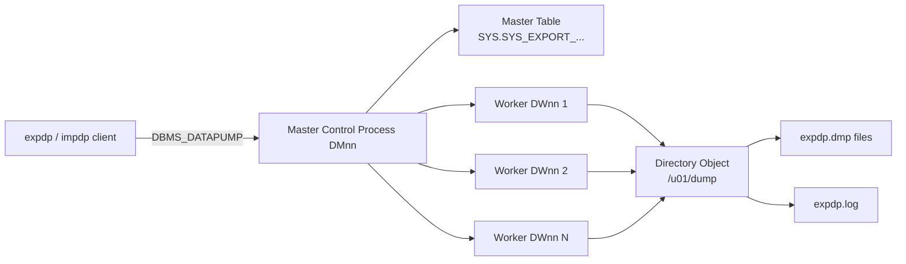

# Oracle Data Pump

**Oracle Data Pump** is Oracle's server-side, parallel bulk data movement facility for logical export/import. It replaces the legacy `exp` / `imp` utilities: significantly faster (direct-path + parallel), restartable, network-mode capable, and encryption-aware. Two client utilities and one PL/SQL package expose it:

- **`expdp`** — export client.
- **`impdp`** — import client.
- **`DBMS_DATAPUMP`** — programmatic API; underlies both.

Data Pump work is done by database server processes (`DMnn`, `DWnn`), not by the client. The client is thin — you can kill it and re-attach later.

## Contents

| Page                                        | Purpose                                    |
| ------------------------------------------- | ------------------------------------------ |
| [EXPDP](expdp.md)                           | Export command reference and patterns      |
| [IMPDP](impdp.md)                           | Import command reference and patterns      |
| [Performance Tuning](performance-tuning.md) | Parallel, compression, network mode tuning |

## Architecture at a Glance



**Master Control Process (MCP)** — `DMnn` — coordinates the job. Its state lives in a **master table** created in the invoking user's schema (`SYS_EXPORT_SCHEMA_01`, etc.). Killing and reattaching a job means finding this master table.

**Workers** — `DWnn` — do the actual work: extract or apply metadata and data.

## Modes

| Mode          | Flag                   | Scope                                                 |
| ------------- | ---------------------- | ----------------------------------------------------- |
| Full          | `FULL=YES`             | Entire database (needs `DATAPUMP_EXP_FULL_DATABASE`). |
| Schema        | `SCHEMAS=...`          | One or more schemas.                                  |
| Table         | `TABLES=...`           | Individual tables.                                    |
| Tablespace    | `TABLESPACES=...`      | All objects in listed tablespaces.                    |
| Transportable | `TRANSPORTABLE=ALWAYS` | Metadata only; datafiles copied out-of-band.          |

## Network Mode

Data Pump can move data **directly database-to-database** over a database link, no dump file:

```bash
impdp system/... network_link=SRC_DB schemas=APP remap_schema=APP:APP_NEW
```

Best for one-shot migrations where the WAN pipe is faster than a landing filesystem.

## Related

- [Migrations](../38-migrations/index.md) — Data Pump is the workhorse for many migration paths.
- [Transportable Tablespaces](../38-migrations/transportable-tablespaces.md) — closely related feature.
- [AWS DMS](../38-migrations/aws-dms.md) — CDC alternative for zero-downtime.
- [Recovery Catalog](../15-rman/recovery-catalog.md) — not to be confused; RMAN is physical, Data Pump is logical.
