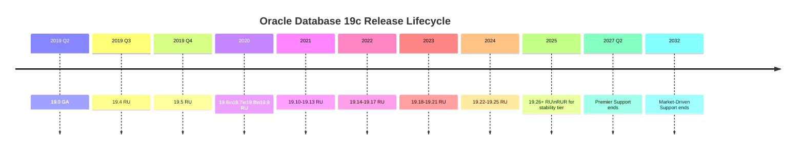

# Oracle Patching

Oracle Database patching is the process of applying **binary patches** (via OPatch/OPatchauto) and **catalog SQL fixes** (via Datapatch) to Oracle Homes and the databases running from them. The 19c release model uses **Release Updates (RU)** every quarter and **Release Update Revisions (RUR)** for stability, plus one-off patches for critical fixes.

Correct patching hygiene is one of the most consequential things a DBA does. Bad patching creates ORA-600, corrupts SGA structures, and — on RAC — evicts nodes for weeks.

## Contents

| Page                                  | Purpose                                 |
| ------------------------------------- | --------------------------------------- |
| [OPatch](opatch.md)                   | Single-instance binary patch tool       |
| [OPatchauto](opatchauto.md)           | Grid Infrastructure / RAC orchestration |
| [Datapatch](datapatch.md)             | Catalog SQL patch application           |
| [Release Updates](release-updates.md) | RU / RUR / One-off patch model          |

## The 19c Release Model



- **RU (Release Update)** — Quarterly. Bug fixes + security. `19.C` for calendar quarter.
- **RUR (Release Update Revision)** — Applied on top of last two RUs. Only regressions/security; no new bugs.
- **One-off** — Fix for a specific bug not yet in an RU.
- **Interim (interim patch)** — Same as one-off.

## Patch Categories

| Category         | Where applied                   | Tool                   |
| ---------------- | ------------------------------- | ---------------------- |
| DB binary        | `$ORACLE_HOME`                  | OPatch                 |
| GI binary        | `$GRID_HOME`                    | OPatchauto (rolls RAC) |
| Catalog SQL      | Each PDB / non-CDB              | Datapatch              |
| Timezone (DSTv#) | `$ORACLE_HOME/oracore/zoneinfo` | `utltz_upg_apply.sql`  |

## Post-Patch Verification

Every patch, every time:

```sql
-- Registry check
SELECT patch_id, action, status, description
FROM   dba_registry_sqlpatch
ORDER  BY action_time DESC
FETCH  FIRST 20 ROWS ONLY;

-- Invalid objects
SELECT owner, object_type, COUNT(*)
FROM   dba_objects
WHERE  status = 'INVALID'
GROUP  BY owner, object_type;

-- Registry components healthy
SELECT comp_name, status, version
FROM   dba_registry;
```

Fix any invalids:

```sql
EXEC UTL_RECOMP.RECOMP_SERIAL;   -- serial for small counts
EXEC UTL_RECOMP.RECOMP_PARALLEL(8);
```

## Related

- [Datapatch (installation view)](../02-installation/datapatch.md) — DB creation angle.
- [OPatch (installation view)](../02-installation/opatch.md) — installation flow.
- [Upgrade & Migration](../23-upgrade-migration/index.md) — a patch you take once every few years.
- [Alert Log](../24-monitoring/alert-log.md) — first stop when a patch misbehaves.
