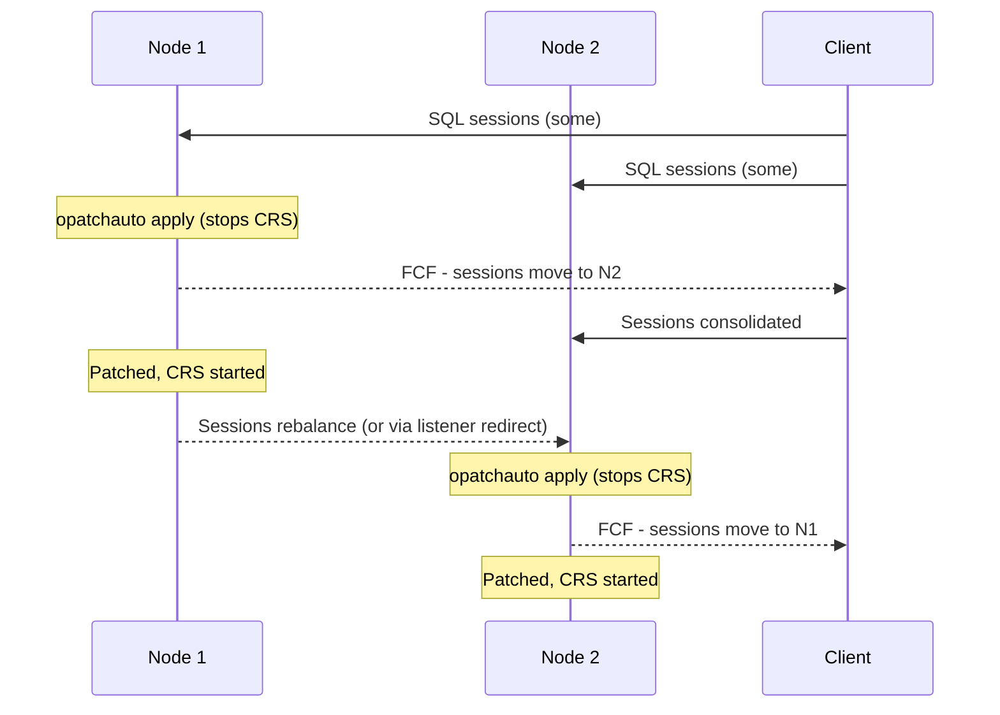

# OPatchauto

## Overview

`opatchauto` is the automation layer over OPatch for **Grid Infrastructure (GI)** and **RAC** environments. It knows about clusterware, listener services, ACFS mounts, and the rolling-restart mechanics needed to patch a RAC cluster without downtime. It runs on **each node**, using the node's local Grid and RDBMS homes.

Single-instance patching = `opatch apply`. RAC/GI patching = `opatchauto apply`.

## Where It Lives

- **12.2+ GI**: `$GRID_HOME/OPatch/opatchauto`.
- Databases running on a GI home are patched via **that node's** `opatchauto` — it discovers homes from the OCR.

## What OPatchauto Does For You

For a GI + RAC RU patch, per node:

1. Stops resources (databases, ACFS mounts, ASM, CRS) on that node — **rolling**, not cluster-wide.
2. Applies patches to **Grid Home** and **all RDBMS homes** on the node.
3. Starts everything back.
4. Optionally runs Datapatch on each database.
5. Moves to the next node.

At the cluster level: **zero downtime** for services that are load-balanced across nodes.

## Prereq Check

```bash
# Analyze the patch against all homes on this node
$GRID_HOME/OPatch/opatchauto apply /u01/patches/35943157 -analyze
```

Reports:

- Homes discovered.
- Patch applicability per home.
- Conflicts.
- Estimated downtime for non-rolling components.

## Apply — Rolling Fashion

Standard flow on a 2-node RAC:

### Node 1

```bash
# As root — opatchauto needs root for CRS ops
export ORACLE_HOME=$GRID_HOME
$GRID_HOME/OPatch/opatchauto apply /u01/patches/35943157
```

Watch:

- CRS shuts down on node 1 (`crsctl stop crs`).
- Databases on node 1 shift to node 2 (services relocate).
- OPatch applies to both GI and RDBMS homes.
- `rootcrs.sh -postpatch` runs.
- CRS starts, databases start on node 1, services return.

### Node 2

Same command, on node 2. When it stops CRS, the databases go back to node 1.

### Datapatch

`opatchauto` normally invokes Datapatch on each RDBMS home during the last node's post-step. Verify:

```sql
SELECT patch_id, status, action, action_time
FROM   dba_registry_sqlpatch
WHERE  action_time > SYSDATE - 1
ORDER  BY action_time DESC;
```

If skipped, run manually on **any one node**:

```bash
$ORACLE_HOME/OPatch/datapatch -verbose
```

## Options You'll Actually Use

| Option                        | Purpose                                                    |
| ----------------------------- | ---------------------------------------------------------- |
| `-analyze`                    | Dry-run — no changes.                                      |
| `-oh <path>`                  | Restrict to specific Oracle Home(s), comma-separated.      |
| `-database <name>`            | Restrict Datapatch to specific database.                   |
| `-nonrolling`                 | Force non-rolling (whole cluster down) — for out-of-place. |
| `-generateSteps`              | Emit the plan without executing.                           |
| `-restore`                    | Roll back after a failed apply.                            |
| `-logLevel FINE`              | Debug output.                                              |
| `-invPtrLoc /etc/oraInst.loc` | Point at inventory pointer file.                           |
| `-outofplace`                 | Patch an out-of-place cloned home instead of in-place.     |

## Rollback

Same syntax as apply, with `rollback`:

```bash
$GRID_HOME/OPatch/opatchauto rollback /u01/patches/35943157
```

If a mid-node failure happens:

```bash
$GRID_HOME/OPatch/opatchauto resume
# or, if not resumable
$GRID_HOME/OPatch/opatchauto -restore
```

## Diagnostic Files

- **Session log**: `$GRID_HOME/cfgtoollogs/opatchauto/<timestamp>/`
- **Individual OPatch logs**: `$GRID_HOME/cfgtoollogs/opatch/`
- **CRS state during patching**: `$GRID_BASE/diag/crs/<host>/crs/trace/`

## Checking Cluster State Between Nodes

Before moving to node 2:

```bash
crsctl stat res -t | grep -E 'STATE|ONLINE'
srvctl status database -db PRD
srvctl status service -db PRD
crsctl check crs
```

All resources should be ONLINE on at least one node. If services didn't relocate cleanly to node 2 during node 1's patching, do NOT patch node 2 — investigate first.

## Cluster-Wide Rolling Model



Zero downtime **only if** services are configured for FCF (Fast Connection Failover) via ONS and the client uses TAF or Application Continuity.

## Common Issues

- **`OPATCHAUTO-72046: Failed to run root scripts`** — Usually SELinux/permission issue on `/etc/oratab`, `oraInst.loc`, or `oraInventory`. Fix perms and `opatchauto resume`.
- **`OPATCHAUTO-68006: unable to run wallet operations`** — 19c: TNS_ADMIN out of sync with Grid. Set correctly and resume.
- **Node 1 patched, node 2 apply says "already patched"** — Wrong; `opatchauto` uses per-node inventory. Check `$ORACLE_HOME/OPatch/opatch lsinventory` on node 2 specifically.
- **Datapatch skipped** — PDB closed. Open all PDBs (`ALTER PLUGGABLE DATABASE ALL OPEN`) then run `datapatch -verbose`.
- **CRS won't restart** — `rootcrs.sh -postpatch` failed. Check `$GRID_BASE/diag/crs/<host>/crs/trace/`. Usually a permissions issue on the OCR/voting disks.
- **`clsecho: CLSU-00100`** — Cluster interconnect lost during patching. Rare — check the private network before resuming.

## Best Practices

1. Always run `-analyze` first on both nodes.
2. **Take an RMAN backup** of every database and a **backup of the OCR** (`ocrconfig -export`) before starting.
3. Verify services are configured for automatic failover BEFORE patching — patch a lab node first.
4. Patch nodes **serially**, not in parallel — RAC does not tolerate concurrent CRS restarts.
5. Verify the cluster is fully healthy on node 2 BEFORE starting node 1's patching (or vice versa).
6. Use the `-database` option to defer Datapatch if you want to control when it runs.
7. Never edit `/etc/oratab` or `oraInventory` mid-patch.
8. If a node reboots mid-patch, `opatchauto resume` — do NOT re-run apply from scratch.
9. Post-patch: run `cluvfy stage -post crsinst -n all` to catch stragglers.
10. Document the patch window in the change management tool with node timings.

## Interview Questions

1. **Q:** How is `opatchauto` different from `opatch`?
   **A:** `opatchauto` orchestrates GI + RDBMS patching on a RAC node, including CRS restart. `opatch` only patches one Oracle Home.

2. **Q:** How is downtime avoided during RAC patching?
   **A:** `opatchauto` works node-by-node; sessions relocate via ONS/FCF; the service is always available on the other nodes.

3. **Q:** What's the role of the `-analyze` flag?
   **A:** Dry-run — reports applicability, conflicts, and estimated downtime without changing anything.

4. **Q:** When would you use `-nonrolling`?
   **A:** Out-of-place home patching, or patches Oracle explicitly marks as non-rolling. Rare — RUs are almost always rolling.

5. **Q:** A patch failed on node 1. What do you do?
   **A:** Do NOT start on node 2. `opatchauto resume` if resumable; otherwise `-restore` to revert node 1, then investigate.

## References

- Oracle Universal Installer & OPatch User's Guide 19c
- MOS Doc ID 2245719.1 — opatchauto Master Note
- MOS Doc ID 2118136.2 — 19c RU / RUR release notes
- MOS Doc ID 2419319.1 — opatchauto troubleshooting
