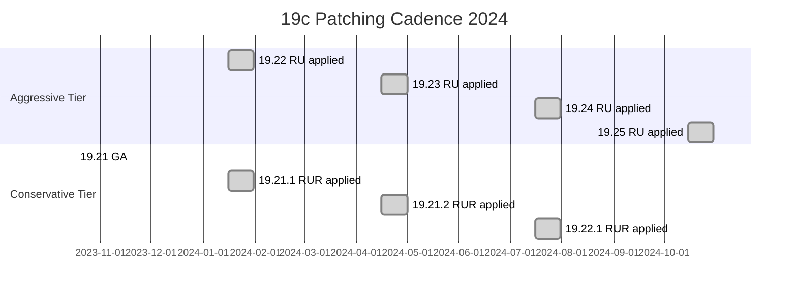

# Release Updates (RU / RUR / One-off)

## Overview

Oracle Database 19c uses a **quarterly patching model** built around three artifacts:

| Type        | Frequency                         | Content                                                              |
| ----------- | --------------------------------- | -------------------------------------------------------------------- |
| **RU**      | Quarterly (Jan / Apr / Jul / Oct) | Bug fixes + security. Cumulative on the 19c GA baseline.             |
| **RUR**     | Quarterly, one/two behind RU      | Only security + regressions from the base RU. No new features/fixes. |
| **One-off** | Ad hoc                            | Individual bug fix, usually for a critical issue not yet in an RU.   |

Understanding this trilogy is essential — the wrong choice at the wrong time is how you either miss a CVE or ship a regression into production.

## RU vs RUR — Choosing a Tier

Two philosophies:

- **RU tier** (aggressive): Apply the latest RU each quarter. You get security + fixes, at the risk of new regressions.
- **RUR tier** (conservative): Stay on an RU that's 2 quarters old but apply its RUR. Same security, no new fixes → very stable.

Oracle numbers `19.C.D.E.F`:

- `C` = **RU version** — `19.19`, `19.20`, `19.21`.
- `D` = **RUR revision** — `0` for RU, `1..N` for RURs.
- Higher numbers = newer.

Example over time on a conservative tier:

```
2023 Q3: 19.20.0.0.0    (Jul RU)
2023 Q4: 19.20.1.0.0    (Oct RUR = 19.20 + security)
2024 Q1: 19.20.2.0.0    (Jan RUR)
```

Meanwhile, the aggressive tier is on `19.21`, `19.22`, `19.23`.

Oracle publishes the current RUR path in **MOS Doc ID 2118136.2** (Master 19c Release Notes).

## Naming Convention Reference

```
19.19.0.0.0    <- RU only (also called "19.19 RU")
19.19.1.0.0    <- RUR 1 for 19.19
19.19.2.0.0    <- RUR 2 for 19.19
19.20.0.0.0    <- new RU (Jan 2024)
```

Each has a **patch bundle ID** on MOS. Downloads:

```
Database RU 19.19.0.0.0 -> Patch 35320081
Database RUR 19.19.1.0.0 -> Patch 35637241
```

## What's Inside an RU

Extract the ZIP and look:

```
p35943157_190000_Linux-x86-64.zip
└── 35943157/
    ├── README.txt              <- READ THIS FIRST
    ├── etc/config/inventory.xml
    ├── files/                  <- binary payload
    ├── sqlpatch/               <- SQL side for Datapatch
    │   ├── 35943157/
    │   │   ├── 25040538/
    │   │   │   ├── postinstall_deploy.sql
    │   │   │   └── ...
    └── automation/             <- OPatchauto plan
```

Every RU contains:

- Fixes for the OPatch inventory (files/_.jar, files/_.so).
- New/modified PL/SQL packages (sqlpatch/\*.sql).
- Post-install steps described in the README.

## Applying Order

For a fresh apply:

1. **RU** — sets `19.C.0.0.0`.
2. **RUR** (optional) — sets `19.C.1.0.0` or higher.
3. **One-offs** — applied last, on top of the current stack.

You cannot apply an RUR on top of a different RU. RUR 19.19.1 requires RU 19.19.0 base. If you're on 19.18 and want 19.19.1, you first apply the 19.19 RU, then the RUR.

## MOS Doc IDs Every DBA Bookmarks

- **2118136.2** — Master Note for 19c Database Release Updates
- **555.1** — 19c Timezone Update Patches
- **1929745.1** — OPatch and Datapatch FAQ
- **2521164.1** — 19c Client Release Update Notes
- **1683791.1** — OJVM Release Updates (separate from RU)

## OJVM: Separate Patch Stream

If your database uses **Oracle JVM** (Java in the database), each RU has a **companion OJVM RU** (patch 33754983 for 19.19 RU, etc.). Apply in this order:

```bash
# 1. Prep: check if OJVM is installed
sqlplus / as sysdba
SELECT COUNT(*) FROM dba_registry WHERE comp_id='JAVAVM';

# 2. Both patches downloaded
# Apply DB RU first, then OJVM RU
opatch apply /patches/35943157   # DB RU
opatch apply /patches/35636971   # OJVM RU

# 3. Datapatch runs both
datapatch -verbose
```

For RAC/GI use `opatchauto` — it stacks both correctly.

## Timezone Files (DSTv)

Separate from RU: **DSTv#** (Daylight Saving Time version) files are updated as governments change TZ rules. Apply if your database uses `TIMESTAMP WITH TIME ZONE`:

```bash
# Check current
SELECT * FROM v$timezone_file;

# Apply new DSTv (patch 33436383 = DSTv44)
opatch apply /patches/33436383
sqlplus / as sysdba
@?/rdbms/admin/utltz_upg_check.sql
@?/rdbms/admin/utltz_upg_apply.sql
```

Only needed when the DST rules for a used TZ change (usually 1-2× per year).

## Deciding When to Skip an RU

Oracle publishes **known issues** for each RU on MOS. Common reasons to defer:

- CVE severity is low + regression risk is high.
- RU introduces new optimizer behavior (`optimizer_features_enable` jumps).
- You're within 60 days of a critical business event (year-end close, migration).

The safe general policy: **apply each RU in a lower environment within 30 days**, in production within 90 days, unless a specific CVE demands faster.

## Patch Lifecycle Visualization



## Post-Patch Health Checks

Every RU deployment ends with:

```sql
SELECT patch_id, version, action, status FROM dba_registry_sqlpatch
ORDER BY action_time DESC FETCH FIRST 10 ROWS ONLY;

SELECT comp_id, comp_name, status, version FROM dba_registry;

SELECT owner, object_type, COUNT(*) FROM dba_objects
WHERE status='INVALID' GROUP BY owner, object_type;

SELECT * FROM pdb_plug_in_violations WHERE status <> 'RESOLVED';
```

And a smoke test on the top workload SQL:

```sql
-- Compare optimizer_features_enable if RU bumped it
SHOW PARAMETER optimizer_features_enable;

-- Any plan changes?
SELECT sql_id, plan_hash_value, COUNT(*)
FROM   dba_hist_sqlstat
WHERE  begin_interval_time > SYSDATE - 7
GROUP  BY sql_id, plan_hash_value
HAVING COUNT(*) > 1;
```

## Common Issues

- **`ORA-01555 snapshot too old` after RU** — Undo behavior may change in new RU. Bump `undo_retention`.
- **Optimizer plan flips after RU** — Set `optimizer_features_enable` to the old value while triaging.
- **PDB doesn't come back with SUCCESS** — See [Datapatch](datapatch.md); usually PDB was closed.
- **OJVM not applied** — Ships as separate patch; RU alone won't cover it. Check `dba_registry` for `JAVAVM`.
- **RAC nodes on different RU levels** — Only under a rolling patch window. `opatch lsinventory` on each node.

## Best Practices

1. Pick a tier (aggressive/conservative) and stick with it across all databases.
2. Track RU applied per database in your CMDB.
3. Read the RU README end-to-end each time — steps sometimes change.
4. Never skip OJVM if `JAVAVM` is installed.
5. Apply DSTv patches when governments change TZ — not on a fixed schedule.
6. Test in an environment that mirrors production's workload — not just an idle clone.
7. Keep the last 2 RU/RUR ZIPs on disk in case rollback is needed.
8. Monitor `dba_registry_sqlpatch.status` for anything not `SUCCESS`.
9. Automate the patching runbook — every manual step is a place to make a mistake.
10. Subscribe to MOS notifications for 19c so you know about emergency one-offs.

## Interview Questions

1. **Q:** What's the difference between an RU and an RUR?
   **A:** RU = cumulative quarterly fixes. RUR = security + regressions only, on top of an existing RU. RUR is the conservative path.

2. **Q:** How do you know which RU a database is on?
   **A:** `SELECT version FROM v$instance` shows the binary; `SELECT * FROM dba_registry_sqlpatch` shows the SQL patches applied.

3. **Q:** OJVM patches — how are they different?
   **A:** Separate patch stream, must be applied alongside the RU if JAVAVM is installed. Datapatch processes both.

4. **Q:** How would you handle a critical CVE announced mid-quarter?
   **A:** Apply the emergency one-off Oracle publishes for that CVE, on top of the current RU. It'll be superseded by the next RU.

5. **Q:** How do you defer patching without going out of support?
   **A:** Move to the RUR tier — one or two quarters behind RU — you stay current on security and stable on features.

## References

- MOS Doc ID 2118136.2 — Master 19c Database Release Notes
- MOS Doc ID 2521164.1 — 19c Client RU Notes
- MOS Doc ID 1683791.1 — OJVM Release Updates
- MOS Doc ID 555.1 — Timezone Patches
- MOS Doc ID 1929745.1 — OPatch and Datapatch FAQ
