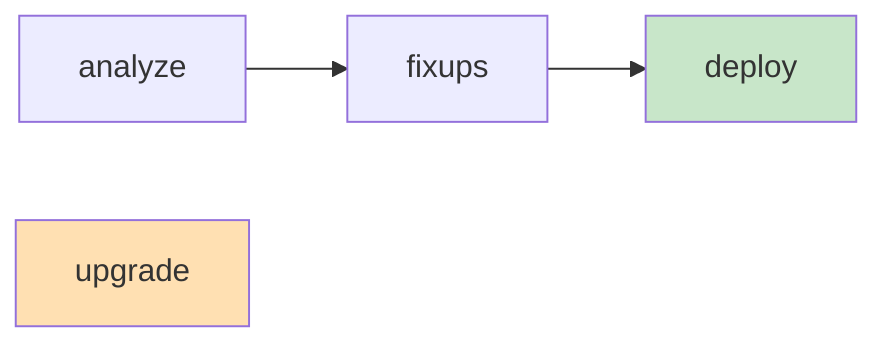

# AutoUpgrade

## Overview

**AutoUpgrade** is Oracle's Java-based automation tool for database upgrades, introduced with 19c and the default recommendation from Oracle for anything 12.2 and above. One JAR file, one JSON config, one command — and it handles pre-upgrade checks, fixups, downtime window, upgrade, post-fixups, timezone patching, and post-upgrade validation.

Ships in `$ORACLE_HOME_19/rdbms/admin/autoupgrade.jar`. **Always** download the latest version from MOS Doc ID 2485457.1 — it's updated more often than the OS-shipped copy.

## Why AutoUpgrade over DBUA / Manual

- **Handles preupgrade fixups automatically** — no separate Java tool run.
- **Non-interactive** — feed a JSON, walk away.
- **Multiple databases in parallel** — a single config file can upgrade N DBs.
- **Deploy modes** — analyze, fixups, deploy, upgrade — you can dry-run everything first.
- **Restore-point safety net** — takes a Guaranteed Restore Point at the start.
- **CDB and PDB aware** — 12.2+ multitenant is first-class.
- **Time zone update** — as part of the flow.
- **Post-upgrade tasks** — invalid recompile, dictionary stats.
- **Automatic rollback** — if a stage fails, it can revert to the restore point.

## Four Processing Modes



| Mode      | What it does                                           |
| --------- | ------------------------------------------------------ |
| `analyze` | Read-only assessment. Produces reports. Zero changes.  |
| `fixups`  | Run only the automatic fixups; no upgrade. Idempotent. |
| `deploy`  | Full flow: analyze + fixups + upgrade + post-fixups.   |
| `upgrade` | Skip analyze/fixup phases (assume already done). Rare. |

Typical production sequence:

```bash
java -jar autoupgrade.jar -config prod.json -mode analyze
# review reports
java -jar autoupgrade.jar -config prod.json -mode fixups
# validate
java -jar autoupgrade.jar -config prod.json -mode deploy
```

## Minimal Config File

`prod.json`:

```json
{
  "global": {
    "autoupg_log_dir": "/u01/app/oracle/upgrade/logs"
  },
  "database": [
    {
      "sid": "PRD",
      "source_home": "/u01/app/oracle/product/12.2.0/dbhome_1",
      "target_home": "/u01/app/oracle/product/19.0.0/dbhome_1",
      "start_time": "NOW",
      "upgrade_node": "prd-db01",
      "timezone_upg": "yes",
      "restoration": "yes"
    }
  ]
}
```

Multi-DB config:

```json
{
  "global": {
    "autoupg_log_dir": "/u01/app/oracle/upgrade/logs"
  },
  "database": [
    {
      "sid": "PRD1",
      "source_home": "...",
      "target_home": "...",
      "start_time": "NOW"
    },
    {
      "sid": "PRD2",
      "source_home": "...",
      "target_home": "...",
      "start_time": "+2h"
    },
    {
      "sid": "PRD3",
      "source_home": "...",
      "target_home": "...",
      "start_time": "2026-08-15 03:00"
    }
  ]
}
```

`start_time` accepts `NOW`, `+2h`, or an absolute timestamp.

## What Happens on `deploy`

Per database, sequentially:

1. **Setup** — validate JSON, connect, take backup of parameter file, spfile.
2. **Prechecks** — same as `analyze` — pre-flight checks + `preupgrade.jar` equivalent.
3. **Prefixups** — apply automatic fixes (purge recycle bin, gather dict stats, etc.).
4. **Drain** — wait for active sessions to drain (respects `drain_time`).
5. **GRP (Guaranteed Restore Point)** — `CREATE RESTORE POINT PRE_AUTOUPG_ ... GUARANTEE FLASHBACK DATABASE`.
6. **DBUpgrade** — run `catctl.pl` internally against the 19c home.
7. **Postchecks** — verify success.
8. **Postfixups** — utlrp, dictionary stats, tz upgrade.
9. **Report** — HTML + logs to `autoupg_log_dir`.

## Advanced Config Keys

| Key                                  | Default | Purpose                                            |
| ------------------------------------ | ------- | -------------------------------------------------- |
| `target_version`                     | infer   | Explicit target version (e.g. `19`).               |
| `restoration`                        | `yes`   | Take GRP; set to `no` on standby-refreshed setups. |
| `timezone_upg`                       | `yes`   | Run tz upgrade as part of post-fixups.             |
| `drain_time`                         | 3       | Minutes to wait for sessions to drain.             |
| `manage_network_files`               | `yes`   | Copy `listener.ora`, `tnsnames.ora`, `sqlnet.ora`. |
| `run_utlrp`                          | `yes`   | Recompile invalids post-upgrade.                   |
| `disable_dv`                         | `yes`   | Disable Database Vault during upgrade.             |
| `cluster_name`                       |         | RAC cluster name, if applicable.                   |
| `upgrade_node`                       | current | Node on which to run.                              |
| `remove_underscore_parameters`       | `no`    | Strip underscore params from spfile.               |
| `dictionary_stats_after`             | `yes`   | Gather DDL stats post-upgrade.                     |
| `add_after_upgrade_pfile_parameters` | -       | Merge parameter changes.                           |

## Job & Stage Monitoring

While a job runs:

```bash
# Interactive console
java -jar autoupgrade.jar -config prod.json -console

AutoUpgrade> lsj
AutoUpgrade> tasks
AutoUpgrade> status -job 100
AutoUpgrade> abort -job 100    # stops the specific job
AutoUpgrade> resume -job 100
```

Alternatively watch the log files:

```bash
tail -f /u01/app/oracle/upgrade/logs/cfgtoollogs/upgrade/auto/status/status.log
```

## Reports

At `autoupg_log_dir/cfgtoollogs/upgrade/auto/`:

- `prechecks/preupgrade.html` — the pre-upgrade tool output.
- `dbupgrade/autoupgrade.log` — main log.
- `<sid>/postupgrade_report.html` — post-upgrade summary.
- `<sid>/upgrade.log` — `catupgrd.sql` output.

## Rollback

If `restoration=yes` and something failed:

```bash
java -jar autoupgrade.jar -config prod.json -mode restore
```

Uses the GRP taken at start. Restore point drops itself after successful upgrade or on demand.

Manual:

```sql
SHUTDOWN IMMEDIATE;
STARTUP MOUNT;
FLASHBACK DATABASE TO RESTORE POINT PRE_AUTOUPG_ ...;
ALTER DATABASE OPEN RESETLOGS;
```

## RAC Considerations

- One node runs `autoupgrade.jar`; the tool orchestrates others via `srvctl`.
- Ensure `oratab` on all nodes lists the 19c home.
- OCR / voting disks stay put — this is a DB upgrade, not a GI upgrade.
- GI must already be at the higher of {source, target} version.

## Common Issues

- **`OPUB-01003: Pre-upgrade checks failed`** — Read the linked report. Usually deprecated init parameters or missing dictionary stats. Rerun `fixups`.
- **AutoUpgrade hangs on drain** — `drain_time` too short and app is still hitting DB. Extend or bounce app tier.
- **`FRPGP-01011: The restore point could not be created`** — Not enough FRA space, or no archivelog mode. Fix and rerun.
- **`AUP-08019: Time zone update failed`** — TZ version mismatch. Set `timezone_upg=no` and do manually after.
- **Deploy hangs on `Executing utlrp.sql`** — Small parallel setting on a huge invalid list. `SET JOB_QUEUE_PROCESSES=32` then rerun `utlrp` manually.
- **`AUP-08018: Standby database detected`** — Data Guard needs pre-configured with `db_files=200` matching + broker in `MOUNT`.

## Best Practices

1. Always download the latest `autoupgrade.jar` from MOS Doc ID 2485457.1.
2. Run `-mode analyze` first, review the HTML report.
3. Take a full RMAN backup **before** the deploy — separate from the GRP safety net.
4. Set `timezone_upg=yes` — one less follow-up step.
5. Use `-console` in a persistent terminal so you can interact if needed.
6. For multi-DB configs, stagger `start_time` to avoid saturating the host.
7. On RAC, run from **one node** — it orchestrates the rest.
8. Retain the old home on disk for 30 days minimum — cheap insurance.
9. Apply the latest RU immediately after upgrade, then Datapatch.
10. Compare AWR before/after for optimizer regressions.

## Interview Questions

1. **Q:** Why AutoUpgrade over DBUA?
   **A:** Non-interactive, JSON-driven, multi-DB parallel, integrated restore point, integrated tz upgrade, integrated utlrp.

2. **Q:** What are the four modes?
   **A:** `analyze` (read-only), `fixups` (apply fixes), `deploy` (full flow), `upgrade` (skip earlier phases).

3. **Q:** How does AutoUpgrade guarantee rollback?
   **A:** Creates a Guaranteed Restore Point at the start — after upgrade, either drops it or lets `-mode restore` flash back.

4. **Q:** Can AutoUpgrade upgrade multiple databases at once?
   **A:** Yes — list all databases in the JSON with staggered `start_time`.

5. **Q:** What version of Java does AutoUpgrade need?
   **A:** JDK 8 or higher; the JDK in `$ORACLE_HOME/jdk` works.

## References

- MOS Doc ID 2485457.1 — AutoUpgrade Tool (latest download)
- MOS Doc ID 2419319.1 — AutoUpgrade Troubleshooting
- Oracle Database Upgrade Guide 19c
- MOS Doc ID 2118136.2 — 19c release notes
