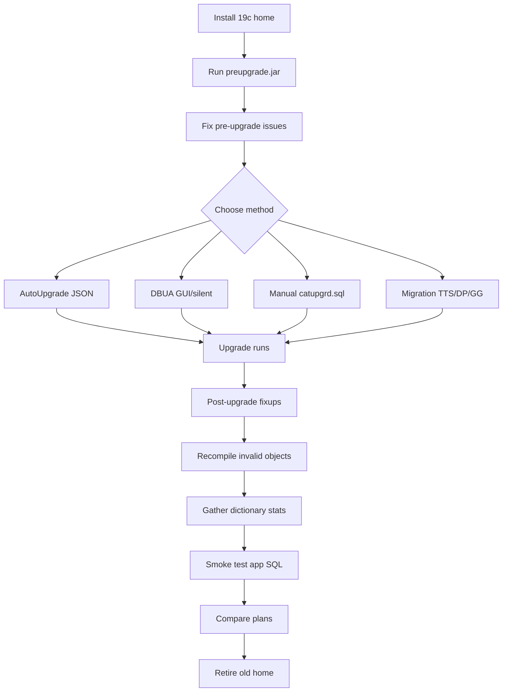

# Upgrade & Migration

Upgrading Oracle Database means moving a database from one release to a higher one (11g → 19c, 12c → 19c, 19c → 21c). Migration means moving a database to a new platform or new hardware, potentially with an upgrade in the same step. Oracle 19c is a **Long-Term Release** — most upgrades from 11g/12c land here.

Four broadly recognized approaches:

| Method                                    | Time   | Downtime      | Rollback                 | When it fits                  |
| ----------------------------------------- | ------ | ------------- | ------------------------ | ----------------------------- |
| [AutoUpgrade](autoupgrade.md)             | Fast   | Minutes-hours | Restore point            | Default choice in 19c         |
| [DBUA](dbua.md)                           | Fast   | Hours         | Guaranteed restore point | Small DBs, single node        |
| [Manual Upgrade](manual-upgrade.md)       | Slow   | Hours         | Manual RMAN              | Full control, RAC, edge cases |
| [Migration Methods](migration-methods.md) | Varies | Varies        | Method-dependent         | Cross-platform / new HW       |

## Version Path Rules

Direct upgrade paths for 19c:

| Source   | Direct to 19c? |
| -------- | -------------- |
| 11.2.0.4 | Yes            |
| 12.1.0.2 | Yes            |
| 12.2.0.1 | Yes            |
| 18c      | Yes            |
| 19c (RU) | Yes (patch)    |

If you're on 11.2.0.3 or earlier, first go through 11.2.0.4 or take a **cross-version data-pump** (functionally a migration, not an upgrade).

## Pre-Upgrade Utility (`preupgrade.jar`)

Whatever method you pick, run the Pre-Upgrade Information Tool first — it's shipped in the 19c home:

```bash
$ORACLE_HOME_19/jdk/bin/java -jar \
   $ORACLE_HOME_19/rdbms/admin/preupgrade.jar \
   FILE TEXT DIR /tmp/preup19c
```

Output:

- `preupgrade.log` — human-readable actions
- `preupgrade_fixups.sql` — pre-upgrade fixes
- `postupgrade_fixups.sql` — post-upgrade fixes

Read `preupgrade.log` end-to-end. It flags:

- Deprecated parameters
- Time zone version mismatch
- Deprecated features you're using
- Component removals (e.g., no more OWM, Ultra Search)
- Statistics gaps
- Recycle bin cleanup

## Overall Flow



## Time Zone Version

19c ships with DSTv32; your source may be lower. Options:

1. **Pre-upgrade TZ upgrade** — recommended: same TZ on both sides.
2. **Post-upgrade TZ upgrade** — run `utltz_upg_apply.sql` after.

Both work. Pre-upgrade avoids one extra outage.

## Component Removals to Know

Between 12c and 19c, several components were removed or deprecated:

- Oracle Streams — gone (use GoldenGate)
- Oracle Multimedia — deprecated, still installable
- Warehouse Builder — gone
- Oracle Text — still there but reduced
- Oracle Ultra Search — gone
- Oracle Workspace Manager — gone (removable)

If any of your app code depends on these, plan a rewrite.

## Contents

| Page                                      | Purpose                                         |
| ----------------------------------------- | ----------------------------------------------- |
| [AutoUpgrade](autoupgrade.md)             | The recommended tool for 19c and later upgrades |
| [DBUA](dbua.md)                           | Database Upgrade Assistant (interactive/silent) |
| [Manual Upgrade](manual-upgrade.md)       | catctl.pl / catupgrd.sql flow                   |
| [Migration Methods](migration-methods.md) | RMAN, Data Pump, Transportable, GoldenGate      |

## Related

- [Data Pump](../21-data-pump/index.md) — powers logical migrations.
- [Transportable Tablespaces](../38-migrations/transportable-tablespaces.md).
- [Zero Downtime Migration](../38-migrations/zero-downtime-migration.md).
- [Patching](../22-patching/index.md) — always apply the latest RU right after upgrade.
