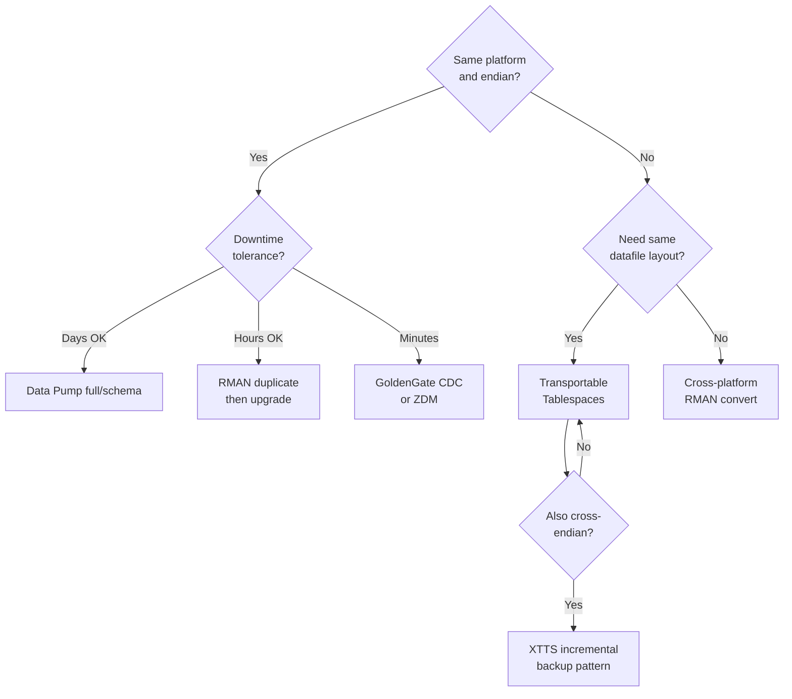

# Migration Methods

## Overview

Where **upgrade** moves a database's version in place, **migration** moves the database to different hardware, storage, OS, endianness, or cloud target — usually with a version bump in the same step. This page maps the family of methods and the criteria for picking one.

## The Decision Matrix



## Methods At a Glance

| Method                              | Best when                                          | Downtime typical    |
| ----------------------------------- | -------------------------------------------------- | ------------------- |
| **Data Pump full/schema**           | Small DBs, refactoring layout, dev/QA moves        | Hours               |
| **Data Pump network mode**          | No landing storage available                       | Hours               |
| **RMAN duplicate**                  | Same platform, same version, cloning               | 1–2 hours           |
| **Physical standby → switchover**   | Zero-data-loss cutover, planned                    | Minutes             |
| **Transportable Tablespaces (TTS)** | Very large DBs, same endian                        | 1–4 hours           |
| **Cross-Platform TTS (XTTS)**       | Cross-endian; big DBs                              | Hours (incremental) |
| **Full Transportable Export**       | 11g → 19c, cross-endian, in one step               | Hours               |
| **RMAN cross-platform backup**      | Full DB moves; simpler than XTTS on small DBs      | Hours               |
| **GoldenGate CDC**                  | Near-zero downtime, heterogeneous, cutover control | Minutes             |
| **Zero Downtime Migration (ZDM)**   | To OCI or between OCI regions                      | Minutes             |
| **AWS DMS**                         | To/from AWS RDS or Aurora                          | Minutes–hours       |

## Method 1 — Data Pump Full/Schema

Most flexible; slowest.

```bash
# Source
expdp system/... full=yes directory=DP_DUMP dumpfile=full_%U.dmp \
      parallel=8 compression=all flashback_time=SYSTIMESTAMP

# Copy dumpfiles to target
rsync -av /u01/dumps/full_*.dmp target:/u01/dumps/

# Target (19c already installed, empty DB created)
impdp system/... full=yes directory=DP_DUMP dumpfile=full_%U.dmp \
      parallel=8 exclude=STATISTICS
```

See [EXPDP](../21-data-pump/expdp.md) and [IMPDP](../21-data-pump/impdp.md).

Use when:

- DB is small (< 500 GB).
- You want to reshape (change tablespace layout, drop old objects).
- Any platform/endian; Data Pump doesn't care.

## Method 2 — RMAN Duplicate (Same Platform)

Bit-for-bit clone.

```bash
# Target server, empty $ORACLE_HOME, target aux instance in NOMOUNT
rman target sys/...@source auxiliary /

RMAN> DUPLICATE TARGET DATABASE TO PRD_NEW
      FROM ACTIVE DATABASE
      SPFILE
      NOFILENAMECHECK;
```

See [Duplicate Database](../15-rman/duplicate-database.md).

Then upgrade if crossing versions:

```bash
java -jar autoupgrade.jar -config prd_new.json -mode deploy
```

## Method 3 — Transportable Tablespaces (Same Endian)

For very large databases when Data Pump would take too long.

```sql
-- Source: make tablespaces READ ONLY
ALTER TABLESPACE USERS_DATA READ ONLY;
ALTER TABLESPACE USERS_IDX  READ ONLY;

-- Source: export metadata only
expdp system/... transport_tablespaces=USERS_DATA,USERS_IDX \
      directory=DP_DUMP dumpfile=tts_meta.dmp

-- Copy datafiles + dump file to target

-- Target: attach
impdp system/... transport_datafiles='/u01/oradata/tgt/users_data01.dbf,/u01/oradata/tgt/users_idx01.dbf' \
      directory=DP_DUMP dumpfile=tts_meta.dmp \
      remap_schema=APP:APP_NEW

-- Source: put back to read-write (or drop tablespaces)
```

See [Transportable Tablespaces](../38-migrations/transportable-tablespaces.md).

## Method 4 — Cross-Platform TTS (Different Endian)

Add an RMAN `CONVERT` step:

```bash
# Source (big-endian) — after read-only
rman target /
RMAN> CONVERT TABLESPACE 'USERS_DATA','USERS_IDX'
      TO PLATFORM 'Linux x86 64-bit'
      FORMAT '/u01/xtts/%U';

# Copy converted files + metadata dump to target
# Impdp same as regular TTS
```

For **very large** cross-endian moves, use the **XTTS incremental** pattern (MOS Doc ID 2005729.1): apply successive incremental level-1 backups from source to target, only requiring the source to be read-only for the final increment. Cuts multi-day migrations to hours of downtime.

## Method 5 — Full Transportable Export/Import

Combines TTS + Data Pump metadata for a **whole-database** move in one command.

```bash
# Source (11.2.0.3+): all user tablespaces to READ ONLY
ALTER TABLESPACE USERS READ ONLY;
-- ... all user tablespaces

# Source: full transportable export
expdp system/... full=yes transportable=always \
      version=19 directory=DP_DUMP dumpfile=full_tts.dmp

# Target: full transportable import
impdp system/... full=yes directory=DP_DUMP dumpfile=full_tts.dmp \
      transport_datafiles='/u01/oradata/tgt/users01.dbf,...'
```

The `transportable=always` + `full=yes` combo is Oracle's officially blessed one-shot upgrade+migrate. Works 11g/12c → 19c, cross-endian OK.

## Method 6 — GoldenGate CDC

For near-zero downtime:

```
1. Instantiate target from source snapshot (Data Pump).
2. Start GoldenGate Extract on source from the SCN of the snapshot.
3. Start GoldenGate Replicat on target — catches up.
4. Once lag = 0, quiesce source, wait for last few TX, cut over.
```

See [GoldenGate](../37-goldengate/index.md).

Use when:

- Downtime budget is minutes.
- Heterogeneous move (Oracle → PostgreSQL, or Oracle-to-Oracle across versions).
- Migration failover needed.

## Method 7 — Zero Downtime Migration (ZDM)

Oracle's turnkey tool for moving to OCI (or between OCI/HW): OCI DBCS, ExaCS, Autonomous DB. Under the hood uses RMAN + Data Guard + backup-restore-and-switchover.

```bash
# On the ZDM server
zdmcli migrate database \
   -sourcedb PRD \
   -targetnode ocibs01 \
   -backupuser opc@ocibs01 \
   -eval          # dry-run
```

Very good for OCI-target migrations; less useful for on-prem→AWS.

## Method 8 — AWS DMS

AWS Database Migration Service for on-prem → AWS RDS/Aurora/S3. See [AWS DMS](../38-migrations/aws-dms.md).

## Comparing on Downtime

```mermaid
gantt
    title Migration Method Downtime Comparison (500GB DB)
    dateFormat  HH:mm
    axisFormat  %H:%M
    section Data Pump
    Extract      :a1, 00:00, 4h
    Transfer     :a2, after a1, 1h
    Import       :a3, after a2, 4h
    section RMAN Duplicate
    Duplicate    :b1, 00:00, 2h
    Upgrade      :b2, after b1, 1h
    section TTS
    Read-only    :c1, 00:00, 5m
    Meta+Copy    :c2, after c1, 1h
    Impdp        :c3, after c2, 30m
    section XTTS incremental
    Final incr   :d1, 00:00, 30m
    Impdp        :d2, after d1, 15m
    section GoldenGate
    Cutover      :e1, 00:00, 15m
```



## Method Selection Cheat-sheet

| Situation                                        | Method                      |
| ------------------------------------------------ | --------------------------- |
| < 200 GB, same OS, downtime OK                   | Data Pump                   |
| 500 GB – 5 TB, same endian                       | TTS                         |
| > 5 TB, same or cross-endian                     | XTTS incremental            |
| Cross-endian upgrade in one step                 | Full transportable          |
| Need to reshape schema                           | Data Pump                   |
| Cloud target (OCI)                               | ZDM                         |
| Cloud target (AWS)                               | DMS + Data Pump             |
| Zero-downtime, keep original running as fallback | GoldenGate                  |
| Just a version upgrade in place                  | AutoUpgrade (not migration) |

## Common Pitfalls

- **Characterset mismatch** — Target must be a superset. Check `NLS_CHARACTERSET`. If not superset, need Data Pump with conversion.
- **National characterset** (`NLS_NCHAR_CHARACTERSET`) — same rule.
- **`db_block_size` mismatch** — Bit-for-bit methods (RMAN duplicate, TTS) require matching block size.
- **Endian mismatch** — Only Data Pump / XTTS / Cross-Platform RMAN handle.
- **Time zone version drift** — Target must be ≥ source; upgrade target's TZ first if lower.
- **Missing user tablespaces on target** for Data Pump — Use `REMAP_TABLESPACE`.
- **SYS objects owned by app** — Common in old systems; Data Pump won't move them without `FULL=YES + DATAPUMP_EXP_FULL_DATABASE`.
- **`ORA-19839` / cross-platform block change** — In XTTS, wrong compatible parameter on source. Set `COMPATIBLE=` to match.

## Best Practices

1. Choose method by downtime budget first, size second.
2. Rehearse the exact cutover 3 times in lower environments before production.
3. Always take a **pre-migration full RMAN backup** at the source — even if the method won't roll back to it.
4. Document the exact commands with real timings from rehearsals.
5. Have a **rollback plan** ready — even for methods where "rollback = re-migrate".
6. Freeze DDL on source during cutover — GoldenGate handles DML, not DDL.
7. Bring statistics with you where possible; avoid the "regenerate for hours after" surprise.
8. Validate row counts and checksums post-migration (`DBMS_COMPARISON`, `MD5(*)` on critical tables).
9. Apply the latest RU on target BEFORE go-live.
10. Keep the source running (read-only) for ≥ 7 days as an emergency fallback.

## Interview Questions

1. **Q:** When would you choose TTS over Data Pump?
   **A:** Very large databases where copying datafiles + metadata is much faster than dumping every row.

2. **Q:** What is the difference between TTS and Full Transportable Export?
   **A:** TTS moves tablespaces; users + roles + everything outside those tablespaces are exported/imported separately. Full transportable does it all in one Data Pump command.

3. **Q:** How do you migrate a 20 TB Oracle from AIX (big-endian) to Linux (little-endian) with < 4 h downtime?
   **A:** XTTS incremental — pre-copy datafiles converted little-endian, keep applying incremental level-1 backups, final increment is the only downtime.

4. **Q:** How does GoldenGate keep downtime near-zero?
   **A:** Replicates changes from source to target in real time; cutover is just: stop app, wait last few TX to replicate, redirect.

5. **Q:** What's the cutover risk with Data Pump vs GoldenGate?
   **A:** Data Pump requires the source read-only for the whole run. GoldenGate lets the source stay open until the cutover minute.

## References

- Oracle Database Backup and Recovery Guide 19c — RMAN cross-platform
- Oracle Database Utilities 19c — TTS
- MOS Doc ID 2005729.1 — XTTS Incremental Backup Method
- MOS Doc ID 733205.1 — Full Transportable Export/Import
- MOS Doc ID 2278553.1 — Zero Downtime Migration
- [Transportable Tablespaces](../38-migrations/transportable-tablespaces.md)
- [Zero Downtime Migration](../38-migrations/zero-downtime-migration.md)
