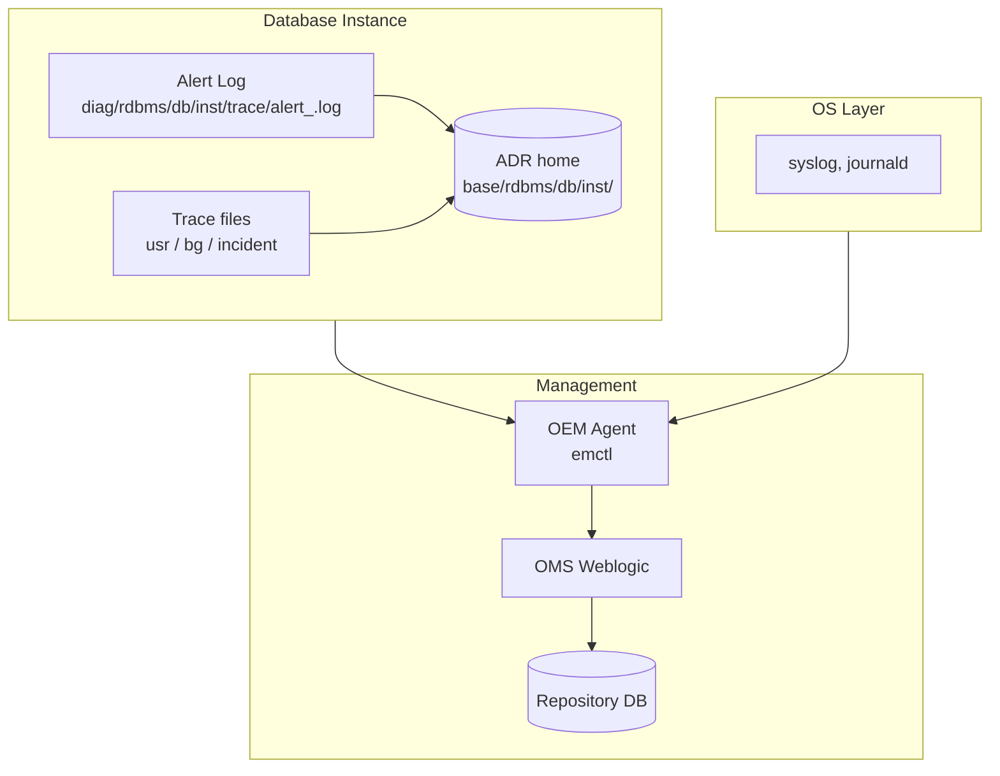

# Monitoring

Oracle Database monitoring spans **three levels**: the **alert log** (the DB's own event stream), **diagnostic files** (traces, incident dumps, ADR), and **management platforms** (Oracle Enterprise Manager, cloud services). This chapter walks the operational monitoring surface a DBA touches daily.

## Contents

| Page                                          | Purpose                                                 |
| --------------------------------------------- | ------------------------------------------------------- |
| [Alert Log](alert-log.md)                     | The primary event stream every DBA reads first          |
| [Trace Files](trace-files.md)                 | Per-process trace, incident/error trace, TKPROF-ready   |
| [ADR](adr.md)                                 | Automatic Diagnostic Repository — one home for all diag |
| [OEM](oem.md)                                 | Oracle Enterprise Manager 13c — architecture overview   |
| [OEM OMS](oem-oms.md)                         | Management Server tier                                  |
| [OEM Repository](oem-repository.md)           | The OMS's own database                                  |
| [OEM Agent](oem-agent.md)                     | Agent lifecycle, discovery, blackouts                   |
| [OEM Troubleshooting](oem-troubleshooting.md) | Common OMS/Agent/Repository issues                      |

## The Three Layers in One Diagram

## What to Watch

- **Uptime** — `v$instance.startup_time`, `v$database.open_mode`.
- **Space** — datafile fill %, FRA %, undo tablespace.
- **Sessions** — active vs limit, blocking chains.
- **Waits** — top wait events per snapshot.
- **Redo** — log switches/hour, archiver lag.
- **Errors** — ORA-00600, ORA-07445, ORA-01578 (corruption), ORA-04031.
- **Data Guard** — apply lag, transport lag, gap.
- **RAC** — evictions, GC waits, service placement.

## Related

- [AWR](../12-performance-tuning/awr.md) — trend metric collection.
- [ASH](../12-performance-tuning/ash.md) — session-level history.
- [ADDM](../12-performance-tuning/addm.md) — auto diagnostic advisor.
- [Errors](../26-errors/index.md) — full ORA- catalog.
- [Runbooks](../27-runbooks/index.md) — response procedures.
- [Scripts](../30-scripts/index.md) — reusable SQL monitoring scripts.
